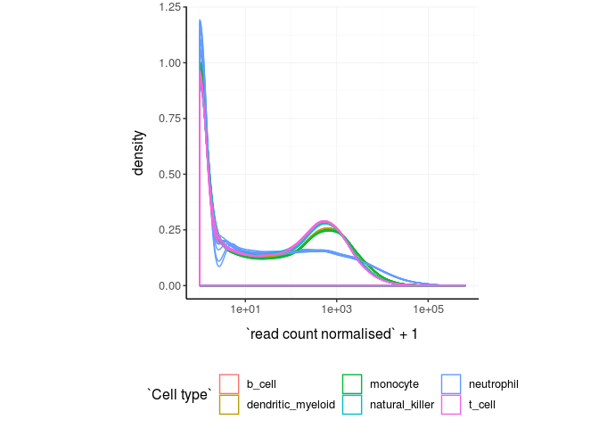
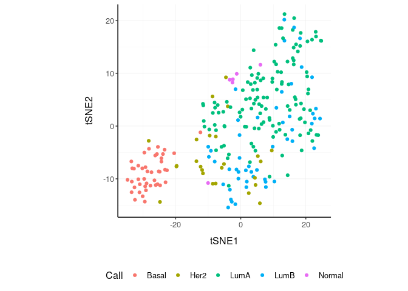
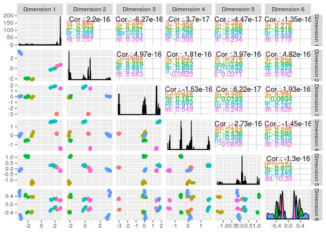
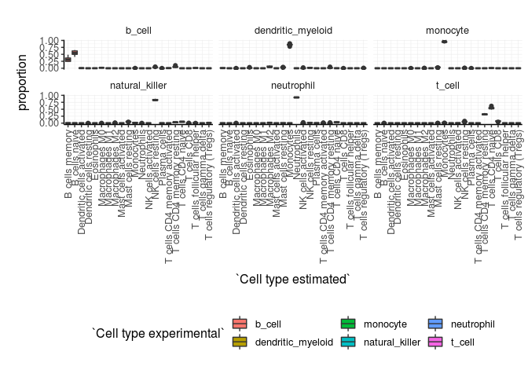
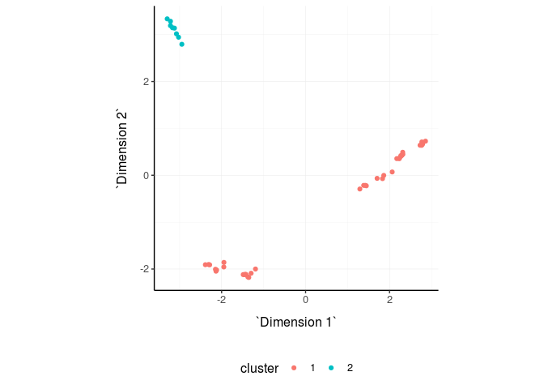
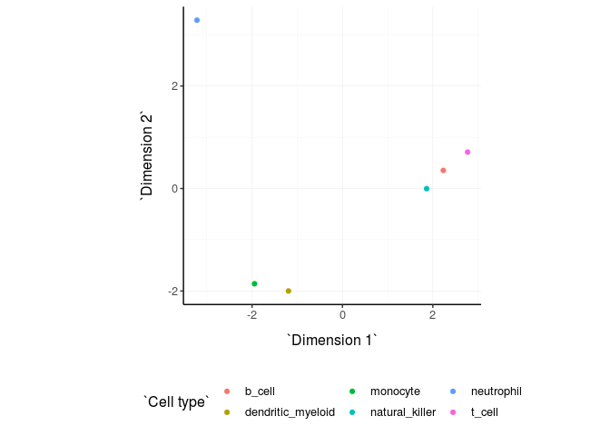
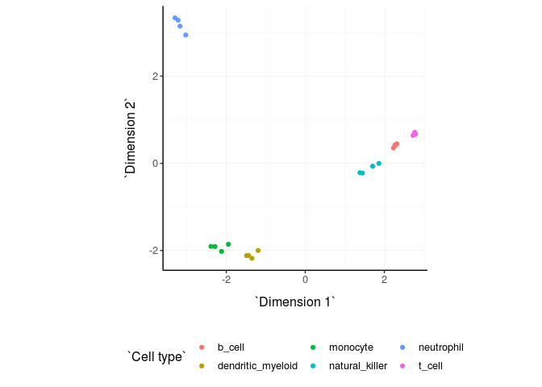

ttBulk - tidyTranscriptomics
================

[](https://travis-ci.org/stemangiola/ttBulk)
[](https://coveralls.io/github/stemangiola/ttBulk?branch=master)

A user-firendly grammar of bulk RNA sequencing data explaration and
processing

# 

# Introduction

ttBulk is a collection of wrappers for bulk tanscriptomic analyses that
follows the “tidy” paradigm. The data structure is a tibble with a
column for

  - sample identifier column
  - transcript identifier column
  - `read count` column
  - annotation (and other info) columns

<!-- end list -->

``` r
ttBulk::counts # Accessible via ttBulk::counts
```

    ## # A tibble: 1,340,160 x 5
    ##    sample     transcript   `Cell type` `read count` time 
    ##    <chr>      <chr>        <chr>              <dbl> <chr>
    ##  1 SRR1740034 DDX11L1      b_cell                17 0 d  
    ##  2 SRR1740034 WASH7P       b_cell              3568 0 d  
    ##  3 SRR1740034 MIR6859-1    b_cell                57 0 d  
    ##  4 SRR1740034 MIR1302-2    b_cell                 1 0 d  
    ##  5 SRR1740034 FAM138A      b_cell                 0 0 d  
    ##  6 SRR1740034 OR4F5        b_cell                 0 0 d  
    ##  7 SRR1740034 LOC729737    b_cell              1764 0 d  
    ##  8 SRR1740034 LOC102725121 b_cell                11 0 d  
    ##  9 SRR1740034 WASH9P       b_cell              3590 0 d  
    ## 10 SRR1740034 MIR6859-2    b_cell                40 0 d  
    ## # … with 1,340,150 more rows

Every function takes this tructure as input and outputs: (i) this
structure with addictional information (action=“add”); or (ii) this
structure with the isolated new information (action=“get”)

In brief you can:

  - Going from BAM/SAM to a tidy data frame of counts (FeatureCounts)
  - Adding gene symbols from ensembl IDs
  - Aggregating duplicated gene symbols
  - Adding normalised counts
  - Adding principal components
  - Adding MDS components
  - Rotating principal component or MDS dimensions
  - Running differential transcript abunance analyses (edgeR)
  - Adding batch adjusted read counts (Combat)
  - Eliminating redunant samples and/or genes
  - Clustering samples and/or genes with kmeans
  - Adding tissue composition (Cibersort)

# Aggregate `transcripts`

Aggregating duplicated transcripts (e.g., isoforms, ensembl). For
example, we often have to convert ensembl to gene symbol, in doing so we
have to deal with duplicated symbols

``` r
counts.aggr = 
  ttBulk::counts %>%
  aggregate_duplicates(
    sample, 
    transcript, 
    `read count`,  
    aggregation_function = sum
  )

counts.aggr
```

    ## # A tibble: 1,340,160 x 6
    ##    sample   transcript  `Cell type` `read count` time  `number of merged t…
    ##    <chr>    <chr>       <chr>              <dbl> <chr>                <dbl>
    ##  1 SRR1740… DDX11L1     b_cell                17 0 d                      1
    ##  2 SRR1740… WASH7P      b_cell              3568 0 d                      1
    ##  3 SRR1740… MIR6859-1   b_cell                57 0 d                      1
    ##  4 SRR1740… MIR1302-2   b_cell                 1 0 d                      1
    ##  5 SRR1740… FAM138A     b_cell                 0 0 d                      1
    ##  6 SRR1740… OR4F5       b_cell                 0 0 d                      1
    ##  7 SRR1740… LOC729737   b_cell              1764 0 d                      1
    ##  8 SRR1740… LOC1027251… b_cell                11 0 d                      1
    ##  9 SRR1740… WASH9P      b_cell              3590 0 d                      1
    ## 10 SRR1740… MIR6859-2   b_cell                40 0 d                      1
    ## # … with 1,340,150 more rows

# Normalise `read counts`

For visualisation purposes or ad hoc analyses, we may want to calculate
the normalised read counts for library size (e.g., with TMM algorithm).
These new values will be added to the original data set as `<NAME OF
SAMPLE COLUMN>
normalised`

``` r
counts.norm =  counts.aggr %>% normalise_counts(sample, transcript, `read count`)
counts.norm
```

    ## # A tibble: 1,340,160 x 10
    ##    sample transcript `Cell type` `read count` time  `number of merg…
    ##    <chr>  <chr>      <chr>              <dbl> <chr>            <dbl>
    ##  1 SRR17… A1BG       b_cell               153 0 d                  1
    ##  2 SRR17… A1BG-AS1   b_cell                83 0 d                  1
    ##  3 SRR17… A1CF       b_cell                 1 0 d                  1
    ##  4 SRR17… A2M        b_cell                 1 0 d                  1
    ##  5 SRR17… A2M-AS1    b_cell                 0 0 d                  1
    ##  6 SRR17… A2ML1      b_cell                 3 0 d                  1
    ##  7 SRR17… A2MP1      b_cell                 0 0 d                  1
    ##  8 SRR17… A3GALT2    b_cell                 0 0 d                  1
    ##  9 SRR17… A4GALT     b_cell                 4 0 d                  1
    ## 10 SRR17… A4GNT      b_cell                 0 0 d                  1
    ## # … with 1,340,150 more rows, and 4 more variables: `read count
    ## #   normalised` <dbl>, TMM <dbl>, multiplier <dbl>,
    ## #   filtered_out_low_counts <lgl>

We can easily plot the normalised density to check the outcome

``` r
counts.norm %>% 
    ggplot(aes(`read count normalised` + 1, group=sample, color=`Cell type`)) +
    geom_density() + 
    scale_x_log10() +
    my_theme
```

<!-- -->

# Reduce `dimensions`

For visualisation purposes or ad hoc analyses, we may want to reduce the
dimentions of our data, for example using PCA or MDS algorithms. These
new values will be added to the original data set.

## MDS

``` r
counts.norm.MDS = 
  counts.norm %>%
  reduce_dimensions(value_column = `read count normalised`, method="MDS" , elements_column = sample, feature_column = transcript, components = 1:10)
counts.norm.MDS
```

    ## # A tibble: 1,340,160 x 20
    ##    sample transcript `Cell type` `read count` time  `number of merg…
    ##    <chr>  <chr>      <chr>              <dbl> <chr>            <dbl>
    ##  1 SRR17… A1BG       b_cell               153 0 d                  1
    ##  2 SRR17… A1BG-AS1   b_cell                83 0 d                  1
    ##  3 SRR17… A1CF       b_cell                 1 0 d                  1
    ##  4 SRR17… A2M        b_cell                 1 0 d                  1
    ##  5 SRR17… A2M-AS1    b_cell                 0 0 d                  1
    ##  6 SRR17… A2ML1      b_cell                 3 0 d                  1
    ##  7 SRR17… A2MP1      b_cell                 0 0 d                  1
    ##  8 SRR17… A3GALT2    b_cell                 0 0 d                  1
    ##  9 SRR17… A4GALT     b_cell                 4 0 d                  1
    ## 10 SRR17… A4GNT      b_cell                 0 0 d                  1
    ## # … with 1,340,150 more rows, and 14 more variables: `read count
    ## #   normalised` <dbl>, TMM <dbl>, multiplier <dbl>,
    ## #   filtered_out_low_counts <lgl>, `Dimension 1` <dbl>, `Dimension
    ## #   10` <dbl>, `Dimension 2` <dbl>, `Dimension 3` <dbl>, `Dimension
    ## #   4` <dbl>, `Dimension 5` <dbl>, `Dimension 6` <dbl>, `Dimension
    ## #   7` <dbl>, `Dimension 8` <dbl>, `Dimension 9` <dbl>

``` r
counts.norm.MDS %>% 
    select(contains("Dimension"), sample, `Cell type`) %>%
  distinct() %>%
  GGally::ggpairs(columns = 1:6, ggplot2::aes(colour=`Cell type`)) 
```

<!-- -->

## PCA

``` r
counts.norm.PCA = 
  counts.norm %>%
  reduce_dimensions(value_column = `read count normalised`, method="PCA" , elements_column = sample, feature_column = transcript, components = 1:10)
```

    ## Fraction of variance explained by the selected principal components
    ## # A tibble: 10 x 2
    ##    `Fraction of variance`    PC
    ##                     <dbl> <int>
    ##  1               0.897        1
    ##  2               0.0475       2
    ##  3               0.0205       3
    ##  4               0.0157       4
    ##  5               0.00661      5
    ##  6               0.00283      6
    ##  7               0.00191      7
    ##  8               0.000635     8
    ##  9               0.000411     9
    ## 10               0.000395    10

``` r
counts.norm.PCA
```

    ## # A tibble: 1,340,160 x 20
    ##    sample transcript `Cell type` `read count` time  `number of merg…
    ##    <chr>  <chr>      <chr>              <dbl> <chr>            <dbl>
    ##  1 SRR17… A1BG       b_cell               153 0 d                  1
    ##  2 SRR17… A1BG-AS1   b_cell                83 0 d                  1
    ##  3 SRR17… A1CF       b_cell                 1 0 d                  1
    ##  4 SRR17… A2M        b_cell                 1 0 d                  1
    ##  5 SRR17… A2M-AS1    b_cell                 0 0 d                  1
    ##  6 SRR17… A2ML1      b_cell                 3 0 d                  1
    ##  7 SRR17… A2MP1      b_cell                 0 0 d                  1
    ##  8 SRR17… A3GALT2    b_cell                 0 0 d                  1
    ##  9 SRR17… A4GALT     b_cell                 4 0 d                  1
    ## 10 SRR17… A4GNT      b_cell                 0 0 d                  1
    ## # … with 1,340,150 more rows, and 14 more variables: `read count
    ## #   normalised` <dbl>, TMM <dbl>, multiplier <dbl>,
    ## #   filtered_out_low_counts <lgl>, PC1 <dbl>, PC2 <dbl>, PC3 <dbl>,
    ## #   PC4 <dbl>, PC5 <dbl>, PC6 <dbl>, PC7 <dbl>, PC8 <dbl>, PC9 <dbl>,
    ## #   PC10 <dbl>

``` r
counts.norm.PCA %>% 
    select(contains("PC"), sample, `Cell type`) %>%
  distinct() %>%
  GGally::ggpairs(columns = 1:6, ggplot2::aes(colour=`Cell type`)) 
```

<!-- -->

# Rotate `dimensions`

For visualisation purposes or ad hoc analyses, we may want to rotate the
reduced dimentions (or any two numeric columns really) of our data, of a
set angle. The rotated dimensions will be added to the original data set
as `<NAME OF DIMENSION> rotated <ANGLE>` by default, or as specified in
the input arguments.

``` r
counts.norm.MDS.rotated =
  counts.norm.MDS %>%
    rotate_dimensions(`Dimension 1`, `Dimension 2`, rotation_degrees = 45, elements_column = sample)
```

## Original

``` r
counts.norm.MDS.rotated %>%
    distinct(sample, `Dimension 1`,`Dimension 2`, `Cell type`) %>%
    ggplot(aes(x=`Dimension 1`, y=`Dimension 2`, color=`Cell type` )) + 
  geom_point() +
  my_theme
```

<!-- -->

## Rotated

``` r
counts.norm.MDS.rotated %>%
    distinct(sample, `Dimension 1 rotated 45`,`Dimension 2 rotated 45`, `Cell type`) %>%
    ggplot(aes(x=`Dimension 1 rotated 45`, y=`Dimension 2 rotated 45`, color=`Cell type` )) + 
  geom_point() +
  my_theme
```

<!-- -->

# Differential transcirption

We may want to test for differential transcription between sample-wise
factors of interest (e.g., with edgeR). The statistics will be added to
the original data. In this example we set action =“get” to just output
the non redundant gene statistics.

``` r
ttBulk::counts_mini %>%
    annotate_differential_transcription(
      ~ condition,
      sample_column = sample,
      transcript_column = transcript,
      counts_column = `read count`,
      action="get") 
```

    ## # A tibble: 30 x 8
    ##    transcript    logFC logCPM    LR  PValue    FDR is_de filtered_out_low_…
    ##    <chr>         <dbl>  <dbl> <dbl>   <dbl>  <dbl> <lgl> <lgl>             
    ##  1 MIR1244-4   -0.564   15.4   8.01 0.00466 0.0932 FALSE FALSE             
    ##  2 LOC1006527…  0.688   12.0   3.20 0.0734  0.609  FALSE FALSE             
    ##  3 KLHL17       0.172   16.5   2.49 0.115   0.609  FALSE FALSE             
    ##  4 DLG5        -0.477   12.2   1.82 0.178   0.609  FALSE FALSE             
    ##  5 ARHGAP11A   -0.225   15.4   1.80 0.180   0.609  FALSE FALSE             
    ##  6 LOC1002894… -0.280   13.5   1.49 0.222   0.609  FALSE FALSE             
    ##  7 PRSS23      -1.25     9.83  1.38 0.241   0.609  FALSE FALSE             
    ##  8 B3GAT3       0.0889  18.3   1.21 0.271   0.609  FALSE FALSE             
    ##  9 C6orf201     0.197   14.3   1.20 0.274   0.609  FALSE FALSE             
    ## 10 WBP1         0.132   15.4   1.03 0.310   0.613  FALSE FALSE             
    ## # … with 20 more rows

# Adjust `read counts`

Adjust `read counts` for (known) unwanted variation. For visualisation
purposes or ad hoc analyses, we may want to adjust our normalised counts
to remove known unwanted variation. The adjusted counts will be added to
the original data set as `<READ COUNT COLUMN> adjusted`. The formulation
is similar to a linear model, where the first covariate is the factor of
interest and the second covariate is the unwanted variation. At the
moment just an unwanted covariated is allowed at the time.

``` r
counts.norm.adj = 
    counts.norm %>%
      
      # Add fake batch and factor of interest
      left_join( 
        (.) %>% 
            distinct(sample) %>% 
            mutate(batch = sample(0:1, n(), replace = T)) 
      ) %>%
        mutate(factor_of_interest = `Cell type` == "b_cell") %>%
        
      # Add covariate
      adjust_counts(
        ~ factor_of_interest + batch,   
        sample, 
        transcript, 
        `read count normalised`, 
        action = "get"
      )
```

    ## Standardizing Data across genes

``` r
counts.norm.adj
```

    ## # A tibble: 1,340,160 x 4
    ##    transcript sample     `read count normalised adju… filtered_out_low_cou…
    ##    <chr>      <chr>                             <int> <lgl>                
    ##  1 A1BG       SRR1740034                          130 FALSE                
    ##  2 A1BG-AS1   SRR1740034                           72 FALSE                
    ##  3 A1CF       SRR1740034                           NA TRUE                 
    ##  4 A2M        SRR1740034                            0 FALSE                
    ##  5 A2M-AS1    SRR1740034                            0 FALSE                
    ##  6 A2ML1      SRR1740034                            2 FALSE                
    ##  7 A2MP1      SRR1740034                           NA TRUE                 
    ##  8 A3GALT2    SRR1740034                            0 FALSE                
    ##  9 A4GALT     SRR1740034                           NA TRUE                 
    ## 10 A4GNT      SRR1740034                           NA TRUE                 
    ## # … with 1,340,150 more rows

# Cell type composition

We may want to infer the cell type composition of our samples (e.g.,
with cibersort). The cell type proportions will be added to the original
data.

``` r
counts.cibersort = 
    ttBulk::counts %>% 
    annotate_cell_type(sample, transcript, `read count`, action="add") 
counts.cibersort
```

    ## # A tibble: 29,483,520 x 7
    ##    sample transcript `Cell type.x` `read count` time  `Cell type.y`
    ##    <chr>  <chr>      <chr>                <dbl> <chr> <chr>        
    ##  1 SRR17… DDX11L1    b_cell                  17 0 d   B cells naive
    ##  2 SRR17… DDX11L1    b_cell                  17 0 d   B cells memo…
    ##  3 SRR17… DDX11L1    b_cell                  17 0 d   Plasma cells 
    ##  4 SRR17… DDX11L1    b_cell                  17 0 d   T cells CD8  
    ##  5 SRR17… DDX11L1    b_cell                  17 0 d   T cells CD4 …
    ##  6 SRR17… DDX11L1    b_cell                  17 0 d   T cells CD4 …
    ##  7 SRR17… DDX11L1    b_cell                  17 0 d   T cells CD4 …
    ##  8 SRR17… DDX11L1    b_cell                  17 0 d   T cells foll…
    ##  9 SRR17… DDX11L1    b_cell                  17 0 d   T cells regu…
    ## 10 SRR17… DDX11L1    b_cell                  17 0 d   T cells gamm…
    ## # … with 29,483,510 more rows, and 1 more variable: proportion <dbl>

We can plot the distributions of cell types across samples, and compare
them with the nominal cell type labels to check for the purity of
isolation.

``` r
counts.cibersort %>%
  rename(`Cell type experimental` = `Cell type.x`, `Cell type estimated` = `Cell type.y`) %>%
  distinct(sample, `Cell type experimental`, `Cell type estimated`, proportion) %>%
  ggplot(aes(x=`Cell type estimated`, y=proportion, fill=`Cell type experimental`)) + 
  geom_boxplot() + 
  facet_wrap(~`Cell type experimental`) +
  my_theme + 
  theme(axis.text.x = element_text(angle = 90, hjust = 1, vjust = 0.5), aspect.ratio=1/5)
```

<!-- -->

# Cluster

For visualisation purposes or ad hoc analyses, we may want to cluster
our data (e.g., k-means sample-wise). The cluster annotation will be
added to the original data set.

## k-means

``` r
counts.norm.cluster = counts.norm %>%
  annotate_clusters(value_column = `read count normalised`, elements_column = sample, feature_column = transcript,  number_of_clusters = 2 )

counts.norm.cluster
```

    ## # A tibble: 1,340,160 x 11
    ##    sample transcript `Cell type` `read count` time  `number of merg…
    ##    <chr>  <chr>      <chr>              <dbl> <chr>            <dbl>
    ##  1 SRR17… A1BG       b_cell               153 0 d                  1
    ##  2 SRR17… A1BG-AS1   b_cell                83 0 d                  1
    ##  3 SRR17… A1CF       b_cell                 1 0 d                  1
    ##  4 SRR17… A2M        b_cell                 1 0 d                  1
    ##  5 SRR17… A2M-AS1    b_cell                 0 0 d                  1
    ##  6 SRR17… A2ML1      b_cell                 3 0 d                  1
    ##  7 SRR17… A2MP1      b_cell                 0 0 d                  1
    ##  8 SRR17… A3GALT2    b_cell                 0 0 d                  1
    ##  9 SRR17… A4GALT     b_cell                 4 0 d                  1
    ## 10 SRR17… A4GNT      b_cell                 0 0 d                  1
    ## # … with 1,340,150 more rows, and 5 more variables: `read count
    ## #   normalised` <dbl>, TMM <dbl>, multiplier <dbl>,
    ## #   filtered_out_low_counts <lgl>, cluster <fct>

We can add cluster annotation to the MDS dimesion reduced data set and
plot

``` r
 counts.norm.MDS %>%
  annotate_clusters(
    value_column = `read count normalised`,
    elements_column = sample, 
    feature_column = transcript,    
    number_of_clusters = 2 
  ) %>% 
    distinct(sample, `Dimension 1`, `Dimension 2`, cluster) %>%
    ggplot(aes(x=`Dimension 1`, y=`Dimension 2`, color=cluster)) + 
  geom_point() +
  my_theme
```

<!-- -->

# Drop redundant

For visualisation purposes or ad hoc analyses, we may want to remove
redundant elements from the original data set (e.g., samples or
transcripts).

## Use correlation or sample removal

``` r
counts.norm.non_redundant = 
    counts.norm.MDS %>% 
  drop_redundant(
    method = "correlation",
    elements_column = sample,
    feature_column = transcript, 
    value_column = `read count normalised`
  )
```

We can visualise how the reduced redundancy with the reduced dimentions
look like

``` r
counts.norm.non_redundant %>%
    distinct(sample, `Dimension 1`, `Dimension 2`, `Cell type`) %>%
    ggplot(aes(x=`Dimension 1`, y=`Dimension 2`, color=`Cell type`)) + 
  geom_point() +
  my_theme
```

<!-- -->

## Use reduced dimensions

``` r
counts.norm.non_redundant = 
    counts.norm.MDS %>% 
  drop_redundant(
    method = "reduced_dimensions",
    elements_column = sample,
    feature_column = transcript,
    Dim_a_column = `Dimension 1`,
    Dim_b_column = `Dimension 2`
  )
```

We can visualise how the reduced redundancy with the reduced dimentions
look like

``` r
counts.norm.non_redundant %>%
    distinct(sample, `Dimension 1`, `Dimension 2`, `Cell type`) %>%
    ggplot(aes(x=`Dimension 1`, y=`Dimension 2`, color=`Cell type`)) + 
  geom_point() +
  my_theme
```

<!-- -->

# Other useful wrappers

We can convert a list of BAM/SAM files into a tidy data frame of
annotated counts, via FeatureCounts

``` r
counts = bam_sam_to_featureCounts_tibble(file_names, genome = "hg38")
```

We can add gene symbols from ensembl identifiers

``` r
counts_ensembl %>% annotate_symbol(ens)
```
