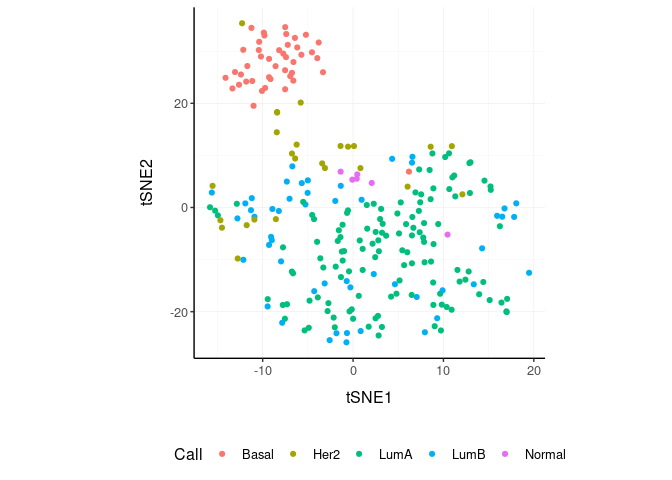

tidybulk - part of tidyTranscriptomics
================

<!-- badges: start -->
[](https://www.tidyverse.org/lifecycle/#maturing)
<!-- badges: end -->

<!---

[](https://travis-ci.org/stemangiola/tidybulk) [](https://coveralls.io/github/stemangiola/tidybulk?branch=master)

-->

A modular framework and a tidy data structure for bulk transcriptional
analyses. This package is part of a tidy transcriptomics suite for tidy
and user-friendly grammar of RNA sequencing data exploration and
analysis. A wide range of analyses are included in convenient wrappers,
including: resolving duplicate gene symbol (e.g., isoforms), scaling
(a.k.a., normalisation), identifying variable transcripts, removal of
know unwanted variation, differential transcript abundance analyses
(a.k.a., differential expression), reducing data dimensionality (MDS,
PCA and tSNE), clustering (SNN and kmeans), gene enrichment analyses,
remove redundancy (either samples or transcripts).

# 

# Installation

``` r
devtools::install_github("stemangiola/tidybulk")
```

# Introduction

tidybulk is a collection of wrapper functions for bulk tanscriptomic
analyses that follows the “tidy” paradigm. The data structure is a
tibble with columns for

  - sample identifier column
  - transcript identifier column
  - count column
  - annotation (and other info) columns

<!-- end list -->

``` r
counts = tidybulk(tidybulk::counts, sample, transcript, count)
counts_tcga = tidybulk(tidybulk::breast_tcga_mini, sample, ens, count)
counts
```

    ## # A tibble: 938,112 x 8
    ##    sample   transcript  `Cell type` count time  condition batch factor_of_inter…
    ##    <fct>    <fct>       <fct>       <dbl> <fct> <lgl>     <int> <lgl>           
    ##  1 SRR1740… DDX11L1     b_cell         17 0 d   TRUE          0 TRUE            
    ##  2 SRR1740… WASH7P      b_cell       3568 0 d   TRUE          0 TRUE            
    ##  3 SRR1740… MIR6859-1   b_cell         57 0 d   TRUE          0 TRUE            
    ##  4 SRR1740… MIR1302-2   b_cell          1 0 d   TRUE          0 TRUE            
    ##  5 SRR1740… FAM138A     b_cell          0 0 d   TRUE          0 TRUE            
    ##  6 SRR1740… OR4F5       b_cell          0 0 d   TRUE          0 TRUE            
    ##  7 SRR1740… LOC729737   b_cell       1764 0 d   TRUE          0 TRUE            
    ##  8 SRR1740… LOC1027251… b_cell         11 0 d   TRUE          0 TRUE            
    ##  9 SRR1740… MIR6859-2   b_cell         40 0 d   TRUE          0 TRUE            
    ## 10 SRR1740… OR4F29      b_cell          0 0 d   TRUE          0 TRUE            
    ## # … with 938,102 more rows

In brief you can: + Going from BAM/SAM to a tidy data frame of counts
(FeatureCounts) + Adding gene symbols from ensembl IDs + Aggregating
duplicated gene symbols + Adding scaled counts + Adding principal
components + Adding MDS components + Rotating principal component or MDS
dimensions + Running differential transcript abunance analyses (edgeR) +
Adding batch adjusted counts (Combat) + Eliminating redunant samples
and/or genes + Clustering samples and/or genes with kmeans + Adding
tissue composition (Cibersort)

# Aggregate duplicated `transcripts`

tidybulk provide the `aggregate_duplicates` function to aggregate
duplicated transcripts (e.g., isoforms, ensembl). For example, we often
have to convert ensembl symbols to gene/transcript symbol, but in doing
so we have to deal with duplicates. `aggregate_duplicates` takes a
tibble and column names (as symbols; for `sample`, `transcript` and
`count`) as arguments and returns a tibble with aggregate transcript
with the same name. All the rest of the column are appended, and factors
and boolean are appended as characters.

<div class="column-left">

TidyTranscriptomics

``` r yellow
counts.aggr = counts %>% aggregate_duplicates()
```

</div>

<div class="column-right">

Standard procedure

``` r
temp = data.frame(
    symbol = dge_list$genes$symbol,
    dge_list$counts
)
dge_list.nr <- by(temp, temp$symbol,
    function(df)
        if(length(df[1,1])>0)
            matrixStats:::colSums(as.matrix(df[,-1]))
)
dge_list.nr <- do.call("rbind", dge_list.nr)
colnames(dge_list.nr) <- colnames(dge_list)
```

</div>

<div style="clear:both;">

</div>

# Scale `counts`

We may want to compensate for sequencing depth, scaling the transcript
abundance (e.g., with TMM algorithm, Robinson and Oshlack
doi.org/10.1186/gb-2010-11-3-r25). `scale_abundance` takes a tibble,
column names (as symbols; for `sample`, `transcript` and `count`) and a
method as arguments and returns a tibble with additional columns with
scaled data as `<NAME OF COUNT COLUMN>_scaled`.

<div class="column-left">

TidyTranscriptomics

``` r
counts.norm = counts.aggr %>% scale_abundance()
```

</div>

<div class="column-right">

Standard procedure

``` r
library(edgeR)

myCPM <- cpm(count_m)
keep <- rowSums(myCPM > 0.5) >= 2
count_m.keep <- count_m[keep,]
[...]
dgList <- calcNormFactors(dgList, method="TMM")
dgList <- estimateCommonDisp(dgList)
dgList <- estimateTagwiseDisp(dgList)
norm_counts.table <- t(
    t(count_m)*
        (dgList$samples$norm.factors)
)
```

</div>

<div style="clear:both;">

</div>

We can easily plot the scaled density to check the scaling outcome. On
the x axis we have the log scaled counts, on the y axes we have the
density, data is grouped by sample and coloured by cell type.

``` r
counts.norm %>%
    ggplot(aes(`count_scaled` + 1, group=sample, color=`Cell type`)) +
    geom_density() +
    scale_x_log10() +
    my_theme
```

<!-- -->

# Filter `variable transcripts`

We may want to identify and filter variable transcripts.

<div class="column-left">

TidyTranscriptomics

``` r
counts.norm.variable = counts.norm %>% keep_variable()
```

    ## Getting the 500 most variable genes

</div>

<div class="column-right">

Standard procedure

``` r
library(edgeR)

x = norm_counts.table

s <- rowMeans((x-rowMeans(x))^2)
o <- order(s,decreasing=TRUE)
x <- x[o[1L:top],,drop=FALSE]

norm_counts.table = norm_counts.table[rownames(x)]

norm_counts.table$cell_type = tidybulk::counts[
    match(
        tidybulk::counts$sample,
        rownames(norm_counts.table)
    ),
    "Cell type"
]
```

</div>

<div style="clear:both;">

</div>

# Reduce `dimensions`

We may want to reduce the dimensions of our data, for example using PCA
or MDS algorithms. `reduce_dimensions` takes a tibble, column names (as
symbols; for `sample`, `transcript` and `count`) and a method (e.g., MDS
or PCA) as arguments and returns a tibble with additional columns for
the reduced dimensions.

**MDS** (Robinson et al., 10.1093/bioinformatics/btp616)

<div class="column-left">

TidyTranscriptomics

``` r
counts.norm.MDS =
  counts.norm %>%
  reduce_dimensions(method="MDS", .dims = 6)
```

</div>

<div class="column-right">

Standard procedure

``` r
library(limma)

count_m_log = log(count_m + 1)
cmds = limma::plotMDS(ndim = .dims, plot = FALSE)

cmds = cmds %$% 
    cmdscale.out %>%
    setNames(sprintf("Dim%s", 1:6))

cmds$cell_type = tidybulk::counts[
    match(tidybulk::counts$sample, rownames(cmds)),
    "Cell type"
]
```

</div>

<div style="clear:both;">

</div>

On the x and y axes axis we have the reduced dimensions 1 to 3, data is
coloured by cell
type.

``` r
counts.norm.MDS %>% pivot_sample()  %>% select(contains("Dim"), everything())
```

    ## # A tibble: 48 x 15
    ##       Dim1   Dim2    Dim3    Dim4    Dim5   Dim6 sample `Cell type` time 
    ##      <dbl>  <dbl>   <dbl>   <dbl>   <dbl>  <dbl> <chr>  <chr>       <chr>
    ##  1 -1.30    0.932 -2.05    0.179   0.127  0.290  SRR17… b_cell      0 d  
    ##  2 -1.36    0.868 -2.06    0.185   0.0928 0.343  SRR17… b_cell      1 d  
    ##  3 -1.43    0.754 -1.97    0.252   0.102  0.377  SRR17… b_cell      3 d  
    ##  4 -1.23    0.944 -2.04    0.204   0.0924 0.229  SRR17… b_cell      7 d  
    ##  5 -0.288  -1.90  -0.0601 -0.0829 -0.783  0.113  SRR17… dendritic_… 0 d  
    ##  6 -0.290  -1.81  -0.0547 -0.0756 -0.702  0.0609 SRR17… dendritic_… 1 d  
    ##  7 -0.423  -2.05  -0.0609 -0.0392 -0.936  0.152  SRR17… dendritic_… 3 d  
    ##  8 -0.390  -1.88  -0.0523 -0.0538 -0.719  0.0817 SRR17… dendritic_… 7 d  
    ##  9 -0.0915 -2.09   0.0768 -0.343   0.739  0.146  SRR17… monocyte    0 d  
    ## 10  0.0253 -1.93   0.0483 -0.358   0.744  0.0770 SRR17… monocyte    1 d  
    ## # … with 38 more rows, and 6 more variables: condition <chr>, batch <dbl>,
    ## #   factor_of_interest <chr>, `merged transcripts` <dbl>, TMM <dbl>,
    ## #   multiplier <dbl>

``` r
counts.norm.MDS %>%
    pivot_sample() %>%
  GGally::ggpairs(columns = 10:15, ggplot2::aes(colour=`Cell type`))
```

<!-- -->

**PCA**

<div class="column-left">

TidyTranscriptomics

``` r
counts.norm.PCA =
  counts.norm %>%
  reduce_dimensions(method="PCA", .dims = 6)
```

</div>

<div class="column-right">

Standard procedure

``` r
count_m_log = log(count_m + 1)
pc = count_m_log %>% prcomp(scale = TRUE)
variance = pc$sdev^2
variance = (variance / sum(variance))[1:6]
pc$cell_type = counts[
    match(counts$sample, rownames(pc)),
    "Cell type"
]
```

</div>

<div style="clear:both;">

</div>

On the x and y axes axis we have the reduced dimensions 1 to 3, data is
coloured by cell
type.

``` r
counts.norm.PCA %>% pivot_sample() %>% select(contains("PC"), everything())
```

    ## # A tibble: 48 x 15
    ##       PC1     PC2     PC3    PC4     PC5   PC6 sample `Cell type` time 
    ##     <dbl>   <dbl>   <dbl>  <dbl>   <dbl> <dbl> <chr>  <chr>       <chr>
    ##  1  0.130  0.137  -0.144  0.248  -0.0598 0.138 SRR17… b_cell      0 d  
    ##  2  0.128  0.137  -0.146  0.253  -0.0536 0.137 SRR17… b_cell      1 d  
    ##  3  0.130  0.135  -0.146  0.251  -0.0481 0.138 SRR17… b_cell      3 d  
    ##  4  0.128  0.138  -0.151  0.248  -0.0516 0.137 SRR17… b_cell      7 d  
    ##  5 -0.177 -0.0647 -0.176  0.0304 -0.0878 0.147 SRR17… dendritic_… 0 d  
    ##  6 -0.176 -0.0786 -0.171  0.0328 -0.0874 0.138 SRR17… dendritic_… 1 d  
    ##  7 -0.174 -0.0719 -0.173  0.0312 -0.103  0.142 SRR17… dendritic_… 3 d  
    ##  8 -0.175 -0.0722 -0.179  0.0306 -0.0856 0.147 SRR17… dendritic_… 7 d  
    ##  9 -0.198 -0.0389 -0.102  0.0234 -0.0556 0.118 SRR17… monocyte    0 d  
    ## 10 -0.192 -0.0567 -0.0966 0.0315 -0.0976 0.117 SRR17… monocyte    1 d  
    ## # … with 38 more rows, and 6 more variables: condition <chr>, batch <dbl>,
    ## #   factor_of_interest <chr>, `merged transcripts` <dbl>, TMM <dbl>,
    ## #   multiplier <dbl>

``` r
counts.norm.PCA %>%
     pivot_sample() %>%
  GGally::ggpairs(columns = 10:12, ggplot2::aes(colour=`Cell type`))
```

<!-- -->

**tSNE**

<div class="column-left">

TidyTranscriptomics

``` r
counts.norm.tSNE =
    counts_tcga%>%
    scale_abundance() %>%
    reduce_dimensions(
        method = "tSNE",
        perplexity=10,
        pca_scale =TRUE
    )
```

</div>

<div class="column-right">

Standard procedure

``` r
count_m_log = log(count_m + 1)

tsne = Rtsne::Rtsne(
    t(count_m_log),
    perplexity=10,
        pca_scale =TRUE
)$Y
tsne$cell_type = tidybulk::counts[
    match(tidybulk::counts$sample, rownames(tsne)),
    "Cell type"
]
```

</div>

<div style="clear:both;">

</div>

Plot

``` r
counts.norm.tSNE %>%
    pivot_sample() %>%
    select(contains("tSNE"), everything()) 
```

    ## # A tibble: 251 x 6
    ##     tSNE1    tSNE2 sample                       Call    TMM multiplier
    ##     <dbl>    <dbl> <chr>                        <fct> <dbl>      <dbl>
    ##  1  -1.24  -8.47   TCGA-A1-A0SD-01A-11R-A115-07 LumA  1.08       0.957
    ##  2   7.31   7.30   TCGA-A1-A0SF-01A-11R-A144-07 LumA  1.12       0.858
    ##  3  -6.64 -12.6    TCGA-A1-A0SG-01A-11R-A144-07 LumA  0.920      0.990
    ##  4 -15.8    0.0394 TCGA-A1-A0SH-01A-11R-A084-07 LumA  0.650      0.817
    ##  5 -15.6    2.87   TCGA-A1-A0SI-01A-11R-A144-07 LumB  0.794      0.991
    ##  6  -4.32  -2.23   TCGA-A1-A0SJ-01A-11R-A084-07 LumA  1.04       0.903
    ##  7  -5.22  33.1    TCGA-A1-A0SK-01A-12R-A084-07 Basal 0.818      1.49 
    ##  8 -12.9    0.711  TCGA-A1-A0SM-01A-11R-A084-07 LumA  0.843      0.821
    ##  9 -11.3   -0.525  TCGA-A1-A0SN-01A-11R-A144-07 LumB  0.952      0.856
    ## 10   2.83 -24.6    TCGA-A1-A0SQ-01A-21R-A144-07 LumA  0.812      1.06 
    ## # … with 241 more rows

``` r
counts.norm.tSNE %>%
    pivot_sample() %>%
    ggplot(aes(x = `tSNE1`, y = `tSNE2`, color=Call)) + geom_point() + my_theme
```

<!-- -->

# Rotate `dimensions`

We may want to rotate the reduced dimensions (or any two numeric columns
really) of our data, of a set angle. `rotate_dimensions` takes a tibble,
column names (as symbols; for `sample`, `transcript` and `count`) and an
angle as arguments and returns a tibble with additional columns for the
rotated dimensions. The rotated dimensions will be added to the original
data set as `<NAME OF DIMENSION> rotated <ANGLE>` by default, or as
specified in the input arguments.

<div class="column-left">

TidyTranscriptomics

``` r
counts.norm.MDS.rotated =
  counts.norm.MDS %>%
    rotate_dimensions(`Dim1`, `Dim2`, rotation_degrees = 45, action="get")
```

</div>

<div class="column-right">

Standard procedure

``` r
rotation = function(m, d) {
    r = d * pi / 180
    ((bind_rows(
        c(`1` = cos(r), `2` = -sin(r)),
        c(`1` = sin(r), `2` = cos(r))
    ) %>% as_matrix) %*% m)
}
mds_r = pca %>% rotation(rotation_degrees)
mds_r$cell_type = counts[
    match(counts$sample, rownames(mds_r)),
    "Cell type"
]
```

</div>

<div style="clear:both;">

</div>

**Original** On the x and y axes axis we have the first two reduced
dimensions, data is coloured by cell type.

``` r
counts.norm.MDS.rotated %>%
    ggplot(aes(x=`Dim1`, y=`Dim2`, color=`Cell type` )) +
  geom_point() +
  my_theme
```

<!-- -->

**Rotated** On the x and y axes axis we have the first two reduced
dimensions rotated of 45 degrees, data is coloured by cell type.

``` r
counts.norm.MDS.rotated %>%
    ggplot(aes(x=`Dim1 rotated 45`, y=`Dim2 rotated 45`, color=`Cell type` )) +
  geom_point() +
  my_theme
```

<!-- -->

# Test `differential abundance`

We may want to test for differential transcription between sample-wise
factors of interest (e.g., with edgeR). `test_differential_abundance`
takes a tibble, column names (as symbols; for `sample`, `transcript` and
`count`) and a formula representing the desired linear model as
arguments and returns a tibble with additional columns for the
statistics from the hypothesis test (e.g., log fold change, p-value and
false discovery rate).

<div class="column-left">

TidyTranscriptomics

``` r
counts.de =
    counts %>%
    test_differential_abundance( ~ condition, action="get")
counts.de
```

</div>

<div class="column-right">

Standard procedure

``` r
library(edgeR)

design =
        model.matrix(
            object = .formula,
            data = df_for_edgeR
        )

DGEList(counts = counts) %>%
        calcNormFactors(method = "TMM") %>%
        estimateGLMCommonDisp(design) %>%
        estimateGLMTagwiseDisp(design) %>%
        glmFit(design) %>%
        glmLRT(coef = 2) %>%
        topTags(n = 999999) %$%
        table
```

</div>

<div style="clear:both;">

</div>

The functon `test_differential_abundance` operated with contrasts too.
The constrasts hve the name of the design matrix (generally
<NAME_COLUMN_COVARIATE><VALUES_OF_COVARIATE>)

``` r
counts.de =
    counts %>%
    test_differential_abundance(
        ~ 0 + condition,                  
        .contrasts = c( "conditionTRUE - conditionFALSE"),
        action="get"
    )
```

# Adjust `counts`

We may want to adjust `counts` for (known) unwanted variation.
`adjust_abundance` takes as arguments a tibble, column names (as
symbols; for `sample`, `transcript` and `count`) and a formula
representing the desired linear model where the first covariate is the
factor of interest and the second covariate is the unwanted variation,
and returns a tibble with additional columns for the adjusted counts as
`<COUNT COLUMN>_adjusted`. At the moment just an unwanted covariated is
allowed at a time.

<div class="column-left">

TidyTranscriptomics

``` r
counts.norm.adj =
    counts.norm %>% adjust_abundance(   ~ factor_of_interest + batch)
```

</div>

<div class="column-right">

Standard procedure

``` r
library(sva)

count_m_log = log(count_m + 1)

design =
        model.matrix(
            object = ~ factor_of_interest + batch,
            data = annotation
        )

count_m_log.sva =
    ComBat(
            batch = design[,2],
            mod = design,
            ...
        )

count_m_log.sva = ceiling(exp(count_m_log.sva) -1)
count_m_log.sva$cell_type = counts[
    match(counts$sample, rownames(count_m_log.sva)),
    "Cell type"
]
```

</div>

<div style="clear:both;">

</div>

# Deconvolve `Cell type composition`

We may want to infer the cell type composition of our samples (with the
algorithm Cibersort; Newman et al., 10.1038/nmeth.3337).
`deconvolve_cellularity` takes as arguments a tibble, column names (as
symbols; for `sample`, `transcript` and `count`) and returns a tibble
with additional columns for the adjusted cell type proportions.

<div class="column-left">

TidyTranscriptomics

``` r
counts.cibersort =
    counts %>%
    deconvolve_cellularity(action="get", cores=2)
```

</div>

<div class="column-right">

Standard procedure

``` r
source(‘CIBERSORT.R’)
count_m %>% write.table("mixture_file.txt")
results <- CIBERSORT(
    "sig_matrix_file.txt",
    "mixture_file.txt",
    perm=100, QN=TRUE
)
results$cell_type = tidybulk::counts[
    match(tidybulk::counts$sample, rownames(results)),
    "Cell type"
]
```

</div>

<div style="clear:both;">

</div>

With the new annotated data frame, we can plot the distributions of cell
types across samples, and compare them with the nominal cell type labels
to check for the purity of isolation. On the x axis we have the cell
types inferred by Cibersort, on the y axis we have the inferred
proportions. The data is facetted and coloured by nominal cell types
(annotation given by the researcher after FACS sorting).

``` r
counts.cibersort %>%
    select(contains("cibersort:"), everything()) %>%
    gather(`Cell type inferred`, `proportion`, 1:22) %>%
  ggplot(aes(x=`Cell type inferred`, y=proportion, fill=`Cell type`)) +
  geom_boxplot() +
  facet_wrap(~`Cell type`) +
  my_theme +
  theme(axis.text.x = element_text(angle = 90, hjust = 1, vjust = 0.5), aspect.ratio=1/5)
```

<!-- -->

# Cluster `samples`

We may want to cluster our data (e.g., using k-means sample-wise).
`cluster_elements` takes as arguments a tibble, column names (as
symbols; for `sample`, `transcript` and `count`) and returns a tibble
with additional columns for the cluster annotation. At the moment only
k-means clustering is supported, the plan is to introduce more
clustering methods.

**k-means**

<div class="column-left">

TidyTranscriptomics

``` r
counts.norm.cluster = counts.norm.MDS %>%
  cluster_elements(method="kmeans", centers = 2, action="get" )
```

</div>

<div class="column-right">

Standard procedure

``` r
count_m_log = log(count_m + 1)

k = kmeans(count_m_log, iter.max = 1000, ...)
cluster = k$cluster

cluster$cell_type = tidybulk::counts[
    match(tidybulk::counts$sample, rownames(cluster)),
    c("Cell type", "Dim1", "Dim2")
]
```

</div>

<div style="clear:both;">

</div>

We can add cluster annotation to the MDS dimesion reduced data set and
plot.

``` r
 counts.norm.cluster %>%
    ggplot(aes(x=`Dim1`, y=`Dim2`, color=`cluster kmeans`)) +
  geom_point() +
  my_theme
```

<!-- -->

**SNN**

<div class="column-left">

TidyTranscriptomics

``` r
counts.norm.SNN =
    counts.norm.tSNE %>%
    cluster_elements(method = "SNN")
```

</div>

<div class="column-right">

Standard procedure

``` r
library(Seurat)

snn = CreateSeuratObject(count_m)
snn = ScaleData(
    snn, display.progress = TRUE,
    num.cores=4, do.par = TRUE
)
snn = FindVariableFeatures(snn, selection.method = "vst")
snn = FindVariableFeatures(snn, selection.method = "vst")
snn = RunPCA(snn, npcs = 30)
snn = FindNeighbors(snn)
snn = FindClusters(snn, method = "igraph", ...)
snn = snn[["seurat_clusters"]]

snn$cell_type = tidybulk::counts[
    match(tidybulk::counts$sample, rownames(snn)),
    c("Cell type", "Dim1", "Dim2")
]
```

</div>

<div style="clear:both;">

</div>

``` r
counts.norm.SNN %>%
    pivot_sample() %>%
    select(contains("tSNE"), everything()) 
```

    ## # A tibble: 251 x 7
    ##     tSNE1    tSNE2 sample                   Call    TMM multiplier `cluster SNN`
    ##     <dbl>    <dbl> <chr>                    <fct> <dbl>      <dbl> <fct>        
    ##  1  -1.24  -8.47   TCGA-A1-A0SD-01A-11R-A1… LumA  1.08       0.957 0            
    ##  2   7.31   7.30   TCGA-A1-A0SF-01A-11R-A1… LumA  1.12       0.858 2            
    ##  3  -6.64 -12.6    TCGA-A1-A0SG-01A-11R-A1… LumA  0.920      0.990 1            
    ##  4 -15.8    0.0394 TCGA-A1-A0SH-01A-11R-A0… LumA  0.650      0.817 0            
    ##  5 -15.6    2.87   TCGA-A1-A0SI-01A-11R-A1… LumB  0.794      0.991 0            
    ##  6  -4.32  -2.23   TCGA-A1-A0SJ-01A-11R-A0… LumA  1.04       0.903 1            
    ##  7  -5.22  33.1    TCGA-A1-A0SK-01A-12R-A0… Basal 0.818      1.49  3            
    ##  8 -12.9    0.711  TCGA-A1-A0SM-01A-11R-A0… LumA  0.843      0.821 2            
    ##  9 -11.3   -0.525  TCGA-A1-A0SN-01A-11R-A1… LumB  0.952      0.856 2            
    ## 10   2.83 -24.6    TCGA-A1-A0SQ-01A-21R-A1… LumA  0.812      1.06  1            
    ## # … with 241 more rows

``` r
counts.norm.SNN %>%
    pivot_sample() %>%
    gather(source, Call, c("cluster SNN", "Call")) %>%
    distinct() %>%
    ggplot(aes(x = `tSNE1`, y = `tSNE2`, color=Call)) + geom_point() + facet_grid(~source) + my_theme
```

<!-- -->

``` r
# Do differential transcription between clusters
counts.norm.SNN %>%
    mutate(factor_of_interest = `cluster SNN` == 3) %>%
    test_differential_abundance(
    ~ factor_of_interest,
    action="get"
   )
```

    ## # A tibble: 500 x 8
    ##    ens           lowly_abundant logFC logCPM    LR   PValue      FDR significant
    ##    <chr>         <lgl>          <dbl>  <dbl> <dbl>    <dbl>    <dbl> <lgl>      
    ##  1 ENSG00000186… FALSE           6.17   7.99  446. 4.54e-99 2.27e-96 TRUE       
    ##  2 ENSG00000111… FALSE           2.94   9.64  407. 1.32e-90 3.30e-88 TRUE       
    ##  3 ENSG00000181… FALSE           7.93   9.12  380. 1.15e-84 1.92e-82 TRUE       
    ##  4 ENSG00000140… FALSE           2.69   9.54  359. 3.65e-80 4.57e-78 TRUE       
    ##  5 ENSG00000065… FALSE           1.59  10.2   329. 1.85e-73 1.85e-71 TRUE       
    ##  6 ENSG00000137… FALSE           3.88   8.28  319. 2.16e-71 1.80e-69 TRUE       
    ##  7 ENSG00000124… FALSE           4.66   8.62  305. 3.37e-68 2.41e-66 TRUE       
    ##  8 ENSG00000196… FALSE           4.92   7.04  291. 3.24e-65 2.03e-63 TRUE       
    ##  9 ENSG00000092… FALSE           2.91   8.40  263. 3.37e-59 1.87e-57 TRUE       
    ## 10 ENSG00000094… FALSE           4.85   9.22  258. 4.11e-58 2.06e-56 TRUE       
    ## # … with 490 more rows

# Drop `redundant` transcripts

We may want to remove redundant elements from the original data set
(e.g., samples or transcripts), for example if we want to define
cell-type specific signatures with low sample redundancy.
`remove_redundancy` takes as arguments a tibble, column names (as
symbols; for `sample`, `transcript` and `count`) and returns a tibble
dropped recundant elements (e.g., samples). Two redundancy estimation
approaches are supported:

  - removal of highly correlated clusters of elements (keeping a
    representative) with method=“correlation”
  - removal of most proximal element pairs in a reduced dimensional
    space.

**Approach 1**

<div class="column-left">

TidyTranscriptomics

``` r
counts.norm.non_redundant =
    counts.norm.MDS %>%
  remove_redundancy(    method = "correlation" )
```

    ## Getting the 19544 most variable genes

</div>

<div class="column-right">

Standard procedure

``` r
library(widyr)

.data.correlated =
    pairwise_cor(
        counts,
        sample,
        transcript,
        rc,
        sort = TRUE,
        diag = FALSE,
        upper = FALSE
    ) %>%
    filter(correlation > correlation_threshold) %>%
    distinct(item1) %>%
    rename(!!.element := item1)

# Return non redudant data frame
counts %>% anti_join(.data.correlated) %>%
    spread(sample, rc, - transcript) %>%
    left_join(annotation)
```

</div>

<div style="clear:both;">

</div>

We can visualise how the reduced redundancy with the reduced dimentions
look like

``` r
counts.norm.non_redundant %>%
    pivot_sample() %>%
    ggplot(aes(x=`Dim1`, y=`Dim2`, color=`Cell type`)) +
  geom_point() +
  my_theme
```

<!-- -->

**Approach 2**

``` r
counts.norm.non_redundant =
    counts.norm.MDS %>%
  remove_redundancy(
    method = "reduced_dimensions",
    Dim_a_column = `Dim1`,
    Dim_b_column = `Dim2`
  )
```

We can visualise MDS reduced dimensions of the samples with the closest
pair removed.

``` r
counts.norm.non_redundant %>%
    pivot_sample() %>%
    ggplot(aes(x=`Dim1`, y=`Dim2`, color=`Cell type`)) +
  geom_point() +
  my_theme
```

<!-- -->

# Other useful wrappers

The above wrapper streamline the most common processing of bulk RNA
sequencing data. Other useful wrappers are listed above.

## From BAM/SAM to tibble of gene counts

We can calculate gene counts (using FeatureCounts; Liao Y et al.,
10.1093/nar/gkz114) from a list of BAM/SAM files and format them into a
tidy structure (similar to counts).

``` r
counts = bam_sam_to_featureCounts_tibble(
    file_names,
    genome = "hg38",
    isPairedEnd = TRUE,
    requireBothEndsMapped = TRUE,
    checkFragLength = FALSE,
    useMetaFeatures = TRUE
)
```

## From ensembl IDs to gene symbol IDs

We can add gene symbols from ensembl identifiers. This is useful since
different resources use ensembl IDs while others use gene symbol IDs.

``` r
counts_ensembl %>% ensembl_to_symbol(ens)
```

    ## # A tibble: 119 x 8
    ##    ens   iso   `read count` sample cases_0_project… cases_0_samples… transcript
    ##    <chr> <chr>        <dbl> <chr>  <chr>            <chr>            <chr>     
    ##  1 ENSG… 13             144 TARGE… Acute Myeloid L… Primary Blood D… TSPAN6    
    ##  2 ENSG… 13              72 TARGE… Acute Myeloid L… Primary Blood D… TSPAN6    
    ##  3 ENSG… 13               0 TARGE… Acute Myeloid L… Primary Blood D… TSPAN6    
    ##  4 ENSG… 13            1099 TARGE… Acute Myeloid L… Primary Blood D… TSPAN6    
    ##  5 ENSG… 13              11 TARGE… Acute Myeloid L… Primary Blood D… TSPAN6    
    ##  6 ENSG… 13               2 TARGE… Acute Myeloid L… Primary Blood D… TSPAN6    
    ##  7 ENSG… 13               3 TARGE… Acute Myeloid L… Primary Blood D… TSPAN6    
    ##  8 ENSG… 13            2678 TARGE… Acute Myeloid L… Primary Blood D… TSPAN6    
    ##  9 ENSG… 13             751 TARGE… Acute Myeloid L… Primary Blood D… TSPAN6    
    ## 10 ENSG… 13               1 TARGE… Acute Myeloid L… Primary Blood D… TSPAN6    
    ## # … with 109 more rows, and 1 more variable: ref_genome <chr>

# ADD versus GET versus ONLY modes

Every function takes a tidytranscriptomics structured data as input, and
(i) with action=“add” outputs the new information joint to the original
input data frame (default), (ii) with action=“get” the new information
with the sample or transcript relative informatin depending on what the
analysis is about, or (iii) with action=“only” just the new information.
For example, from this data set

``` r
  counts.norm
```

    ## # A tibble: 938,112 x 13
    ##    sample transcript `Cell type` count time  condition batch factor_of_inter…
    ##    <chr>  <chr>      <chr>       <dbl> <chr> <chr>     <dbl> <chr>           
    ##  1 SRR17… A1BG       b_cell        153 0 d   TRUE          0 TRUE            
    ##  2 SRR17… A1BG-AS1   b_cell         83 0 d   TRUE          0 TRUE            
    ##  3 SRR17… A2M-AS1    b_cell          0 0 d   TRUE          0 TRUE            
    ##  4 SRR17… A2ML1      b_cell          3 0 d   TRUE          0 TRUE            
    ##  5 SRR17… A2MP1      b_cell          0 0 d   TRUE          0 TRUE            
    ##  6 SRR17… A3GALT2    b_cell          0 0 d   TRUE          0 TRUE            
    ##  7 SRR17… A4GALT     b_cell          4 0 d   TRUE          0 TRUE            
    ##  8 SRR17… A4GNT      b_cell          0 0 d   TRUE          0 TRUE            
    ##  9 SRR17… AA06       b_cell          0 0 d   TRUE          0 TRUE            
    ## 10 SRR17… AAAS       b_cell        868 0 d   TRUE          0 TRUE            
    ## # … with 938,102 more rows, and 5 more variables: `merged transcripts` <dbl>,
    ## #   count_scaled <dbl>, TMM <dbl>, multiplier <dbl>, lowly_abundant <lgl>

**action=“add”** (Default) We can add the MDS dimensions to the original
data set

``` r
  counts.norm %>%
    reduce_dimensions(
        .abundance = `count_scaled`,
        method="MDS" ,
        .element = sample,
        .feature = transcript,
        .dims = 3,
        action="add"
    )
```

    ## # A tibble: 938,112 x 16
    ##    sample transcript `Cell type` count time  condition batch factor_of_inter…
    ##    <chr>  <chr>      <chr>       <dbl> <chr> <chr>     <dbl> <chr>           
    ##  1 SRR17… A1BG       b_cell        153 0 d   TRUE          0 TRUE            
    ##  2 SRR17… A1BG-AS1   b_cell         83 0 d   TRUE          0 TRUE            
    ##  3 SRR17… A2M-AS1    b_cell          0 0 d   TRUE          0 TRUE            
    ##  4 SRR17… A2ML1      b_cell          3 0 d   TRUE          0 TRUE            
    ##  5 SRR17… A2MP1      b_cell          0 0 d   TRUE          0 TRUE            
    ##  6 SRR17… A3GALT2    b_cell          0 0 d   TRUE          0 TRUE            
    ##  7 SRR17… A4GALT     b_cell          4 0 d   TRUE          0 TRUE            
    ##  8 SRR17… A4GNT      b_cell          0 0 d   TRUE          0 TRUE            
    ##  9 SRR17… AA06       b_cell          0 0 d   TRUE          0 TRUE            
    ## 10 SRR17… AAAS       b_cell        868 0 d   TRUE          0 TRUE            
    ## # … with 938,102 more rows, and 8 more variables: `merged transcripts` <dbl>,
    ## #   count_scaled <dbl>, TMM <dbl>, multiplier <dbl>, lowly_abundant <lgl>,
    ## #   Dim1 <dbl>, Dim2 <dbl>, Dim3 <dbl>

**action=“get”** We can add the MDS dimensions to the original data set
selecting just the sample-wise column

``` r
  counts.norm %>%
    reduce_dimensions(
        .abundance = `count_scaled`,
        method="MDS" ,
        .element = sample,
        .feature = transcript,
        .dims = 3,
        action="get"
    )
```

    ## # A tibble: 48 x 12
    ##    sample `Cell type` time  condition batch factor_of_inter… `merged transcr…
    ##    <chr>  <chr>       <chr> <chr>     <dbl> <chr>                       <dbl>
    ##  1 SRR17… b_cell      0 d   TRUE          0 TRUE                            1
    ##  2 SRR17… b_cell      1 d   TRUE          1 TRUE                            1
    ##  3 SRR17… b_cell      3 d   TRUE          1 TRUE                            1
    ##  4 SRR17… b_cell      7 d   TRUE          1 TRUE                            1
    ##  5 SRR17… dendritic_… 0 d   FALSE         0 FALSE                           1
    ##  6 SRR17… dendritic_… 1 d   FALSE         0 FALSE                           1
    ##  7 SRR17… dendritic_… 3 d   FALSE         1 FALSE                           1
    ##  8 SRR17… dendritic_… 7 d   FALSE         0 FALSE                           1
    ##  9 SRR17… monocyte    0 d   FALSE         1 FALSE                           1
    ## 10 SRR17… monocyte    1 d   FALSE         1 FALSE                           1
    ## # … with 38 more rows, and 5 more variables: TMM <dbl>, multiplier <dbl>,
    ## #   Dim1 <dbl>, Dim2 <dbl>, Dim3 <dbl>

**action=“only”** We can get just the MDS dimensions relative to each
sample

``` r
  counts.norm %>%
    reduce_dimensions(
        .abundance = `count_scaled`,
        method="MDS" ,
        .element = sample,
        .feature = transcript,
        .dims = 3,
        action="only"
    )
```

    ## # A tibble: 48 x 4
    ##    sample        Dim1   Dim2    Dim3
    ##    <chr>        <dbl>  <dbl>   <dbl>
    ##  1 SRR1740034 -1.52    0.559 -2.06  
    ##  2 SRR1740035 -1.51    0.548 -2.08  
    ##  3 SRR1740036 -1.49    0.519 -2.00  
    ##  4 SRR1740037 -1.50    0.527 -2.04  
    ##  5 SRR1740038  0.150  -1.84   0.0708
    ##  6 SRR1740039  0.0907 -1.82   0.0922
    ##  7 SRR1740040  0.161  -1.82   0.0301
    ##  8 SRR1740041  0.0450 -1.84   0.0818
    ##  9 SRR1740042  0.407  -1.95   0.200 
    ## 10 SRR1740043  0.412  -1.90   0.198 
    ## # … with 38 more rows
