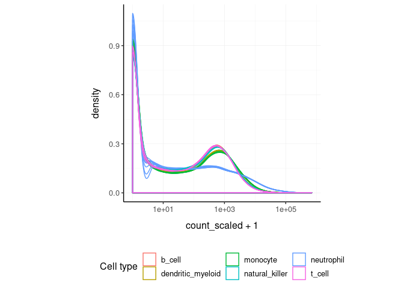
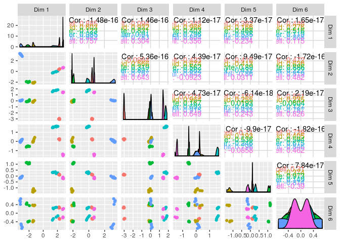
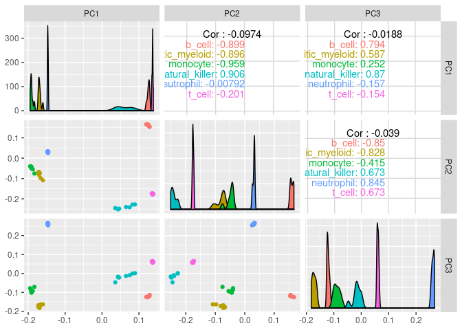
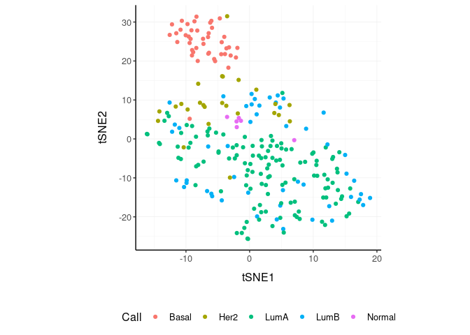
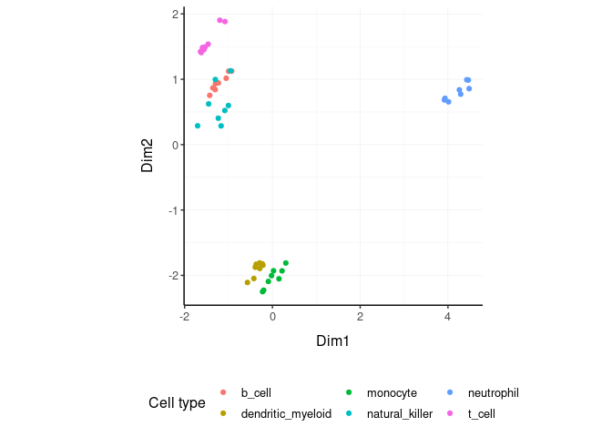
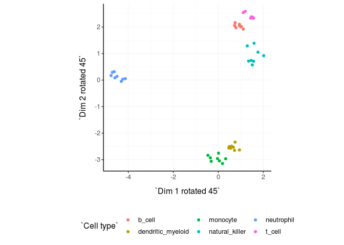
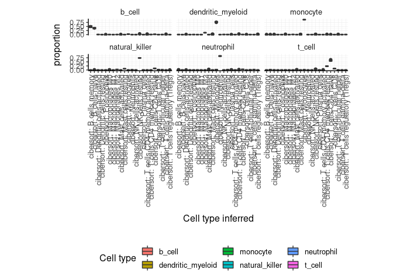
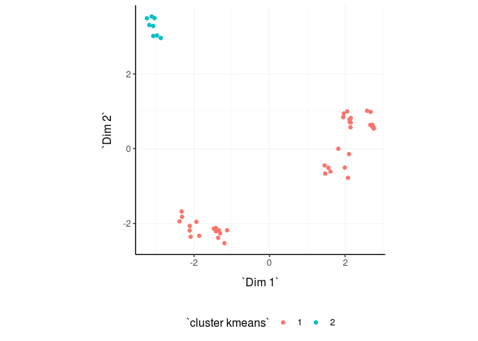
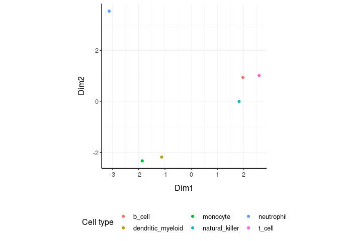
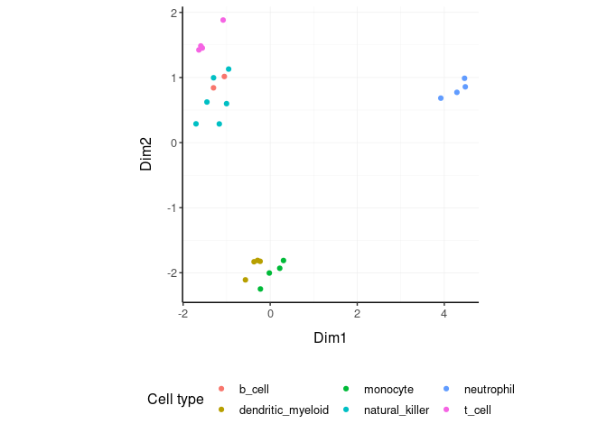

tidybulk - part of tidyTranscriptomics
================

**Brings transcriptomics to the tidyverse\!**

# 

<!-- badges: start -->
[](https://www.tidyverse.org/lifecycle/#maturing)
<!-- badges: end -->

<!---

[](https://travis-ci.org/stemangiola/tidybulk) [](https://coveralls.io/github/stemangiola/tidybulk?branch=master)

-->

## Functions/utilities available

| Function                       | Description                                                           |
| ------------------------------ | --------------------------------------------------------------------- |
| `aggregate_duplicates`         | Aggregate robustly abundance and annotation of duplicated transcripts |
| `scale_abundance`              | Scale (normalise) abundance for RNA requencing depth                  |
| `reduce_dimensions`            | Perform dimensionality reduction (PCA, MDS, tSNE)                     |
| `cluster_elements`             | Labels elements with cluster identity (kmeans, SNN)                   |
| `remove_redundancy`            | Filter out elements with highly correlated features                   |
| `adjust_abundance`             | Remove known unwanted variation (Combat)                              |
| `test_differential_abundance`  | Differenatial abundance testing (DE)                                  |
| `deconvolve_cellularity`       | Estimated tissue composition (Cibersort)                              |
| `keep_variable`                | Filter top variable features                                          |
| `keep_abundant`                | Filter out lowly abundant transcripts                                 |
| `test_gene_enrichment`         | Gene enrichment analyses (EGSEA)                                      |
| `test_gene_overrepresentation` | Gene enrichment on list of transcript names (no rank)                 |
| `impute_abundance`             | Impute abundance for missing data points using sample groupings       |

| Utilities           | Description                                |
| ------------------- | ------------------------------------------ |
| `tidybulk`          | add tidybulk attributes to a tibble object |
| `tidybulk_SAM_BAM`  | Convert SAM BAM files into tidybulk tibble |
| `pivot_sample`      | Select sample-wise columns/information     |
| `pivot_transcript`  | Select transcript-wise columns/information |
| `rotate_dimensions` | Rotate two dimensions of a degree          |
| `ensembl_to_symbol` | Add gene symbol from ensembl IDs           |
| `symbol_to_entrez`  | Add entrez ID from gene symbol             |

## Minimal input data frame

| sample          | transcript      | abundance | annotation |
| --------------- | --------------- | --------- | ---------- |
| `chr` or `fctr` | `chr` or `fctr` | `integer` | …          |

## Output data frame

| sample          | transcript      | abundance | annotation | new information |
| --------------- | --------------- | --------- | ---------- | --------------- |
| `chr` or `fctr` | `chr` or `fctr` | `integer` | …          | …               |

All functions are also directly compatible with `SummarizedExperiment`
object as well.

## Installation

From Bioconductor

``` r
BiocManager::install("tidybulk")
```

From Github

``` r
devtools::install_github("stemangiola/tidybulk@dev")
```

## Create `tidybulk` tibble. It memorises key column names

``` r
tt = counts %>% tidybulk(sample, transcript, count)
```

## Aggregate duplicated `transcripts`

tidybulk provide the `aggregate_duplicates` function to aggregate
duplicated transcripts (e.g., isoforms, ensembl). For example, we often
have to convert ensembl symbols to gene/transcript symbol, but in doing
so we have to deal with duplicates. `aggregate_duplicates` takes a
tibble and column names (as symbols; for `sample`, `transcript` and
`count`) as arguments and returns a tibble with aggregate transcript
with the same name. All the rest of the column are appended, and factors
and boolean are appended as characters.

<div class="column-left">

TidyTranscriptomics

``` r yellow
tt.aggr = tt %>% aggregate_duplicates()
```

</div>

<div class="column-right">

Standard procedure (comparative purpose)

``` r
temp = data.frame(
    symbol = dge_list$genes$symbol,
    dge_list$counts
)
dge_list.nr <- by(temp, temp$symbol,
    function(df)
        if(length(df[1,1])>0)
            matrixStats:::colSums(as.matrix(df[,-1]))
)
dge_list.nr <- do.call("rbind", dge_list.nr)
colnames(dge_list.nr) <- colnames(dge_list)
```

</div>

<div style="clear:both;">

</div>

## Scale `counts`

We may want to compensate for sequencing depth, scaling the transcript
abundance (e.g., with TMM algorithm, Robinson and Oshlack
doi.org/10.1186/gb-2010-11-3-r25). `scale_abundance` takes a tibble,
column names (as symbols; for `sample`, `transcript` and `count`) and a
method as arguments and returns a tibble with additional columns with
scaled data as `<NAME OF COUNT COLUMN>_scaled`.

<div class="column-left">

TidyTranscriptomics

``` r
tt.norm = tt.aggr %>% scale_abundance()
```

</div>

<div class="column-right">

Standard procedure (comparative purpose)

``` r
library(edgeR)

myCPM <- cpm(count_m)
keep <- rowSums(myCPM > 0.5) >= 2
count_m.keep <- count_m[keep,]
[...]
dgList <- calcNormFactors(dgList, method="TMM")
dgList <- estimateCommonDisp(dgList)
dgList <- estimateTagwiseDisp(dgList)
norm_counts.table <- t(
    t(count_m)*
        (dgList$samples$norm.factors)
)
```

</div>

<div style="clear:both;">

</div>

We can easily plot the scaled density to check the scaling outcome. On
the x axis we have the log scaled counts, on the y axes we have the
density, data is grouped by sample and coloured by cell type.

``` r
tt.norm %>%
    ggplot(aes(count_scaled + 1, group=sample, color=`Cell type`)) +
    geom_density() +
    scale_x_log10() +
    my_theme
```

<!-- -->

## Filter `variable transcripts`

We may want to identify and filter variable transcripts.

<div class="column-left">

TidyTranscriptomics

``` r
tt.norm.variable = tt.norm %>% keep_variable()
```

    ## Getting the 500 most variable genes

</div>

<div class="column-right">

Standard procedure (comparative purpose)

``` r
library(edgeR)

x = norm_counts.table

s <- rowMeans((x-rowMeans(x))^2)
o <- order(s,decreasing=TRUE)
x <- x[o[1L:top],,drop=FALSE]

norm_counts.table = norm_counts.table[rownames(x)]

norm_counts.table$cell_type = tidybulk::counts[
    match(
        tidybulk::counts$sample,
        rownames(norm_counts.table)
    ),
    "Cell type"
]
```

</div>

<div style="clear:both;">

</div>

## Reduce `dimensions`

We may want to reduce the dimensions of our data, for example using PCA
or MDS algorithms. `reduce_dimensions` takes a tibble, column names (as
symbols; for `sample`, `transcript` and `count`) and a method (e.g., MDS
or PCA) as arguments and returns a tibble with additional columns for
the reduced dimensions.

**MDS** (Robinson et al., 10.1093/bioinformatics/btp616)

<div class="column-left">

TidyTranscriptomics

``` r
tt.norm.MDS =
  tt.norm %>%
  reduce_dimensions(method="MDS", .dims = 6)
```

</div>

<div class="column-right">

Standard procedure (comparative purpose)

``` r
library(limma)

count_m_log = log(count_m + 1)
cmds = limma::plotMDS(ndim = .dims, plot = FALSE)

cmds = cmds %$% 
    cmdscale.out %>%
    setNames(sprintf("Dim%s", 1:6))

cmds$cell_type = tidybulk::counts[
    match(tidybulk::counts$sample, rownames(cmds)),
    "Cell type"
]
```

</div>

<div style="clear:both;">

</div>

On the x and y axes axis we have the reduced dimensions 1 to 3, data is
coloured by cell
type.

``` r
tt.norm.MDS %>% pivot_sample()  %>% select(contains("Dim"), everything())
```

    ## # A tibble: 48 x 15
    ##       Dim1   Dim2    Dim3     Dim4    Dim5   Dim6 sample `Cell type` time 
    ##      <dbl>  <dbl>   <dbl>    <dbl>   <dbl>  <dbl> <chr>  <chr>       <chr>
    ##  1 -1.52    0.559 -2.06    0.111    0.125  -0.239 SRR17… b_cell      0 d  
    ##  2 -1.51    0.548 -2.08    0.0950   0.0942 -0.230 SRR17… b_cell      1 d  
    ##  3 -1.49    0.519 -2.00    0.136    0.102  -0.229 SRR17… b_cell      3 d  
    ##  4 -1.50    0.527 -2.04    0.157    0.0953 -0.196 SRR17… b_cell      7 d  
    ##  5  0.150  -1.84   0.0708 -0.0425  -0.781  -0.207 SRR17… dendritic_… 0 d  
    ##  6  0.0907 -1.82   0.0922 -0.00628 -0.704  -0.205 SRR17… dendritic_… 1 d  
    ##  7  0.161  -1.82   0.0301 -0.0586  -0.940  -0.179 SRR17… dendritic_… 3 d  
    ##  8  0.0450 -1.84   0.0818 -0.00920 -0.714  -0.184 SRR17… dendritic_… 7 d  
    ##  9  0.407  -1.95   0.200  -0.315    0.742  -0.209 SRR17… monocyte    0 d  
    ## 10  0.412  -1.90   0.198  -0.300    0.728  -0.186 SRR17… monocyte    1 d  
    ## # … with 38 more rows, and 6 more variables: condition <chr>, batch <dbl>,
    ## #   factor_of_interest <chr>, `merged transcripts` <dbl>, TMM <dbl>,
    ## #   multiplier <dbl>

``` r
tt.norm.MDS %>%
    pivot_sample() %>%
  GGally::ggpairs(columns = 10:15, ggplot2::aes(colour=`Cell type`))
```

<!-- -->

**PCA**

<div class="column-left">

TidyTranscriptomics

``` r
tt.norm.PCA =
  tt.norm %>%
  reduce_dimensions(method="PCA", .dims = 6)
```

</div>

<div class="column-right">

Standard procedure (comparative purpose)

``` r
count_m_log = log(count_m + 1)
pc = count_m_log %>% prcomp(scale = TRUE)
variance = pc$sdev^2
variance = (variance / sum(variance))[1:6]
pc$cell_type = counts[
    match(counts$sample, rownames(pc)),
    "Cell type"
]
```

</div>

<div style="clear:both;">

</div>

On the x and y axes axis we have the reduced dimensions 1 to 3, data is
coloured by cell type.

``` r
tt.norm.PCA %>% pivot_sample() %>% select(contains("PC"), everything())
```

    ## # A tibble: 48 x 15
    ##       PC1     PC2    PC3    PC4    PC5   PC6 sample `Cell type` time  condition
    ##     <dbl>   <dbl>  <dbl>  <dbl>  <dbl> <dbl> <chr>  <chr>       <chr> <chr>    
    ##  1  0.130  0.137  -0.155 0.247  0.0594 0.129 SRR17… b_cell      0 d   TRUE     
    ##  2  0.128  0.139  -0.156 0.251  0.0525 0.127 SRR17… b_cell      1 d   TRUE     
    ##  3  0.129  0.137  -0.158 0.247  0.0488 0.128 SRR17… b_cell      3 d   TRUE     
    ##  4  0.129  0.139  -0.159 0.247  0.0511 0.126 SRR17… b_cell      7 d   TRUE     
    ##  5 -0.175 -0.0641 -0.180 0.0217 0.0930 0.143 SRR17… dendritic_… 0 d   FALSE    
    ##  6 -0.174 -0.0792 -0.174 0.0224 0.0923 0.135 SRR17… dendritic_… 1 d   FALSE    
    ##  7 -0.171 -0.0710 -0.178 0.0240 0.109  0.135 SRR17… dendritic_… 3 d   FALSE    
    ##  8 -0.172 -0.0724 -0.183 0.0218 0.0890 0.142 SRR17… dendritic_… 7 d   FALSE    
    ##  9 -0.195 -0.0447 -0.104 0.0321 0.0539 0.117 SRR17… monocyte    0 d   FALSE    
    ## 10 -0.189 -0.0607 -0.101 0.0364 0.0929 0.119 SRR17… monocyte    1 d   FALSE    
    ## # … with 38 more rows, and 5 more variables: batch <dbl>,
    ## #   factor_of_interest <chr>, `merged transcripts` <dbl>, TMM <dbl>,
    ## #   multiplier <dbl>

``` r
tt.norm.PCA %>%
     pivot_sample() %>%
  GGally::ggpairs(columns = 10:12, ggplot2::aes(colour=`Cell type`))
```

<!-- -->

**tSNE**

<div class="column-left">

TidyTranscriptomics

``` r
tt.norm.tSNE =
    breast_tcga_mini %>%
    tidybulk(       sample, ens, count_scaled) %>%
    reduce_dimensions(
        method = "tSNE",
        perplexity=10,
        pca_scale =TRUE
    )
```

</div>

<div class="column-right">

Standard procedure (comparative purpose)

``` r
count_m_log = log(count_m + 1)

tsne = Rtsne::Rtsne(
    t(count_m_log),
    perplexity=10,
        pca_scale =TRUE
)$Y
tsne$cell_type = tidybulk::counts[
    match(tidybulk::counts$sample, rownames(tsne)),
    "Cell type"
]
```

</div>

<div style="clear:both;">

</div>

Plot

``` r
tt.norm.tSNE %>%
    pivot_sample() %>%
    select(contains("tSNE"), everything()) 
```

    ## # A tibble: 251 x 4
    ##     tSNE1  tSNE2 sample                       Call 
    ##     <dbl>  <dbl> <chr>                        <fct>
    ##  1   9.42  -4.39 TCGA-A1-A0SD-01A-11R-A115-07 LumA 
    ##  2  -7.03  -2.09 TCGA-A1-A0SF-01A-11R-A144-07 LumA 
    ##  3  14.1  -15.6  TCGA-A1-A0SG-01A-11R-A144-07 LumA 
    ##  4   4.31   3.75 TCGA-A1-A0SH-01A-11R-A084-07 LumA 
    ##  5   5.61  -2.10 TCGA-A1-A0SI-01A-11R-A144-07 LumB 
    ##  6  -4.11   3.76 TCGA-A1-A0SJ-01A-11R-A084-07 LumA 
    ##  7 -30.9    7.92 TCGA-A1-A0SK-01A-12R-A084-07 Basal
    ##  8   2.92  13.0  TCGA-A1-A0SM-01A-11R-A084-07 LumA 
    ##  9   2.09  11.3  TCGA-A1-A0SN-01A-11R-A144-07 LumB 
    ## 10  21.4  -11.7  TCGA-A1-A0SQ-01A-21R-A144-07 LumA 
    ## # … with 241 more rows

``` r
tt.norm.tSNE %>%
    pivot_sample() %>%
    ggplot(aes(x = `tSNE1`, y = `tSNE2`, color=Call)) + geom_point() + my_theme
```

<!-- -->

## Rotate `dimensions`

We may want to rotate the reduced dimensions (or any two numeric columns
really) of our data, of a set angle. `rotate_dimensions` takes a tibble,
column names (as symbols; for `sample`, `transcript` and `count`) and an
angle as arguments and returns a tibble with additional columns for the
rotated dimensions. The rotated dimensions will be added to the original
data set as `<NAME OF DIMENSION> rotated <ANGLE>` by default, or as
specified in the input arguments.

<div class="column-left">

TidyTranscriptomics

``` r
tt.norm.MDS.rotated =
  tt.norm.MDS %>%
    rotate_dimensions(`Dim1`, `Dim2`, rotation_degrees = 45, action="get")
```

</div>

<div class="column-right">

Standard procedure (comparative purpose)

``` r
rotation = function(m, d) {
    r = d * pi / 180
    ((bind_rows(
        c(`1` = cos(r), `2` = -sin(r)),
        c(`1` = sin(r), `2` = cos(r))
    ) %>% as_matrix) %*% m)
}
mds_r = pca %>% rotation(rotation_degrees)
mds_r$cell_type = counts[
    match(counts$sample, rownames(mds_r)),
    "Cell type"
]
```

</div>

<div style="clear:both;">

</div>

**Original** On the x and y axes axis we have the first two reduced
dimensions, data is coloured by cell type.

``` r
tt.norm.MDS.rotated %>%
    ggplot(aes(x=`Dim1`, y=`Dim2`, color=`Cell type` )) +
  geom_point() +
  my_theme
```

<!-- -->

**Rotated** On the x and y axes axis we have the first two reduced
dimensions rotated of 45 degrees, data is coloured by cell type.

``` r
tt.norm.MDS.rotated %>%
    ggplot(aes(x=`Dim1 rotated 45`, y=`Dim2 rotated 45`, color=`Cell type` )) +
  geom_point() +
  my_theme
```

<!-- -->

## Test `differential abundance`

We may want to test for differential transcription between sample-wise
factors of interest (e.g., with edgeR). `test_differential_abundance`
takes a tibble, column names (as symbols; for `sample`, `transcript` and
`count`) and a formula representing the desired linear model as
arguments and returns a tibble with additional columns for the
statistics from the hypothesis test (e.g., log fold change, p-value and
false discovery rate).

<div class="column-left">

TidyTranscriptomics

``` r
tt.de =
    tt %>%
    test_differential_abundance( ~ condition, action="get")
tt.de
```

</div>

<div class="column-right">

Standard procedure (comparative purpose)

``` r
library(edgeR)

design =
        model.matrix(
            object = .formula,
            data = df_for_edgeR
        )

DGEList(counts = counts) %>%
        calcNormFactors(method = "TMM") %>%
        estimateGLMCommonDisp(design) %>%
        estimateGLMTagwiseDisp(design) %>%
        glmFit(design) %>%
        glmLRT(coef = 2) %>%
        topTags(n = 999999) %$%
        table
```

</div>

<div style="clear:both;">

</div>

The functon `test_differential_abundance` operated with contrasts too.
The constrasts hve the name of the design matrix (generally
<NAME_COLUMN_COVARIATE><VALUES_OF_COVARIATE>)

``` r
tt.de =
    tt %>%
    test_differential_abundance(
        ~ 0 + condition,                  
        .contrasts = c( "conditionTRUE - conditionFALSE"),
        action="get"
    )
```

## Adjust `counts`

We may want to adjust `counts` for (known) unwanted variation.
`adjust_abundance` takes as arguments a tibble, column names (as
symbols; for `sample`, `transcript` and `count`) and a formula
representing the desired linear model where the first covariate is the
factor of interest and the second covariate is the unwanted variation,
and returns a tibble with additional columns for the adjusted counts as
`<COUNT COLUMN>_adjusted`. At the moment just an unwanted covariated is
allowed at a time.

<div class="column-left">

TidyTranscriptomics

``` r
tt.norm.adj =
    tt.norm %>% adjust_abundance(   ~ factor_of_interest + batch)
```

</div>

<div class="column-right">

Standard procedure (comparative purpose)

``` r
library(sva)

count_m_log = log(count_m + 1)

design =
        model.matrix(
            object = ~ factor_of_interest + batch,
            data = annotation
        )

count_m_log.sva =
    ComBat(
            batch = design[,2],
            mod = design,
            ...
        )

count_m_log.sva = ceiling(exp(count_m_log.sva) -1)
count_m_log.sva$cell_type = counts[
    match(counts$sample, rownames(count_m_log.sva)),
    "Cell type"
]
```

</div>

<div style="clear:both;">

</div>

## Deconvolve `Cell type composition`

We may want to infer the cell type composition of our samples (with the
algorithm Cibersort; Newman et al., 10.1038/nmeth.3337).
`deconvolve_cellularity` takes as arguments a tibble, column names (as
symbols; for `sample`, `transcript` and `count`) and returns a tibble
with additional columns for the adjusted cell type proportions.

<div class="column-left">

TidyTranscriptomics

``` r
tt.cibersort =
    tt %>%
    deconvolve_cellularity(action="get", cores=2)
```

</div>

<div class="column-right">

Standard procedure (comparative purpose)

``` r
source(‘CIBERSORT.R’)
count_m %>% write.table("mixture_file.txt")
results <- CIBERSORT(
    "sig_matrix_file.txt",
    "mixture_file.txt",
    perm=100, QN=TRUE
)
results$cell_type = tidybulk::counts[
    match(tidybulk::counts$sample, rownames(results)),
    "Cell type"
]
```

</div>

<div style="clear:both;">

</div>

With the new annotated data frame, we can plot the distributions of cell
types across samples, and compare them with the nominal cell type labels
to check for the purity of isolation. On the x axis we have the cell
types inferred by Cibersort, on the y axis we have the inferred
proportions. The data is facetted and coloured by nominal cell types
(annotation given by the researcher after FACS sorting).

``` r
tt.cibersort %>%
    select(contains("cibersort:"), everything()) %>%
    gather(`Cell type inferred`, `proportion`, 1:22) %>%
  ggplot(aes(x=`Cell type inferred`, y=proportion, fill=`Cell type`)) +
  geom_boxplot() +
  facet_wrap(~`Cell type`) +
  my_theme +
  theme(axis.text.x = element_text(angle = 90, hjust = 1, vjust = 0.5), aspect.ratio=1/5)
```

<!-- -->

## Cluster `samples`

We may want to cluster our data (e.g., using k-means sample-wise).
`cluster_elements` takes as arguments a tibble, column names (as
symbols; for `sample`, `transcript` and `count`) and returns a tibble
with additional columns for the cluster annotation. At the moment only
k-means clustering is supported, the plan is to introduce more
clustering methods.

**k-means**

<div class="column-left">

TidyTranscriptomics

``` r
tt.norm.cluster = tt.norm.MDS %>%
  cluster_elements(method="kmeans", centers = 2, action="get" )
```

</div>

<div class="column-right">

Standard procedure (comparative purpose)

``` r
count_m_log = log(count_m + 1)

k = kmeans(count_m_log, iter.max = 1000, ...)
cluster = k$cluster

cluster$cell_type = tidybulk::counts[
    match(tidybulk::counts$sample, rownames(cluster)),
    c("Cell type", "Dim1", "Dim2")
]
```

</div>

<div style="clear:both;">

</div>

We can add cluster annotation to the MDS dimesion reduced data set and
plot.

``` r
 tt.norm.cluster %>%
    ggplot(aes(x=`Dim1`, y=`Dim2`, color=`cluster kmeans`)) +
  geom_point() +
  my_theme
```

<!-- -->

**SNN**

<div class="column-left">

TidyTranscriptomics

``` r
tt.norm.SNN =
    tt.norm.tSNE %>%
    cluster_elements(method = "SNN")
```

</div>

<div class="column-right">

Standard procedure (comparative purpose)

``` r
library(Seurat)

snn = CreateSeuratObject(count_m)
snn = ScaleData(
    snn, display.progress = TRUE,
    num.cores=4, do.par = TRUE
)
snn = FindVariableFeatures(snn, selection.method = "vst")
snn = FindVariableFeatures(snn, selection.method = "vst")
snn = RunPCA(snn, npcs = 30)
snn = FindNeighbors(snn)
snn = FindClusters(snn, method = "igraph", ...)
snn = snn[["seurat_clusters"]]

snn$cell_type = tidybulk::counts[
    match(tidybulk::counts$sample, rownames(snn)),
    c("Cell type", "Dim1", "Dim2")
]
```

</div>

<div style="clear:both;">

</div>

``` r
tt.norm.SNN %>%
    pivot_sample() %>%
    select(contains("tSNE"), everything()) 
```

    ## # A tibble: 251 x 5
    ##     tSNE1  tSNE2 sample                       Call  `cluster SNN`
    ##     <dbl>  <dbl> <chr>                        <fct> <fct>        
    ##  1   9.42  -4.39 TCGA-A1-A0SD-01A-11R-A115-07 LumA  0            
    ##  2  -7.03  -2.09 TCGA-A1-A0SF-01A-11R-A144-07 LumA  2            
    ##  3  14.1  -15.6  TCGA-A1-A0SG-01A-11R-A144-07 LumA  1            
    ##  4   4.31   3.75 TCGA-A1-A0SH-01A-11R-A084-07 LumA  0            
    ##  5   5.61  -2.10 TCGA-A1-A0SI-01A-11R-A144-07 LumB  0            
    ##  6  -4.11   3.76 TCGA-A1-A0SJ-01A-11R-A084-07 LumA  1            
    ##  7 -30.9    7.92 TCGA-A1-A0SK-01A-12R-A084-07 Basal 3            
    ##  8   2.92  13.0  TCGA-A1-A0SM-01A-11R-A084-07 LumA  2            
    ##  9   2.09  11.3  TCGA-A1-A0SN-01A-11R-A144-07 LumB  2            
    ## 10  21.4  -11.7  TCGA-A1-A0SQ-01A-21R-A144-07 LumA  1            
    ## # … with 241 more rows

``` r
tt.norm.SNN %>%
    pivot_sample() %>%
    gather(source, Call, c("cluster SNN", "Call")) %>%
    distinct() %>%
    ggplot(aes(x = `tSNE1`, y = `tSNE2`, color=Call)) + geom_point() + facet_grid(~source) + my_theme
```

<!-- -->

``` r
# Do differential transcription between clusters
tt.norm.SNN %>%
    mutate(factor_of_interest = `cluster SNN` == 3) %>%
    test_differential_abundance(
    ~ factor_of_interest,
    action="get"
   )
```

    ## # A tibble: 500 x 8
    ##    ens           logFC logCPM    LR   PValue      FDR significant lowly_abundant
    ##    <chr>         <dbl>  <dbl> <dbl>    <dbl>    <dbl> <lgl>       <lgl>         
    ##  1 ENSG00000186…  6.17   7.99  446. 4.54e-99 2.27e-96 TRUE        FALSE         
    ##  2 ENSG00000111…  2.94   9.64  407. 1.32e-90 3.30e-88 TRUE        FALSE         
    ##  3 ENSG00000181…  7.93   9.12  380. 1.15e-84 1.92e-82 TRUE        FALSE         
    ##  4 ENSG00000140…  2.69   9.54  359. 3.65e-80 4.57e-78 TRUE        FALSE         
    ##  5 ENSG00000065…  1.59  10.2   329. 1.85e-73 1.85e-71 TRUE        FALSE         
    ##  6 ENSG00000137…  3.88   8.28  319. 2.16e-71 1.80e-69 TRUE        FALSE         
    ##  7 ENSG00000124…  4.66   8.62  305. 3.37e-68 2.41e-66 TRUE        FALSE         
    ##  8 ENSG00000196…  4.92   7.04  291. 3.24e-65 2.03e-63 TRUE        FALSE         
    ##  9 ENSG00000092…  2.91   8.40  263. 3.37e-59 1.87e-57 TRUE        FALSE         
    ## 10 ENSG00000094…  4.85   9.22  258. 4.11e-58 2.06e-56 TRUE        FALSE         
    ## # … with 490 more rows

## Drop `redundant` transcripts

We may want to remove redundant elements from the original data set
(e.g., samples or transcripts), for example if we want to define
cell-type specific signatures with low sample redundancy.
`remove_redundancy` takes as arguments a tibble, column names (as
symbols; for `sample`, `transcript` and `count`) and returns a tibble
dropped recundant elements (e.g., samples). Two redundancy estimation
approaches are supported:

  - removal of highly correlated clusters of elements (keeping a
    representative) with method=“correlation”
  - removal of most proximal element pairs in a reduced dimensional
    space.

**Approach 1**

<div class="column-left">

TidyTranscriptomics

``` r
tt.norm.non_redundant =
    tt.norm.MDS %>%
  remove_redundancy(    method = "correlation" )
```

    ## Getting the 19544 most variable genes

</div>

<div class="column-right">

Standard procedure (comparative purpose)

``` r
library(widyr)

.data.correlated =
    pairwise_cor(
        counts,
        sample,
        transcript,
        rc,
        sort = TRUE,
        diag = FALSE,
        upper = FALSE
    ) %>%
    filter(correlation > correlation_threshold) %>%
    distinct(item1) %>%
    rename(!!.element := item1)

# Return non redudant data frame
counts %>% anti_join(.data.correlated) %>%
    spread(sample, rc, - transcript) %>%
    left_join(annotation)
```

</div>

<div style="clear:both;">

</div>

We can visualise how the reduced redundancy with the reduced dimentions
look like

``` r
tt.norm.non_redundant %>%
    pivot_sample() %>%
    ggplot(aes(x=`Dim1`, y=`Dim2`, color=`Cell type`)) +
  geom_point() +
  my_theme
```

<!-- -->

**Approach 2**

``` r
tt.norm.non_redundant =
    tt.norm.MDS %>%
  remove_redundancy(
    method = "reduced_dimensions",
    Dim_a_column = `Dim1`,
    Dim_b_column = `Dim2`
  )
```

We can visualise MDS reduced dimensions of the samples with the closest
pair removed.

``` r
tt.norm.non_redundant %>%
    pivot_sample() %>%
    ggplot(aes(x=`Dim1`, y=`Dim2`, color=`Cell type`)) +
  geom_point() +
  my_theme
```

<!-- -->

## Other useful wrappers

The above wrapper streamline the most common processing of bulk RNA
sequencing data. Other useful wrappers are listed above.

## From BAM/SAM to tibble of gene counts

We can calculate gene counts (using FeatureCounts; Liao Y et al.,
10.1093/nar/gkz114) from a list of BAM/SAM files and format them into a
tidy structure (similar to counts).

``` r
counts = tidybulk_SAM_BAM(
    file_names,
    genome = "hg38",
    isPairedEnd = TRUE,
    requireBothEndsMapped = TRUE,
    checkFragLength = FALSE,
    useMetaFeatures = TRUE
)
```

## From ensembl IDs to gene symbol IDs

We can add gene symbols from ensembl identifiers. This is useful since
different resources use ensembl IDs while others use gene symbol IDs.

``` r
counts_ensembl %>% ensembl_to_symbol(ens)
```

    ## # A tibble: 119 x 8
    ##    ens   iso   `read count` sample cases_0_project… cases_0_samples… transcript
    ##    <chr> <chr>        <dbl> <chr>  <chr>            <chr>            <chr>     
    ##  1 ENSG… 13             144 TARGE… Acute Myeloid L… Primary Blood D… TSPAN6    
    ##  2 ENSG… 13              72 TARGE… Acute Myeloid L… Primary Blood D… TSPAN6    
    ##  3 ENSG… 13               0 TARGE… Acute Myeloid L… Primary Blood D… TSPAN6    
    ##  4 ENSG… 13            1099 TARGE… Acute Myeloid L… Primary Blood D… TSPAN6    
    ##  5 ENSG… 13              11 TARGE… Acute Myeloid L… Primary Blood D… TSPAN6    
    ##  6 ENSG… 13               2 TARGE… Acute Myeloid L… Primary Blood D… TSPAN6    
    ##  7 ENSG… 13               3 TARGE… Acute Myeloid L… Primary Blood D… TSPAN6    
    ##  8 ENSG… 13            2678 TARGE… Acute Myeloid L… Primary Blood D… TSPAN6    
    ##  9 ENSG… 13             751 TARGE… Acute Myeloid L… Primary Blood D… TSPAN6    
    ## 10 ENSG… 13               1 TARGE… Acute Myeloid L… Primary Blood D… TSPAN6    
    ## # … with 109 more rows, and 1 more variable: ref_genome <chr>

## ADD versus GET versus ONLY modes

Every function takes a tidytranscriptomics structured data as input, and
(i) with action=“add” outputs the new information joint to the original
input data frame (default), (ii) with action=“get” the new information
with the sample or transcript relative informatin depending on what the
analysis is about, or (iii) with action=“only” just the new information.
For example, from this data set

``` r
  tt.norm
```

    ## # A tibble: 938,112 x 13
    ##    sample transcript `Cell type` count time  condition batch factor_of_inter…
    ##    <chr>  <chr>      <chr>       <dbl> <chr> <chr>     <dbl> <chr>           
    ##  1 SRR17… A1BG       b_cell        153 0 d   TRUE          0 TRUE            
    ##  2 SRR17… A1BG-AS1   b_cell         83 0 d   TRUE          0 TRUE            
    ##  3 SRR17… A2M-AS1    b_cell          0 0 d   TRUE          0 TRUE            
    ##  4 SRR17… A2ML1      b_cell          3 0 d   TRUE          0 TRUE            
    ##  5 SRR17… A2MP1      b_cell          0 0 d   TRUE          0 TRUE            
    ##  6 SRR17… A3GALT2    b_cell          0 0 d   TRUE          0 TRUE            
    ##  7 SRR17… A4GALT     b_cell          4 0 d   TRUE          0 TRUE            
    ##  8 SRR17… A4GNT      b_cell          0 0 d   TRUE          0 TRUE            
    ##  9 SRR17… AA06       b_cell          0 0 d   TRUE          0 TRUE            
    ## 10 SRR17… AAAS       b_cell        868 0 d   TRUE          0 TRUE            
    ## # … with 938,102 more rows, and 5 more variables: `merged transcripts` <dbl>,
    ## #   count_scaled <dbl>, TMM <dbl>, multiplier <dbl>, lowly_abundant <lgl>

**action=“add”** (Default) We can add the MDS dimensions to the original
data set

``` r
  tt.norm %>%
    reduce_dimensions(
        .abundance = count_scaled,
        method="MDS" ,
        .element = sample,
        .feature = transcript,
        .dims = 3,
        action="add"
    )
```

    ## # A tibble: 938,112 x 16
    ##    sample transcript `Cell type` count time  condition batch factor_of_inter…
    ##    <chr>  <chr>      <chr>       <dbl> <chr> <chr>     <dbl> <chr>           
    ##  1 SRR17… A1BG       b_cell        153 0 d   TRUE          0 TRUE            
    ##  2 SRR17… A1BG-AS1   b_cell         83 0 d   TRUE          0 TRUE            
    ##  3 SRR17… A2M-AS1    b_cell          0 0 d   TRUE          0 TRUE            
    ##  4 SRR17… A2ML1      b_cell          3 0 d   TRUE          0 TRUE            
    ##  5 SRR17… A2MP1      b_cell          0 0 d   TRUE          0 TRUE            
    ##  6 SRR17… A3GALT2    b_cell          0 0 d   TRUE          0 TRUE            
    ##  7 SRR17… A4GALT     b_cell          4 0 d   TRUE          0 TRUE            
    ##  8 SRR17… A4GNT      b_cell          0 0 d   TRUE          0 TRUE            
    ##  9 SRR17… AA06       b_cell          0 0 d   TRUE          0 TRUE            
    ## 10 SRR17… AAAS       b_cell        868 0 d   TRUE          0 TRUE            
    ## # … with 938,102 more rows, and 8 more variables: `merged transcripts` <dbl>,
    ## #   count_scaled <dbl>, TMM <dbl>, multiplier <dbl>, lowly_abundant <lgl>,
    ## #   Dim1 <dbl>, Dim2 <dbl>, Dim3 <dbl>

**action=“get”** We can add the MDS dimensions to the original data set
selecting just the sample-wise column

``` r
  tt.norm %>%
    reduce_dimensions(
        .abundance = count_scaled,
        method="MDS" ,
        .element = sample,
        .feature = transcript,
        .dims = 3,
        action="get"
    )
```

    ## # A tibble: 48 x 12
    ##    sample `Cell type` time  condition batch factor_of_inter… `merged transcr…
    ##    <chr>  <chr>       <chr> <chr>     <dbl> <chr>                       <dbl>
    ##  1 SRR17… b_cell      0 d   TRUE          0 TRUE                            1
    ##  2 SRR17… b_cell      1 d   TRUE          1 TRUE                            1
    ##  3 SRR17… b_cell      3 d   TRUE          1 TRUE                            1
    ##  4 SRR17… b_cell      7 d   TRUE          1 TRUE                            1
    ##  5 SRR17… dendritic_… 0 d   FALSE         0 FALSE                           1
    ##  6 SRR17… dendritic_… 1 d   FALSE         0 FALSE                           1
    ##  7 SRR17… dendritic_… 3 d   FALSE         1 FALSE                           1
    ##  8 SRR17… dendritic_… 7 d   FALSE         0 FALSE                           1
    ##  9 SRR17… monocyte    0 d   FALSE         1 FALSE                           1
    ## 10 SRR17… monocyte    1 d   FALSE         1 FALSE                           1
    ## # … with 38 more rows, and 5 more variables: TMM <dbl>, multiplier <dbl>,
    ## #   Dim1 <dbl>, Dim2 <dbl>, Dim3 <dbl>

**action=“only”** We can get just the MDS dimensions relative to each
sample

``` r
  tt.norm %>%
    reduce_dimensions(
        .abundance = count_scaled,
        method="MDS" ,
        .element = sample,
        .feature = transcript,
        .dims = 3,
        action="only"
    )
```

    ## # A tibble: 48 x 4
    ##    sample        Dim1   Dim2    Dim3
    ##    <chr>        <dbl>  <dbl>   <dbl>
    ##  1 SRR1740034 -1.52    0.559 -2.06  
    ##  2 SRR1740035 -1.51    0.548 -2.08  
    ##  3 SRR1740036 -1.49    0.519 -2.00  
    ##  4 SRR1740037 -1.50    0.527 -2.04  
    ##  5 SRR1740038  0.150  -1.84   0.0708
    ##  6 SRR1740039  0.0907 -1.82   0.0922
    ##  7 SRR1740040  0.161  -1.82   0.0301
    ##  8 SRR1740041  0.0450 -1.84   0.0818
    ##  9 SRR1740042  0.407  -1.95   0.200 
    ## 10 SRR1740043  0.412  -1.90   0.198 
    ## # … with 38 more rows
