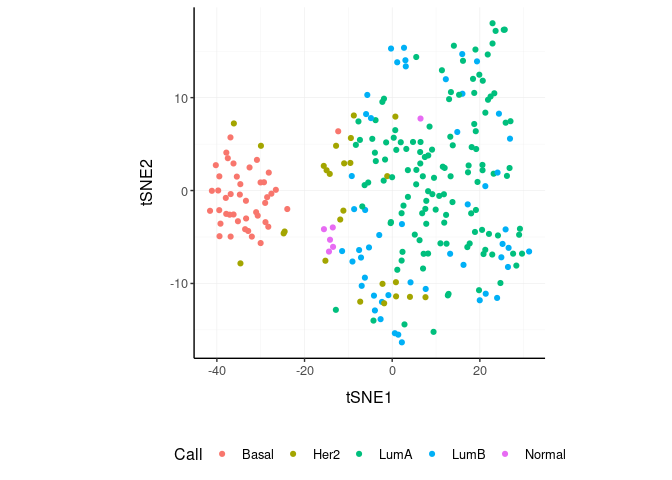
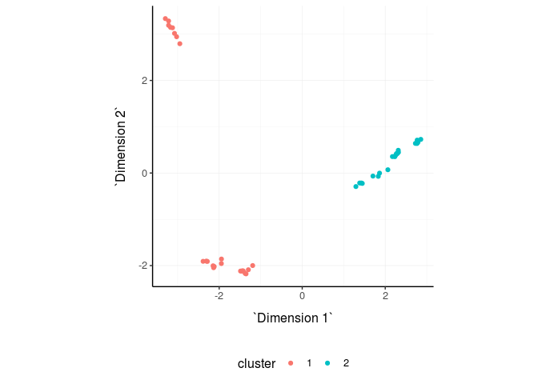

tidyTranscriptomics (tidyT) - beta
================

A user-firendly grammar of bulk RNA sequencing data explaration and
processing

# 

A user-firendly grammar of bulk RNA sequencing data explaration and
processing; which allows the use of a consistent data structure, in a
tidy and pipe-friendly fashion. In brief you can easily pipe thought:

  - Going from BAM/SAM to a tidy data frame of counts (FeatureCounts)
  - Adding gene symbols from ensembl IDs
  - Aggregating duplicated gene symbols
  - Adding normalised counts
  - Adding principal components
  - Adding MDS components
  - Rotating principal component or MDS dimensions
  - Running differential transcript abunance analyses (edgeR)
  - Adding batch adjusted read counts (Combat)
  - Eliminating redunant samples and/or genes
  - Clustering samples and/or genes with kmeans
  - Adding tissue composition (Cibersort)

The grammar verbs:

  - drop\_
  - aggregate\_
  - recuce\_
  - noralise\_
  - adjust\_
  - annotate\_

Data structure management:

with the “action” parameter you can decide whether to join the new
information to the input tibble (add), or just get the non-redundant
tibble with the new information (get).

You can convert a list of BAM/SAM files into a tidy data frame of
annotated counts

``` r
counts = bam_sam_to_featureCounts_tibble(file_names, genome = "hg38")
```

We can add transcript from ensembl indexes if needed

``` r
counts_ensembl %>% annotate_symbol(ens)
```

With an example data set of this kind (included in the package)

``` r
counts # Accessible via tidyTranscriptomics::counts
```

    ## # A tibble: 1,340,160 x 5
    ##    sample     transcript   `Cell type` `read count` time 
    ##    <chr>      <chr>        <chr>              <dbl> <chr>
    ##  1 SRR1740034 DDX11L1      b_cell                17 0 d  
    ##  2 SRR1740034 WASH7P       b_cell              3568 0 d  
    ##  3 SRR1740034 MIR6859-1    b_cell                57 0 d  
    ##  4 SRR1740034 MIR1302-2    b_cell                 1 0 d  
    ##  5 SRR1740034 FAM138A      b_cell                 0 0 d  
    ##  6 SRR1740034 OR4F5        b_cell                 0 0 d  
    ##  7 SRR1740034 LOC729737    b_cell              1764 0 d  
    ##  8 SRR1740034 LOC102725121 b_cell                11 0 d  
    ##  9 SRR1740034 WASH9P       b_cell              3590 0 d  
    ## 10 SRR1740034 MIR6859-2    b_cell                40 0 d  
    ## # … with 1,340,150 more rows

We can aggregate (e.g., sum) duplicated gene symbols

``` r
counts.aggr = 
  counts %>%
  aggregate_duplicates(sample, transcript, `read count`,  aggregation_function = sum)

counts.aggr
```

    ## # A tibble: 1,340,160 x 6
    ##    sample   transcript  `Cell type` `read count` time  `number of merged t…
    ##    <chr>    <chr>       <chr>              <dbl> <chr>                <dbl>
    ##  1 SRR1740… DDX11L1     b_cell                17 0 d                      1
    ##  2 SRR1740… WASH7P      b_cell              3568 0 d                      1
    ##  3 SRR1740… MIR6859-1   b_cell                57 0 d                      1
    ##  4 SRR1740… MIR1302-2   b_cell                 1 0 d                      1
    ##  5 SRR1740… FAM138A     b_cell                 0 0 d                      1
    ##  6 SRR1740… OR4F5       b_cell                 0 0 d                      1
    ##  7 SRR1740… LOC729737   b_cell              1764 0 d                      1
    ##  8 SRR1740… LOC1027251… b_cell                11 0 d                      1
    ##  9 SRR1740… WASH9P      b_cell              3590 0 d                      1
    ## 10 SRR1740… MIR6859-2   b_cell                40 0 d                      1
    ## # … with 1,340,150 more rows

We can add normalised
counts

``` r
counts.norm =  counts.aggr %>% normalise_counts(sample, transcript, `read count`)
counts.norm
```

    ## # A tibble: 1,340,160 x 10
    ##    sample transcript `Cell type` `read count` time  `number of merg…
    ##    <chr>  <chr>      <chr>              <dbl> <chr>            <dbl>
    ##  1 SRR17… A1BG       b_cell               153 0 d                  1
    ##  2 SRR17… A1BG-AS1   b_cell                83 0 d                  1
    ##  3 SRR17… A1CF       b_cell                 1 0 d                  1
    ##  4 SRR17… A2M        b_cell                 1 0 d                  1
    ##  5 SRR17… A2M-AS1    b_cell                 0 0 d                  1
    ##  6 SRR17… A2ML1      b_cell                 3 0 d                  1
    ##  7 SRR17… A2MP1      b_cell                 0 0 d                  1
    ##  8 SRR17… A3GALT2    b_cell                 0 0 d                  1
    ##  9 SRR17… A4GALT     b_cell                 4 0 d                  1
    ## 10 SRR17… A4GNT      b_cell                 0 0 d                  1
    ## # … with 1,340,150 more rows, and 4 more variables: `read count
    ## #   normalised` <dbl>, TMM <dbl>, multiplier <dbl>,
    ## #   filtered_out_low_counts <lgl>

``` r
counts.norm %>% ggplot(aes(`read count normalised` + 1, group=sample, color=`Cell type`)) + geom_density() + scale_x_log10() + my_theme
```

<!-- -->

We can add MDS components, then use them for plotting or other post
processing

``` r
counts.norm.MDS = 
  counts.norm %>%
  reduce_dimensions(value_column = `read count normalised`, method="MDS" , elements_column = sample, feature_column = transcript)
counts.norm.MDS
```

    ## # A tibble: 1,340,160 x 12
    ##    sample transcript `Cell type` `read count` time  `number of merg…
    ##    <chr>  <chr>      <chr>              <dbl> <chr>            <dbl>
    ##  1 SRR17… A1BG       b_cell               153 0 d                  1
    ##  2 SRR17… A1BG-AS1   b_cell                83 0 d                  1
    ##  3 SRR17… A1CF       b_cell                 1 0 d                  1
    ##  4 SRR17… A2M        b_cell                 1 0 d                  1
    ##  5 SRR17… A2M-AS1    b_cell                 0 0 d                  1
    ##  6 SRR17… A2ML1      b_cell                 3 0 d                  1
    ##  7 SRR17… A2MP1      b_cell                 0 0 d                  1
    ##  8 SRR17… A3GALT2    b_cell                 0 0 d                  1
    ##  9 SRR17… A4GALT     b_cell                 4 0 d                  1
    ## 10 SRR17… A4GNT      b_cell                 0 0 d                  1
    ## # … with 1,340,150 more rows, and 6 more variables: `read count
    ## #   normalised` <dbl>, TMM <dbl>, multiplier <dbl>,
    ## #   filtered_out_low_counts <lgl>, `Dimension 1` <dbl>, `Dimension
    ## #   2` <dbl>

``` r
counts.norm.MDS %>% 
    distinct(sample, `Dimension 1`, `Dimension 2`, `Cell type`) %>%
    ggplot(aes(x=`Dimension 1`, y=`Dimension 2`, color=`Cell type`)) + 
  geom_point() +
  my_theme
```

<!-- -->

There are cases where we may want to rotate two dimensions (e.g., when a
factor of interest is correlated - diagonally - with a linear
combination of two dimensions)

``` r
counts.norm.MDS.rotated =
  counts.norm.MDS %>%
    rotate_dimensions(`Dimension 1`, `Dimension 2`, rotation_degrees = 45, elements_column = sample)
```

``` r
counts.norm.MDS.rotated %>%
    distinct(sample, `Dimension 1 rotated 45`,`Dimension 2 rotated 45`, `Cell type`) %>%
    ggplot(aes(x=`Dimension 1 rotated 45`, y=`Dimension 2 rotated 45`, color=`Cell type` )) + 
  geom_point() +
  my_theme
```

<!-- -->

We visualise the combinations of the first N Dimensions for an overall
evaluation

``` r
counts.norm %>%
 reduce_dimensions(value_column = `read count normalised`, method="MDS" , elements_column = sample, feature_column = transcript, components = 1:6) %>%
  select(contains("Dimension"), everything()) %>%
  distinct() %>%
  GGally::ggpairs(columns = 1:6, ggplot2::aes(colour=`Cell type`)) 
```

<!-- -->

We can remove highly correlated samples and see how the MDS plot looks
like

``` r
counts.norm.MDS %>% 
  drop_redundant(method = "correlation", elements_column = sample, feature_column = transcript, value_column = `read count normalised`) %>%
    distinct(sample, `Dimension 1`, `Dimension 2`, `Cell type`) %>%
    ggplot(aes(x=`Dimension 1`, y=`Dimension 2`, color=`Cell type`)) + 
  geom_point() +
  my_theme
```

<!-- -->

We can add K-means cluster labels, then use them for plotting or other
post processing

``` r
counts.norm.MDS.kmeans = counts.norm.MDS %>%
  annotate_clusters(value_column = `read count normalised`, elements_column = sample, feature_column = transcript,  number_of_clusters = 2 )

counts.norm.MDS.kmeans
```

    ## # A tibble: 1,340,160 x 13
    ##    sample transcript `Cell type` `read count` time  `number of merg…
    ##    <chr>  <chr>      <chr>              <dbl> <chr>            <dbl>
    ##  1 SRR17… A1BG       b_cell               153 0 d                  1
    ##  2 SRR17… A1BG-AS1   b_cell                83 0 d                  1
    ##  3 SRR17… A1CF       b_cell                 1 0 d                  1
    ##  4 SRR17… A2M        b_cell                 1 0 d                  1
    ##  5 SRR17… A2M-AS1    b_cell                 0 0 d                  1
    ##  6 SRR17… A2ML1      b_cell                 3 0 d                  1
    ##  7 SRR17… A2MP1      b_cell                 0 0 d                  1
    ##  8 SRR17… A3GALT2    b_cell                 0 0 d                  1
    ##  9 SRR17… A4GALT     b_cell                 4 0 d                  1
    ## 10 SRR17… A4GNT      b_cell                 0 0 d                  1
    ## # … with 1,340,150 more rows, and 7 more variables: `read count
    ## #   normalised` <dbl>, TMM <dbl>, multiplier <dbl>,
    ## #   filtered_out_low_counts <lgl>, `Dimension 1` <dbl>, `Dimension
    ## #   2` <dbl>, cluster <fct>

``` r
counts.norm.MDS.kmeans %>% 
    distinct(sample, `Dimension 1`, `Dimension 2`, cluster) %>%
    ggplot(aes(x=`Dimension 1`, y=`Dimension 2`, color=cluster)) + 
  geom_point() +
  my_theme
```

<!-- -->

We can annotate our tibble with differential transcription analysis
results

``` r
counts.norm.MDS.kmeans %>%
    annotate_differential_transcription( ~ cluster, sample, transcript, `read count`, action="get") 
```

    ## # A tibble: 27,920 x 8
    ##    transcript logFC logCPM    LR    PValue       FDR is_de filtered_out_lo…
    ##    <chr>      <dbl>  <dbl> <dbl>     <dbl>     <dbl> <lgl> <lgl>           
    ##  1 ZNF827      7.37   3.78  984. 5.10e-216 8.06e-212 TRUE  FALSE           
    ##  2 SLC31A2    -5.18   6.60  974. 6.63e-214 5.24e-210 TRUE  FALSE           
    ##  3 SEPT1       6.31   6.70  970. 6.20e-213 3.27e-209 TRUE  FALSE           
    ##  4 CLUHP3      8.62   3.56  935. 2.11e-205 8.35e-202 TRUE  FALSE           
    ##  5 MCTP1      -4.71   5.37  843. 3.06e-185 9.67e-182 TRUE  FALSE           
    ##  6 DMXL2      -6.07   8.12  751. 2.63e-165 6.92e-162 TRUE  FALSE           
    ##  7 LINC00426   7.21   2.49  717. 6.31e-158 1.43e-154 TRUE  FALSE           
    ##  8 LDOC1       6.86   2.54  707. 1.03e-155 2.03e-152 TRUE  FALSE           
    ##  9 CASP17P     7.18   2.20  705. 2.40e-155 4.22e-152 TRUE  FALSE           
    ## 10 SIDT1       5.02   5.40  696. 2.28e-153 3.61e-150 TRUE  FALSE           
    ## # … with 27,910 more rows

For visualisation purposes, we can add the batch adjusted read counts;
to see the data with the linear model eyes in case the batch is one of
the covariates

``` r
counts.norm.MDS.kmeans %>%
  
  # Add fake batch
  left_join( (.) %>% distinct(sample) %>% mutate(batch = sample(0:1, n(), replace = T))) %>%
    
  # Add covariate
  adjust_counts( ~ cluster + batch, sample, transcript, `read count normalised`)
```

    ## Standardizing Data across genes

    ## # A tibble: 1,340,160 x 16
    ##    sample transcript `Cell type` `read count` time  `number of merg…
    ##    <chr>  <chr>      <chr>              <dbl> <chr>            <dbl>
    ##  1 SRR17… A1BG       b_cell               153 0 d                  1
    ##  2 SRR17… A1BG-AS1   b_cell                83 0 d                  1
    ##  3 SRR17… A1CF       b_cell                 1 0 d                  1
    ##  4 SRR17… A2M        b_cell                 1 0 d                  1
    ##  5 SRR17… A2M-AS1    b_cell                 0 0 d                  1
    ##  6 SRR17… A2ML1      b_cell                 3 0 d                  1
    ##  7 SRR17… A2MP1      b_cell                 0 0 d                  1
    ##  8 SRR17… A3GALT2    b_cell                 0 0 d                  1
    ##  9 SRR17… A4GALT     b_cell                 4 0 d                  1
    ## 10 SRR17… A4GNT      b_cell                 0 0 d                  1
    ## # … with 1,340,150 more rows, and 10 more variables: `read count
    ## #   normalised` <dbl>, TMM <dbl>, multiplier <dbl>,
    ## #   filtered_out_low_counts.x <lgl>, `Dimension 1` <dbl>, `Dimension
    ## #   2` <dbl>, cluster <fct>, batch <int>, `read count normalised
    ## #   adjusted` <int>, filtered_out_low_counts.y <lgl>

We can add the predictions from Cibersort to each
sample

``` r
counts.cibersort = counts %>% annotate_cell_type(sample, transcript, `read count`, action="add") 
counts.cibersort
```

    ## # A tibble: 29,483,520 x 7
    ##    sample transcript `Cell type.x` `read count` time  `Cell type.y`
    ##    <chr>  <chr>      <chr>                <dbl> <chr> <chr>        
    ##  1 SRR17… DDX11L1    b_cell                  17 0 d   B cells naive
    ##  2 SRR17… DDX11L1    b_cell                  17 0 d   B cells memo…
    ##  3 SRR17… DDX11L1    b_cell                  17 0 d   Plasma cells 
    ##  4 SRR17… DDX11L1    b_cell                  17 0 d   T cells CD8  
    ##  5 SRR17… DDX11L1    b_cell                  17 0 d   T cells CD4 …
    ##  6 SRR17… DDX11L1    b_cell                  17 0 d   T cells CD4 …
    ##  7 SRR17… DDX11L1    b_cell                  17 0 d   T cells CD4 …
    ##  8 SRR17… DDX11L1    b_cell                  17 0 d   T cells foll…
    ##  9 SRR17… DDX11L1    b_cell                  17 0 d   T cells regu…
    ## 10 SRR17… DDX11L1    b_cell                  17 0 d   T cells gamm…
    ## # … with 29,483,510 more rows, and 1 more variable: proportion <dbl>

And plot the distributions of cell types across samples

``` r
counts.cibersort %>%
  rename(`Cell type experimental` = `Cell type.x`, `Cell type estimated` = `Cell type.y`) %>%
  distinct(sample, `Cell type experimental`, `Cell type estimated`, proportion) %>%
  ggplot(aes(x=`Cell type estimated`, y=proportion, fill=`Cell type experimental`)) + 
  geom_boxplot() + 
  facet_wrap(~`Cell type experimental`) +
  my_theme + 
  theme(axis.text.x = element_text(angle = 90, hjust = 1, vjust = 0.5), aspect.ratio=1/5)
```

<!-- -->
