tidybulk - part of tidyTranscriptomics
================

**Brings transcriptomics to the tidyverse\!** (SEO: tidy differential
expression)

# 

<!-- badges: start -->
[](https://www.tidyverse.org/lifecycle/#maturing)
<!-- badges: end -->

website:
[stemangiola.github.io/tidybulk/](http://stemangiola.github.io/tidybulk/)

Please have a look also to

  - [nanny](https://github.com/stemangiola/nanny) for tidy high-level
    data analysis and manipulation
  - [tidygate](https://github.com/stemangiola/tidygate) for adding
    custom gate information to your tibble
  - [tidyHeatmap](https://github.com/stemangiola/tidyHeatmap) for
    heatmaps produced with tidy principles

<!---

[](https://travis-ci.org/stemangiola/tidybulk) [](https://coveralls.io/github/stemangiola/tidybulk?branch=master)

-->

**IMPORTANT\!** From version 1.1.6, the detection of abundant/lowly
abundant transcripts has to be done explicitly
(**identify\_abundant()**; you will be warned otherwise). This because,
it is better to make each function do one thing only, without
hidden/implicit procedures (as stated in the tidy data manifesto). This
improves logical flow, and software modularity.

## Functions/utilities available

| Function                        | Description                                                                  |
| ------------------------------- | ---------------------------------------------------------------------------- |
| `aggregate_duplicates`          | Aggregate abundance and annotation of duplicated transcripts in a robust way |
| `scale_abundance`               | Scale (normalise) abundance for RNA sequencing depth                         |
| `reduce_dimensions`             | Perform dimensionality reduction (PCA, MDS, tSNE)                            |
| `cluster_elements`              | Labels elements with cluster identity (kmeans, SNN)                          |
| `remove_redundancy`             | Filter out elements with highly correlated features                          |
| `adjust_abundance`              | Remove known unwanted variation (Combat)                                     |
| `test_differential_abundance`   | Differential transcript abundance testing (DE)                               |
| `deconvolve_cellularity`        | Estimated tissue composition (Cibersort or llsr)                             |
| `test_differential_cellularity` | Differential cell-type abundance testing                                     |
| `keep_variable`                 | Filter for top variable features                                             |
| `keep_abundant`                 | Filter out lowly abundant transcripts                                        |
| `test_gene_enrichment`          | Gene enrichment analyses (EGSEA)                                             |
| `test_gene_overrepresentation`  | Gene enrichment on list of transcript names (no rank)                        |

| Utilities                  | Description                                                     |
| -------------------------- | --------------------------------------------------------------- |
| `get_bibliography`         | Get the bibliography of your workflow                           |
| `tidybulk`                 | add tidybulk attributes to a tibble object                      |
| `tidybulk_SAM_BAM`         | Convert SAM BAM files into tidybulk tibble                      |
| `pivot_sample`             | Select sample-wise columns/information                          |
| `pivot_transcript`         | Select transcript-wise columns/information                      |
| `rotate_dimensions`        | Rotate two dimensions of a degree                               |
| `ensembl_to_symbol`        | Add gene symbol from ensembl IDs                                |
| `symbol_to_entrez`         | Add entrez ID from gene symbol                                  |
| `describe_transcript`      | Add gene description from gene symbol                           |
| `impute_missing_abundance` | Impute abundance for missing data points using sample groupings |
| `fill_missing_abundance`   | Fill abundance for missing data points using an arbitrary value |

## Minimal input data frame

| sample          | transcript      | abundance | annotation |
| --------------- | --------------- | --------- | ---------- |
| `chr` or `fctr` | `chr` or `fctr` | `integer` | …          |

## Output data frame

| sample          | transcript      | abundance | annotation | new information |
| --------------- | --------------- | --------- | ---------- | --------------- |
| `chr` or `fctr` | `chr` or `fctr` | `integer` | …          | …               |

All functions are also directly compatible with `SummarizedExperiment`
object.

## Installation

From Bioconductor

``` r
BiocManager::install("tidybulk")
```

From Github

``` r
devtools::install_github("stemangiola/tidybulk")
```

## Create `tidybulk` tibble.

It memorises key column names

``` r
tt = counts %>% tidybulk(sample, transcript, count)
```

## Get the bibliography of your workflow

First of all, you can cite all articles utilised within your workflow
automatically from any tidybulk tibble

``` r
tt %>%
    # call analysis functions
    get_bibliography()
```

## Aggregate duplicated `transcripts`

tidybulk provide the `aggregate_duplicates` function to aggregate
duplicated transcripts (e.g., isoforms, ensembl). For example, we often
have to convert ensembl symbols to gene/transcript symbol, but in doing
so we have to deal with duplicates. `aggregate_duplicates` takes a
tibble and column names (as symbols; for `sample`, `transcript` and
`count`) as arguments and returns a tibble with transcripts with the
same name aggregated. All the rest of the columns are appended, and
factors and boolean are appended as characters.

<div class="column-left">

TidyTranscriptomics

``` r yellow
tt.aggr = tt %>% aggregate_duplicates()
```

</div>

<div class="column-right">

Standard procedure (comparative purpose)

``` r
temp = data.frame(
    symbol = dge_list$genes$symbol,
    dge_list$counts
)
dge_list.nr <- by(temp, temp$symbol,
    function(df)
        if(length(df[1,1])>0)
            matrixStats:::colSums(as.matrix(df[,-1]))
)
dge_list.nr <- do.call("rbind", dge_list.nr)
colnames(dge_list.nr) <- colnames(dge_list)
```

</div>

<div style="clear:both;">

</div>

## Scale `counts`

We may want to compensate for sequencing depth, scaling the transcript
abundance (e.g., with TMM algorithm, Robinson and Oshlack
doi.org/10.1186/gb-2010-11-3-r25). `scale_abundance` takes a tibble,
column names (as symbols; for `sample`, `transcript` and `count`) and a
method as arguments and returns a tibble with additional columns with
scaled data as `<NAME OF COUNT COLUMN>_scaled`.

<div class="column-left">

TidyTranscriptomics

``` r
tt.norm = tt.aggr %>% identify_abundant(factor_of_interest = condition) %>% scale_abundance()
```

</div>

<div class="column-right">

Standard procedure (comparative purpose)

``` r
library(edgeR)

dgList <- DGEList(count_m=x,group=group)
keep <- filterByExpr(dgList)
dgList <- dgList[keep,,keep.lib.sizes=FALSE]
[...]
dgList <- calcNormFactors(dgList, method="TMM")
norm_counts.table <- cpm(dgList)
```

</div>

<div style="clear:both;">

</div>

We can easily plot the scaled density to check the scaling outcome. On
the x axis we have the log scaled counts, on the y axes we have the
density, data is grouped by sample and coloured by cell type.

``` r
tt.norm %>%
    ggplot(aes(count_scaled + 1, group=sample, color=`Cell type`)) +
    geom_density() +
    scale_x_log10() +
    my_theme
```

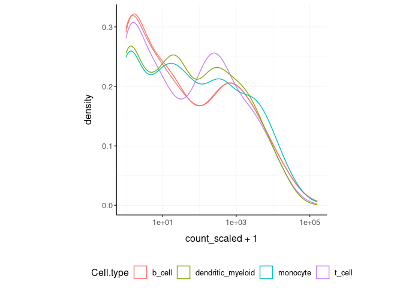<!-- -->

## Filter `variable transcripts`

We may want to identify and filter variable transcripts.

<div class="column-left">

TidyTranscriptomics

``` r
tt.norm.variable = tt.norm %>% keep_variable()
```

</div>

<div class="column-right">

Standard procedure (comparative purpose)

``` r
library(edgeR)

x = norm_counts.table

s <- rowMeans((x-rowMeans(x))^2)
o <- order(s,decreasing=TRUE)
x <- x[o[1L:top],,drop=FALSE]

norm_counts.table = norm_counts.table[rownames(x)]

norm_counts.table$cell_type = tidybulk::counts[
    match(
        tidybulk::counts$sample,
        rownames(norm_counts.table)
    ),
    "Cell type"
]
```

</div>

<div style="clear:both;">

</div>

## Reduce `dimensions`

We may want to reduce the dimensions of our data, for example using PCA
or MDS algorithms. `reduce_dimensions` takes a tibble, column names (as
symbols; for `sample`, `transcript` and `count`) and a method (e.g., MDS
or PCA) as arguments and returns a tibble with additional columns for
the reduced dimensions.

**MDS** (Robinson et al., 10.1093/bioinformatics/btp616)

<div class="column-left">

TidyTranscriptomics

``` r
tt.norm.MDS =
  tt.norm %>%
  reduce_dimensions(method="MDS", .dims = 6)
```

</div>

<div class="column-right">

Standard procedure (comparative purpose)

``` r
library(limma)

count_m_log = log(count_m + 1)
cmds = limma::plotMDS(ndim = .dims, plot = FALSE)

cmds = cmds %$% 
    cmdscale.out %>%
    setNames(sprintf("Dim%s", 1:6))

cmds$cell_type = tidybulk::counts[
    match(tidybulk::counts$sample, rownames(cmds)),
    "Cell type"
]
```

</div>

<div style="clear:both;">

</div>

On the x and y axes axis we have the reduced dimensions 1 to 3, data is
coloured by cell type.

``` r
tt.norm.MDS %>% pivot_sample()  %>% select(contains("Dim"), everything())
```

    ## # A tibble: 48 x 15
    ##     Dim1  Dim2   Dim3    Dim4    Dim5   Dim6 sample `Cell type` time  condition
    ##    <dbl> <dbl>  <dbl>   <dbl>   <dbl>  <dbl> <chr>  <chr>       <chr> <chr>    
    ##  1  2.31  1.87 -2.73   0.108   0.0918 -0.515 SRR17… b_cell      0 d   TRUE     
    ##  2  2.30  1.88 -2.77   0.119   0.116  -0.490 SRR17… b_cell      1 d   TRUE     
    ##  3  2.27  1.83 -2.73   0.169   0.121  -0.481 SRR17… b_cell      3 d   TRUE     
    ##  4  2.29  1.87 -2.78   0.166   0.0763 -0.471 SRR17… b_cell      7 d   TRUE     
    ##  5 -1.50 -1.79 -1.01  -0.171  -1.25   -0.516 SRR17… dendritic_… 0 d   FALSE    
    ##  6 -1.45 -1.87 -0.925 -0.0722 -1.15   -0.534 SRR17… dendritic_… 1 d   FALSE    
    ##  7 -1.46 -1.79 -0.989 -0.230  -1.42   -0.503 SRR17… dendritic_… 3 d   FALSE    
    ##  8 -1.41 -1.88 -0.981 -0.123  -1.23   -0.511 SRR17… dendritic_… 7 d   FALSE    
    ##  9 -2.07 -1.71 -0.936 -0.445   1.16   -0.519 SRR17… monocyte    0 d   FALSE    
    ## 10 -1.88 -1.69 -0.788 -0.561   1.15   -0.512 SRR17… monocyte    1 d   FALSE    
    ## # … with 38 more rows, and 5 more variables: batch <dbl>,
    ## #   factor_of_interest <chr>, `merged transcripts` <dbl>, TMM <dbl>,
    ## #   multiplier <dbl>

``` r
tt.norm.MDS %>%
    pivot_sample() %>%
  GGally::ggpairs(columns = 10:15, ggplot2::aes(colour=`Cell type`))
```

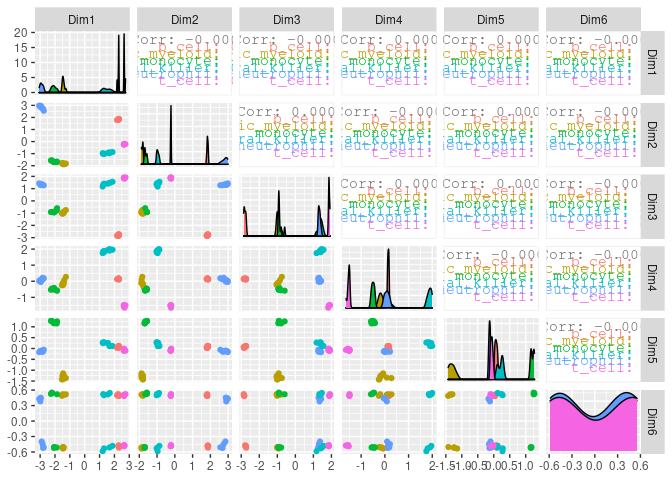<!-- -->

**PCA**

<div class="column-left">

TidyTranscriptomics

``` r
tt.norm.PCA =
  tt.norm %>%
  reduce_dimensions(method="PCA", .dims = 6)
```

</div>

<div class="column-right">

Standard procedure (comparative purpose)

``` r
count_m_log = log(count_m + 1)
pc = count_m_log %>% prcomp(scale = TRUE)
variance = pc$sdev^2
variance = (variance / sum(variance))[1:6]
pc$cell_type = counts[
    match(counts$sample, rownames(pc)),
    "Cell type"
]
```

</div>

<div style="clear:both;">

</div>

On the x and y axes axis we have the reduced dimensions 1 to 3, data is
coloured by cell type.

``` r
tt.norm.PCA %>% pivot_sample() %>% select(contains("PC"), everything())
```

    ## # A tibble: 48 x 15
    ##      PC1      PC2    PC3     PC4     PC5   PC6 sample `Cell type` time 
    ##    <dbl>    <dbl>  <dbl>   <dbl>   <dbl> <dbl> <chr>  <chr>       <chr>
    ##  1 -17.3 -20.4    -0.745 -0.205   0.0756 -3.05 SRR17… b_cell      0 d  
    ##  2 -17.4 -20.6    -0.580 -0.558  -0.139  -2.91 SRR17… b_cell      1 d  
    ##  3 -17.1 -20.0    -0.345 -1.08   -0.220  -3.02 SRR17… b_cell      3 d  
    ##  4 -17.4 -20.7    -0.484 -0.713  -0.0373 -3.01 SRR17… b_cell      7 d  
    ##  5  12.1  -0.778  10.8    0.537   5.09   -2.17 SRR17… dendritic_… 0 d  
    ##  6  11.8   0.0561 11.0    0.0632  4.77   -2.13 SRR17… dendritic_… 1 d  
    ##  7  11.8  -0.652  10.7    0.808   5.81   -1.94 SRR17… dendritic_… 3 d  
    ##  8  11.5  -0.565  11.1    0.0806  4.86   -2.22 SRR17… dendritic_… 7 d  
    ##  9  16.7  -1.20    8.18   2.38   -4.28   -2.85 SRR17… monocyte    0 d  
    ## 10  15.1  -0.247   8.00   2.68   -4.40   -3.17 SRR17… monocyte    1 d  
    ## # … with 38 more rows, and 6 more variables: condition <chr>, batch <dbl>,
    ## #   factor_of_interest <chr>, `merged transcripts` <dbl>, TMM <dbl>,
    ## #   multiplier <dbl>

``` r
tt.norm.PCA %>%
     pivot_sample() %>%
  GGally::ggpairs(columns = 10:12, ggplot2::aes(colour=`Cell type`))
```

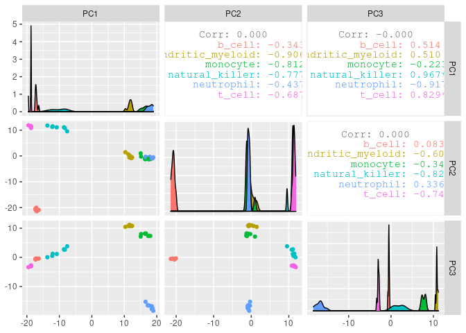<!-- -->

**tSNE**

<div class="column-left">

TidyTranscriptomics

``` r
tt.norm.tSNE =
    breast_tcga_mini %>%
    tidybulk(       sample, ens, count_scaled) %>%
    identify_abundant() %>%
    reduce_dimensions(
        method = "tSNE",
        perplexity=10,
        pca_scale =TRUE
    )
```

</div>

<div class="column-right">

Standard procedure (comparative purpose)

``` r
count_m_log = log(count_m + 1)

tsne = Rtsne::Rtsne(
    t(count_m_log),
    perplexity=10,
        pca_scale =TRUE
)$Y
tsne$cell_type = tidybulk::counts[
    match(tidybulk::counts$sample, rownames(tsne)),
    "Cell type"
]
```

</div>

<div style="clear:both;">

</div>

Plot

``` r
tt.norm.tSNE %>%
    pivot_sample() %>%
    select(contains("tSNE"), everything()) 
```

    ## # A tibble: 251 x 4
    ##      tSNE1  tSNE2 sample                       Call 
    ##      <dbl>  <dbl> <chr>                        <fct>
    ##  1   9.36    7.99 TCGA-A1-A0SD-01A-11R-A115-07 LumA 
    ##  2  -9.20    2.81 TCGA-A1-A0SF-01A-11R-A144-07 LumA 
    ##  3  14.6    16.0  TCGA-A1-A0SG-01A-11R-A144-07 LumA 
    ##  4   5.10   -9.53 TCGA-A1-A0SH-01A-11R-A084-07 LumA 
    ##  5   6.18    6.32 TCGA-A1-A0SI-01A-11R-A144-07 LumB 
    ##  6  -0.550  13.1  TCGA-A1-A0SJ-01A-11R-A084-07 LumA 
    ##  7 -37.6    -4.31 TCGA-A1-A0SK-01A-12R-A084-07 Basal
    ##  8  -2.72  -17.1  TCGA-A1-A0SM-01A-11R-A084-07 LumA 
    ##  9  -2.66  -15.1  TCGA-A1-A0SN-01A-11R-A144-07 LumB 
    ## 10  21.8    12.9  TCGA-A1-A0SQ-01A-21R-A144-07 LumA 
    ## # … with 241 more rows

``` r
tt.norm.tSNE %>%
    pivot_sample() %>%
    ggplot(aes(x = `tSNE1`, y = `tSNE2`, color=Call)) + geom_point() + my_theme
```

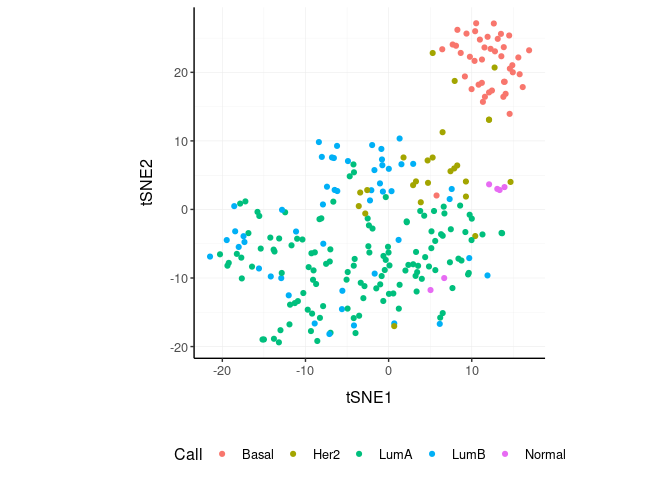<!-- -->

## Rotate `dimensions`

We may want to rotate the reduced dimensions (or any two numeric columns
really) of our data, of a set angle. `rotate_dimensions` takes a tibble,
column names (as symbols; for `sample`, `transcript` and `count`) and an
angle as arguments and returns a tibble with additional columns for the
rotated dimensions. The rotated dimensions will be added to the original
data set as `<NAME OF DIMENSION> rotated <ANGLE>` by default, or as
specified in the input arguments.

<div class="column-left">

TidyTranscriptomics

``` r
tt.norm.MDS.rotated =
  tt.norm.MDS %>%
    rotate_dimensions(`Dim1`, `Dim2`, rotation_degrees = 45, action="get")
```

</div>

<div class="column-right">

Standard procedure (comparative purpose)

``` r
rotation = function(m, d) {
    r = d * pi / 180
    ((bind_rows(
        c(`1` = cos(r), `2` = -sin(r)),
        c(`1` = sin(r), `2` = cos(r))
    ) %>% as_matrix) %*% m)
}
mds_r = pca %>% rotation(rotation_degrees)
mds_r$cell_type = counts[
    match(counts$sample, rownames(mds_r)),
    "Cell type"
]
```

</div>

<div style="clear:both;">

</div>

**Original** On the x and y axes axis we have the first two reduced
dimensions, data is coloured by cell type.

``` r
tt.norm.MDS.rotated %>%
    ggplot(aes(x=`Dim1`, y=`Dim2`, color=`Cell type` )) +
  geom_point() +
  my_theme
```

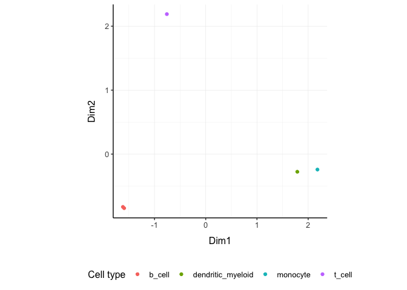<!-- -->

**Rotated** On the x and y axes axis we have the first two reduced
dimensions rotated of 45 degrees, data is coloured by cell type.

``` r
tt.norm.MDS.rotated %>%
    ggplot(aes(x=`Dim1 rotated 45`, y=`Dim2 rotated 45`, color=`Cell type` )) +
  geom_point() +
  my_theme
```

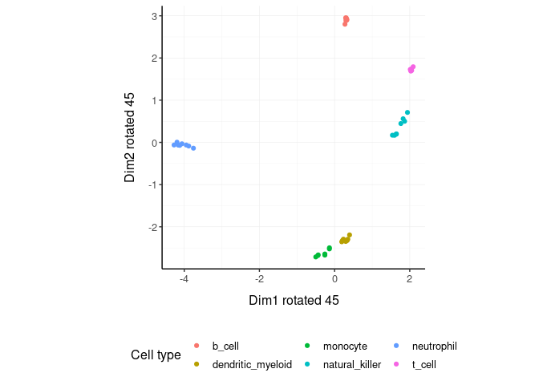<!-- -->

## Test `differential abundance`

We may want to test for differential transcription between sample-wise
factors of interest (e.g., with edgeR). `test_differential_abundance`
takes a tibble, column names (as symbols; for `sample`, `transcript` and
`count`) and a formula representing the desired linear model as
arguments and returns a tibble with additional columns for the
statistics from the hypothesis test (e.g., log fold change, p-value and
false discovery rate).

<div class="column-left">

TidyTranscriptomics

``` r
tt.de =
    tt %>%
    test_differential_abundance( ~ condition, action="get")
tt.de
```

</div>

<div class="column-right">

Standard procedure (comparative purpose)

``` r
library(edgeR)

dgList <- DGEList(counts=counts_m,group=group)
keep <- filterByExpr(dgList)
dgList <- dgList[keep,,keep.lib.sizes=FALSE]
dgList <- calcNormFactors(dgList)
design <- model.matrix(~group)
dgList <- estimateDisp(dgList,design)
fit <- glmQLFit(dgList,design)
qlf <- glmQLFTest(fit,coef=2)
topTags(qlf, n=Inf)
```

</div>

<div style="clear:both;">

</div>

The functon `test_differential_abundance` operated with contrasts too.
The constrasts hve the name of the design matrix (generally
<NAME_COLUMN_COVARIATE><VALUES_OF_COVARIATE>)

``` r
tt.de =
    tt %>%
    identify_abundant(factor_of_interest = condition) %>%
    test_differential_abundance(
        ~ 0 + condition,                  
        .contrasts = c( "conditionTRUE - conditionFALSE"),
        action="get"
    )
```

## Adjust `counts`

We may want to adjust `counts` for (known) unwanted variation.
`adjust_abundance` takes as arguments a tibble, column names (as
symbols; for `sample`, `transcript` and `count`) and a formula
representing the desired linear model where the first covariate is the
factor of interest and the second covariate is the unwanted variation,
and returns a tibble with additional columns for the adjusted counts as
`<COUNT COLUMN>_adjusted`. At the moment just an unwanted covariated is
allowed at a time.

<div class="column-left">

TidyTranscriptomics

``` r
tt.norm.adj =
    tt.norm %>% adjust_abundance(   ~ factor_of_interest + batch)
```

</div>

<div class="column-right">

Standard procedure (comparative purpose)

``` r
library(sva)

count_m_log = log(count_m + 1)

design =
        model.matrix(
            object = ~ factor_of_interest + batch,
            data = annotation
        )

count_m_log.sva =
    ComBat(
            batch = design[,2],
            mod = design,
            ...
        )

count_m_log.sva = ceiling(exp(count_m_log.sva) -1)
count_m_log.sva$cell_type = counts[
    match(counts$sample, rownames(count_m_log.sva)),
    "Cell type"
]
```

</div>

<div style="clear:both;">

</div>

## Deconvolve `Cell type composition`

We may want to infer the cell type composition of our samples (with the
algorithm Cibersort; Newman et al., 10.1038/nmeth.3337).
`deconvolve_cellularity` takes as arguments a tibble, column names (as
symbols; for `sample`, `transcript` and `count`) and returns a tibble
with additional columns for the adjusted cell type proportions.

<div class="column-left">

TidyTranscriptomics

``` r
tt.cibersort =
    tt %>%
    deconvolve_cellularity(action="get", cores=1)
```

</div>

<div class="column-right">

Standard procedure (comparative purpose)

``` r
source(‘CIBERSORT.R’)
count_m %>% write.table("mixture_file.txt")
results <- CIBERSORT(
    "sig_matrix_file.txt",
    "mixture_file.txt",
    perm=100, QN=TRUE
)
results$cell_type = tidybulk::counts[
    match(tidybulk::counts$sample, rownames(results)),
    "Cell type"
]
```

</div>

<div style="clear:both;">

</div>

With the new annotated data frame, we can plot the distributions of cell
types across samples, and compare them with the nominal cell type labels
to check for the purity of isolation. On the x axis we have the cell
types inferred by Cibersort, on the y axis we have the inferred
proportions. The data is facetted and coloured by nominal cell types
(annotation given by the researcher after FACS sorting).

``` r
tt.cibersort %>%
    select(contains("cibersort:"), everything()) %>%
    gather(`Cell type inferred`, `proportion`, 1:22) %>%
  ggplot(aes(x=`Cell type inferred`, y=proportion, fill=`Cell type`)) +
  geom_boxplot() +
  facet_wrap(~`Cell type`) +
  my_theme +
  theme(axis.text.x = element_text(angle = 90, hjust = 1, vjust = 0.5), aspect.ratio=1/5)
```

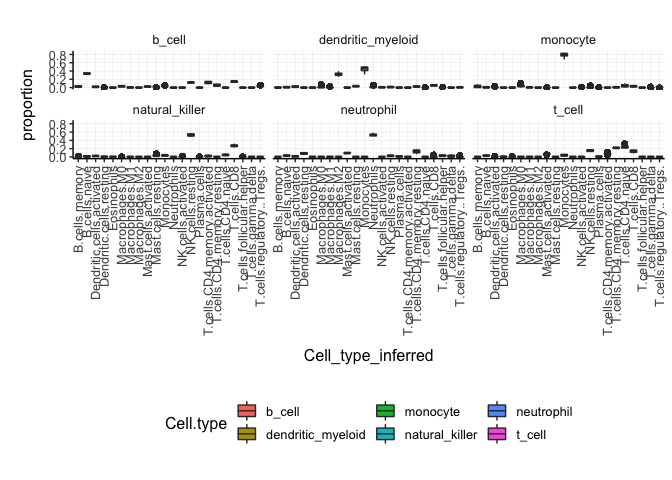<!-- -->

## Test differential cell-type abundance

We can also perform a statistical test on the differential cell-type
abundance across conditions

``` r
    tt %>%
    test_differential_cellularity( ~ condition )
```

    ## # A tibble: 22 x 7
    ##    .cell_type cell_type_propo… `estimate_(Inte… estimate_condit…
    ##    <chr>      <list>                      <dbl>            <dbl>
    ##  1 B cells n… <tibble [48 × 9…            -3.38           3.17  
    ##  2 B cells m… <tibble [48 × 9…            -2.98           2.83  
    ##  3 Plasma ce… <tibble [48 × 9…            -7.09          -0.508 
    ##  4 T cells C… <tibble [48 × 9…            -4.05          -0.445 
    ##  5 T cells C… <tibble [48 × 9…            -1.93           0.0167
    ##  6 T cells C… <tibble [48 × 9…            -3.07          -0.533 
    ##  7 T cells C… <tibble [48 × 9…            -5.97           1.46  
    ##  8 T cells f… <tibble [48 × 9…            -5.17          -0.469 
    ##  9 T cells r… <tibble [48 × 9…            -5.62          -0.602 
    ## 10 T cells g… <tibble [48 × 9…            -5.53           1.02  
    ## # … with 12 more rows, and 3 more variables: std.error_conditionTRUE <dbl>,
    ## #   statistic_conditionTRUE <dbl>, p.value_conditionTRUE <dbl>

We can also perform regression analysis with censored data (coxph).

``` r
    tt %>%
    test_differential_cellularity(survival::Surv(time, dead) ~ .)
```

## Cluster `samples`

We may want to cluster our data (e.g., using k-means sample-wise).
`cluster_elements` takes as arguments a tibble, column names (as
symbols; for `sample`, `transcript` and `count`) and returns a tibble
with additional columns for the cluster annotation. At the moment only
k-means clustering is supported, the plan is to introduce more
clustering methods.

**k-means**

<div class="column-left">

TidyTranscriptomics

``` r
tt.norm.cluster = tt.norm.MDS %>%
  cluster_elements(method="kmeans", centers = 2, action="get" )
```

</div>

<div class="column-right">

Standard procedure (comparative purpose)

``` r
count_m_log = log(count_m + 1)

k = kmeans(count_m_log, iter.max = 1000, ...)
cluster = k$cluster

cluster$cell_type = tidybulk::counts[
    match(tidybulk::counts$sample, rownames(cluster)),
    c("Cell type", "Dim1", "Dim2")
]
```

</div>

<div style="clear:both;">

</div>

We can add cluster annotation to the MDS dimesion reduced data set and
plot.

``` r
 tt.norm.cluster %>%
    ggplot(aes(x=`Dim1`, y=`Dim2`, color=`cluster kmeans`)) +
  geom_point() +
  my_theme
```

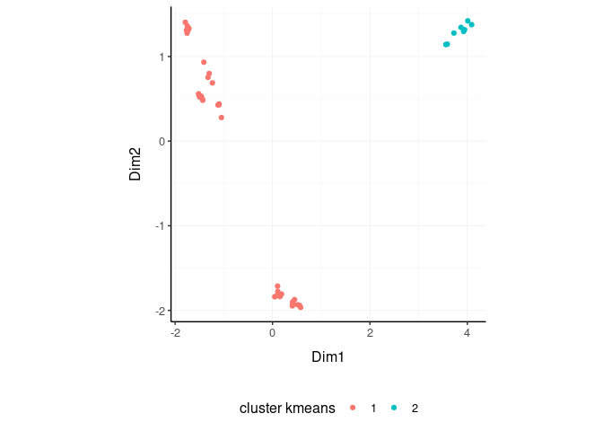<!-- -->

**SNN**

<div class="column-left">

TidyTranscriptomics

``` r
tt.norm.SNN =
    tt.norm.tSNE %>%
    cluster_elements(method = "SNN")
```

</div>

<div class="column-right">

Standard procedure (comparative purpose)

``` r
library(Seurat)

snn = CreateSeuratObject(count_m)
snn = ScaleData(
    snn, display.progress = TRUE,
    num.cores=4, do.par = TRUE
)
snn = FindVariableFeatures(snn, selection.method = "vst")
snn = FindVariableFeatures(snn, selection.method = "vst")
snn = RunPCA(snn, npcs = 30)
snn = FindNeighbors(snn)
snn = FindClusters(snn, method = "igraph", ...)
snn = snn[["seurat_clusters"]]

snn$cell_type = tidybulk::counts[
    match(tidybulk::counts$sample, rownames(snn)),
    c("Cell type", "Dim1", "Dim2")
]
```

</div>

<div style="clear:both;">

</div>

``` r
tt.norm.SNN %>%
    pivot_sample() %>%
    select(contains("tSNE"), everything()) 
```

    ## # A tibble: 251 x 5
    ##      tSNE1  tSNE2 sample                       Call  `cluster SNN`
    ##      <dbl>  <dbl> <chr>                        <fct> <fct>        
    ##  1   9.36    7.99 TCGA-A1-A0SD-01A-11R-A115-07 LumA  0            
    ##  2  -9.20    2.81 TCGA-A1-A0SF-01A-11R-A144-07 LumA  2            
    ##  3  14.6    16.0  TCGA-A1-A0SG-01A-11R-A144-07 LumA  1            
    ##  4   5.10   -9.53 TCGA-A1-A0SH-01A-11R-A084-07 LumA  0            
    ##  5   6.18    6.32 TCGA-A1-A0SI-01A-11R-A144-07 LumB  0            
    ##  6  -0.550  13.1  TCGA-A1-A0SJ-01A-11R-A084-07 LumA  1            
    ##  7 -37.6    -4.31 TCGA-A1-A0SK-01A-12R-A084-07 Basal 3            
    ##  8  -2.72  -17.1  TCGA-A1-A0SM-01A-11R-A084-07 LumA  2            
    ##  9  -2.66  -15.1  TCGA-A1-A0SN-01A-11R-A144-07 LumB  2            
    ## 10  21.8    12.9  TCGA-A1-A0SQ-01A-21R-A144-07 LumA  1            
    ## # … with 241 more rows

``` r
tt.norm.SNN %>%
    pivot_sample() %>%
    gather(source, Call, c("cluster SNN", "Call")) %>%
    distinct() %>%
    ggplot(aes(x = `tSNE1`, y = `tSNE2`, color=Call)) + geom_point() + facet_grid(~source) + my_theme
```

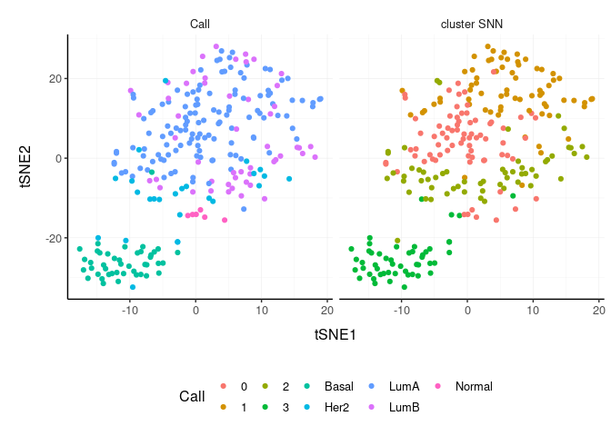<!-- -->

``` r
# Do differential transcription between clusters
tt.norm.SNN %>%
    mutate(factor_of_interest = `cluster SNN` == 3) %>%
    test_differential_abundance(
    ~ factor_of_interest,
    action="get"
   )
```

    ## # A tibble: 500 x 7
    ##    ens               logFC logCPM      F   PValue      FDR significant
    ##    <chr>             <dbl>  <dbl>  <dbl>    <dbl>    <dbl> <lgl>      
    ##  1 ENSG00000002834 -0.981   10.7  42.9   3.13e-10 8.86e-10 TRUE       
    ##  2 ENSG00000003989 -3.54     9.92 81.9   3.99e-17 2.10e-16 TRUE       
    ##  3 ENSG00000004478 -0.154   10.6   1.20  2.74e- 1 2.96e- 1 FALSE      
    ##  4 ENSG00000006125 -0.669   10.7  30.5   8.14e- 8 1.75e- 7 TRUE       
    ##  5 ENSG00000008988  0.826   11.3  78.4   1.49e-16 7.45e-16 TRUE       
    ##  6 ENSG00000009307  0.412   11.3  32.1   3.92e- 8 8.72e- 8 TRUE       
    ##  7 ENSG00000010278  0.0782  10.5   0.569 4.51e- 1 4.73e- 1 FALSE      
    ##  8 ENSG00000011465 -1.13    11.1  34.5   1.33e- 8 3.19e- 8 TRUE       
    ##  9 ENSG00000012223  0.238   11.8   0.256 6.13e- 1 6.31e- 1 FALSE      
    ## 10 ENSG00000012660 -1.68    10.5  92.0   8.66e-19 5.15e-18 TRUE       
    ## # … with 490 more rows

## Drop `redundant` transcripts

We may want to remove redundant elements from the original data set
(e.g., samples or transcripts), for example if we want to define
cell-type specific signatures with low sample redundancy.
`remove_redundancy` takes as arguments a tibble, column names (as
symbols; for `sample`, `transcript` and `count`) and returns a tibble
with redundant elements removed (e.g., samples). Two redundancy
estimation approaches are supported:

  - removal of highly correlated clusters of elements (keeping a
    representative) with method=“correlation”
  - removal of most proximal element pairs in a reduced dimensional
    space.

**Approach 1**

<div class="column-left">

TidyTranscriptomics

``` r
tt.norm.non_redundant =
    tt.norm.MDS %>%
  remove_redundancy(    method = "correlation" )
```

</div>

<div class="column-right">

Standard procedure (comparative purpose)

``` r
library(widyr)

.data.correlated =
    pairwise_cor(
        counts,
        sample,
        transcript,
        rc,
        sort = TRUE,
        diag = FALSE,
        upper = FALSE
    ) %>%
    filter(correlation > correlation_threshold) %>%
    distinct(item1) %>%
    rename(!!.element := item1)

# Return non redudant data frame
counts %>% anti_join(.data.correlated) %>%
    spread(sample, rc, - transcript) %>%
    left_join(annotation)
```

</div>

<div style="clear:both;">

</div>

We can visualise how the reduced redundancy with the reduced dimentions
look like

``` r
tt.norm.non_redundant %>%
    pivot_sample() %>%
    ggplot(aes(x=`Dim1`, y=`Dim2`, color=`Cell type`)) +
  geom_point() +
  my_theme
```

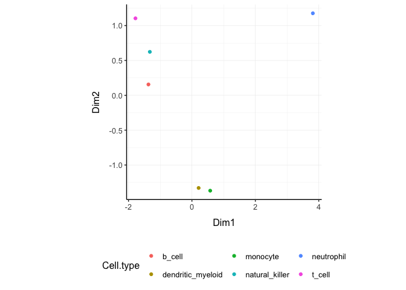<!-- -->

**Approach 2**

``` r
tt.norm.non_redundant =
    tt.norm.MDS %>%
  remove_redundancy(
    method = "reduced_dimensions",
    Dim_a_column = `Dim1`,
    Dim_b_column = `Dim2`
  )
```

We can visualise MDS reduced dimensions of the samples with the closest
pair removed.

``` r
tt.norm.non_redundant %>%
    pivot_sample() %>%
    ggplot(aes(x=`Dim1`, y=`Dim2`, color=`Cell type`)) +
  geom_point() +
  my_theme
```

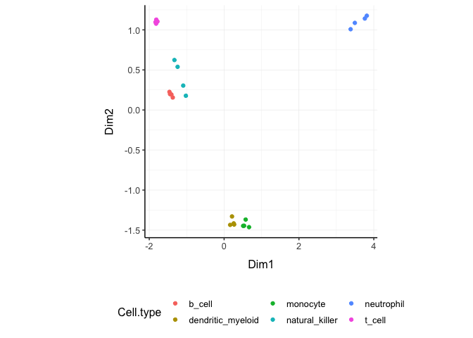<!-- -->

## Other useful wrappers

The above wrapper streamline the most common processing of bulk RNA
sequencing data. Other useful wrappers are listed above.

## From BAM/SAM to tibble of gene counts

We can calculate gene counts (using FeatureCounts; Liao Y et al.,
10.1093/nar/gkz114) from a list of BAM/SAM files and format them into a
tidy structure (similar to counts).

``` r
counts = tidybulk_SAM_BAM(
    file_names,
    genome = "hg38",
    isPairedEnd = TRUE,
    requireBothEndsMapped = TRUE,
    checkFragLength = FALSE,
    useMetaFeatures = TRUE
)
```

## From ensembl IDs to gene symbol IDs

We can add gene symbols from ensembl identifiers. This is useful since
different resources use ensembl IDs while others use gene symbol IDs.
This currently works for human and mouse.

``` r
counts_ensembl %>% ensembl_to_symbol(ens)
```

    ## # A tibble: 119 x 8
    ##    ens   iso   `read count` sample cases_0_project… cases_0_samples… transcript
    ##    <chr> <chr>        <dbl> <chr>  <chr>            <chr>            <chr>     
    ##  1 ENSG… 13             144 TARGE… Acute Myeloid L… Primary Blood D… TSPAN6    
    ##  2 ENSG… 13              72 TARGE… Acute Myeloid L… Primary Blood D… TSPAN6    
    ##  3 ENSG… 13               0 TARGE… Acute Myeloid L… Primary Blood D… TSPAN6    
    ##  4 ENSG… 13            1099 TARGE… Acute Myeloid L… Primary Blood D… TSPAN6    
    ##  5 ENSG… 13              11 TARGE… Acute Myeloid L… Primary Blood D… TSPAN6    
    ##  6 ENSG… 13               2 TARGE… Acute Myeloid L… Primary Blood D… TSPAN6    
    ##  7 ENSG… 13               3 TARGE… Acute Myeloid L… Primary Blood D… TSPAN6    
    ##  8 ENSG… 13            2678 TARGE… Acute Myeloid L… Primary Blood D… TSPAN6    
    ##  9 ENSG… 13             751 TARGE… Acute Myeloid L… Primary Blood D… TSPAN6    
    ## 10 ENSG… 13               1 TARGE… Acute Myeloid L… Primary Blood D… TSPAN6    
    ## # … with 109 more rows, and 1 more variable: ref_genome <chr>

## From gene symbol to gene description (gene name in full)

We can add gene full name (and in future description) from symbol
identifiers. This currently works for human and mouse.

``` r
tt %>% describe_transcript() %>% select(transcript, description, everything())
```

    ## # A tibble: 938,112 x 9
    ##    transcript description sample `Cell type` count time  condition batch
    ##    <chr>      <chr>       <fct>  <fct>       <dbl> <fct> <lgl>     <int>
    ##  1 DDX11L1    DEAD/H-box… SRR17… b_cell         17 0 d   TRUE          0
    ##  2 WASH7P     WASP famil… SRR17… b_cell       3568 0 d   TRUE          0
    ##  3 MIR6859-1  microRNA 6… SRR17… b_cell         57 0 d   TRUE          0
    ##  4 MIR1302-2  microRNA 1… SRR17… b_cell          1 0 d   TRUE          0
    ##  5 FAM138A    family wit… SRR17… b_cell          0 0 d   TRUE          0
    ##  6 OR4F5      olfactory … SRR17… b_cell          0 0 d   TRUE          0
    ##  7 LOC729737  uncharacte… SRR17… b_cell       1764 0 d   TRUE          0
    ##  8 LOC102725… DEAD/H-box… SRR17… b_cell         11 0 d   TRUE          0
    ##  9 MIR6859-2  microRNA 6… SRR17… b_cell         40 0 d   TRUE          0
    ## 10 OR4F29     olfactory … SRR17… b_cell          0 0 d   TRUE          0
    ## # … with 938,102 more rows, and 1 more variable: factor_of_interest <lgl>

## ADD versus GET versus ONLY modes

Every function takes a tidytranscriptomics structured data as input, and
(i) with action=“add” outputs the new information joint to the original
input data frame (default), (ii) with action=“get” the new information
with the sample or transcript relative informatin depending on what the
analysis is about, or (iii) with action=“only” just the new information.
For example, from this data set

``` r
  tt.norm
```

    ## # A tibble: 938,112 x 13
    ##    sample transcript `Cell type` count time  condition batch factor_of_inter…
    ##    <chr>  <chr>      <chr>       <dbl> <chr> <chr>     <dbl> <chr>           
    ##  1 SRR17… DDX11L1    b_cell         17 0 d   TRUE          0 TRUE            
    ##  2 SRR17… WASH7P     b_cell       3568 0 d   TRUE          0 TRUE            
    ##  3 SRR17… MIR6859-1  b_cell         57 0 d   TRUE          0 TRUE            
    ##  4 SRR17… MIR1302-2  b_cell          1 0 d   TRUE          0 TRUE            
    ##  5 SRR17… FAM138A    b_cell          0 0 d   TRUE          0 TRUE            
    ##  6 SRR17… OR4F5      b_cell          0 0 d   TRUE          0 TRUE            
    ##  7 SRR17… LOC729737  b_cell       1764 0 d   TRUE          0 TRUE            
    ##  8 SRR17… LOC102725… b_cell         11 0 d   TRUE          0 TRUE            
    ##  9 SRR17… MIR6859-2  b_cell         40 0 d   TRUE          0 TRUE            
    ## 10 SRR17… OR4F29     b_cell          0 0 d   TRUE          0 TRUE            
    ## # … with 938,102 more rows, and 5 more variables: `merged transcripts` <dbl>,
    ## #   .abundant <lgl>, TMM <dbl>, multiplier <dbl>, count_scaled <dbl>

**action=“add”** (Default) We can add the MDS dimensions to the original
data set

``` r
  tt.norm %>%
    reduce_dimensions(
        .abundance = count_scaled,
        method="MDS" ,
        .element = sample,
        .feature = transcript,
        .dims = 3,
        action="add"
    )
```

    ## # A tibble: 938,112 x 16
    ##    sample transcript `Cell type` count time  condition batch factor_of_inter…
    ##    <chr>  <chr>      <chr>       <dbl> <chr> <chr>     <dbl> <chr>           
    ##  1 SRR17… DDX11L1    b_cell         17 0 d   TRUE          0 TRUE            
    ##  2 SRR17… WASH7P     b_cell       3568 0 d   TRUE          0 TRUE            
    ##  3 SRR17… MIR6859-1  b_cell         57 0 d   TRUE          0 TRUE            
    ##  4 SRR17… MIR1302-2  b_cell          1 0 d   TRUE          0 TRUE            
    ##  5 SRR17… FAM138A    b_cell          0 0 d   TRUE          0 TRUE            
    ##  6 SRR17… OR4F5      b_cell          0 0 d   TRUE          0 TRUE            
    ##  7 SRR17… LOC729737  b_cell       1764 0 d   TRUE          0 TRUE            
    ##  8 SRR17… LOC102725… b_cell         11 0 d   TRUE          0 TRUE            
    ##  9 SRR17… MIR6859-2  b_cell         40 0 d   TRUE          0 TRUE            
    ## 10 SRR17… OR4F29     b_cell          0 0 d   TRUE          0 TRUE            
    ## # … with 938,102 more rows, and 8 more variables: `merged transcripts` <dbl>,
    ## #   .abundant <lgl>, TMM <dbl>, multiplier <dbl>, count_scaled <dbl>,
    ## #   Dim1 <dbl>, Dim2 <dbl>, Dim3 <dbl>

**action=“get”** We can add the MDS dimensions to the original data set
selecting just the sample-wise column

``` r
  tt.norm %>%
    reduce_dimensions(
        .abundance = count_scaled,
        method="MDS" ,
        .element = sample,
        .feature = transcript,
        .dims = 3,
        action="get"
    )
```

    ## # A tibble: 48 x 12
    ##    sample `Cell type` time  condition batch factor_of_inter… `merged transcr…
    ##    <chr>  <chr>       <chr> <chr>     <dbl> <chr>                       <dbl>
    ##  1 SRR17… b_cell      0 d   TRUE          0 TRUE                            1
    ##  2 SRR17… b_cell      1 d   TRUE          1 TRUE                            1
    ##  3 SRR17… b_cell      3 d   TRUE          1 TRUE                            1
    ##  4 SRR17… b_cell      7 d   TRUE          1 TRUE                            1
    ##  5 SRR17… dendritic_… 0 d   FALSE         0 FALSE                           1
    ##  6 SRR17… dendritic_… 1 d   FALSE         0 FALSE                           1
    ##  7 SRR17… dendritic_… 3 d   FALSE         1 FALSE                           1
    ##  8 SRR17… dendritic_… 7 d   FALSE         0 FALSE                           1
    ##  9 SRR17… monocyte    0 d   FALSE         1 FALSE                           1
    ## 10 SRR17… monocyte    1 d   FALSE         1 FALSE                           1
    ## # … with 38 more rows, and 5 more variables: TMM <dbl>, multiplier <dbl>,
    ## #   Dim1 <dbl>, Dim2 <dbl>, Dim3 <dbl>

**action=“only”** We can get just the MDS dimensions relative to each
sample

``` r
  tt.norm %>%
    reduce_dimensions(
        .abundance = count_scaled,
        method="MDS" ,
        .element = sample,
        .feature = transcript,
        .dims = 3,
        action="only"
    )
```

    ## # A tibble: 48 x 4
    ##    sample      Dim1  Dim2   Dim3
    ##    <chr>      <dbl> <dbl>  <dbl>
    ##  1 SRR1740034  2.31  1.87 -2.73 
    ##  2 SRR1740035  2.30  1.88 -2.77 
    ##  3 SRR1740036  2.27  1.83 -2.73 
    ##  4 SRR1740037  2.29  1.87 -2.78 
    ##  5 SRR1740038 -1.50 -1.79 -1.01 
    ##  6 SRR1740039 -1.45 -1.87 -0.925
    ##  7 SRR1740040 -1.46 -1.79 -0.989
    ##  8 SRR1740041 -1.41 -1.88 -0.981
    ##  9 SRR1740042 -2.07 -1.71 -0.936
    ## 10 SRR1740043 -1.88 -1.69 -0.788
    ## # … with 38 more rows
