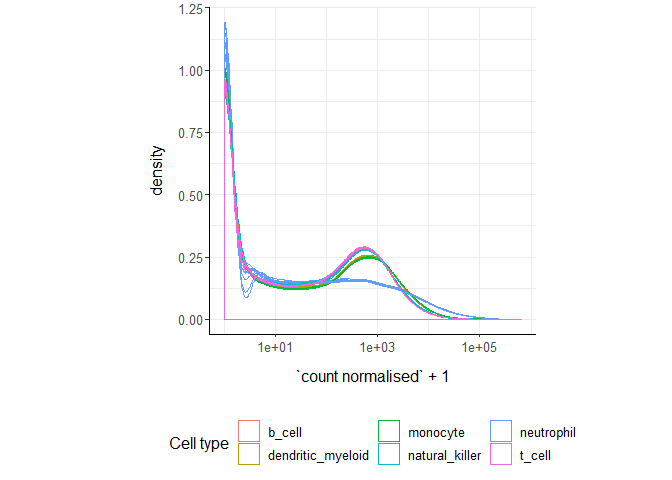
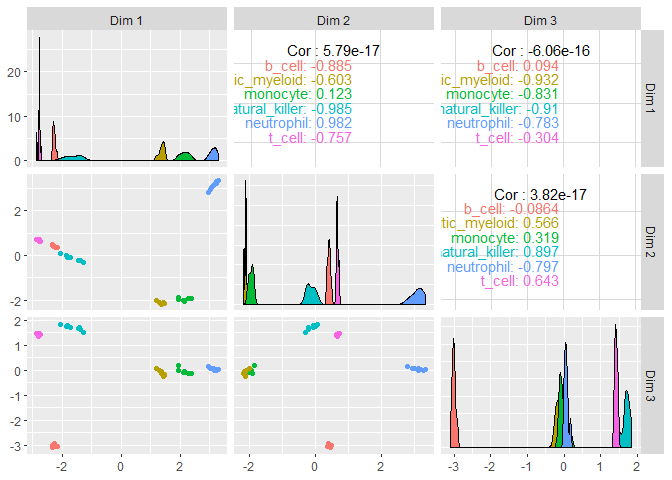
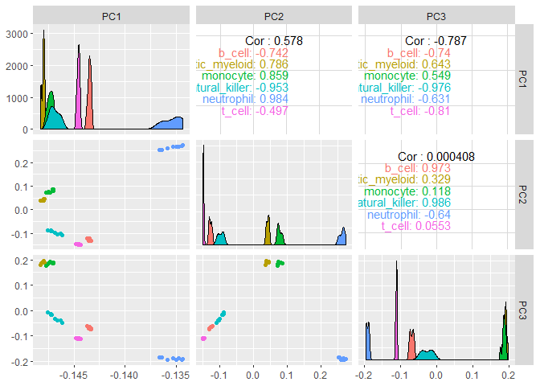
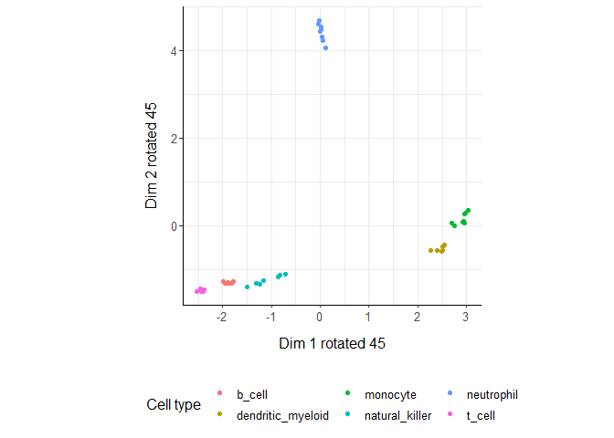
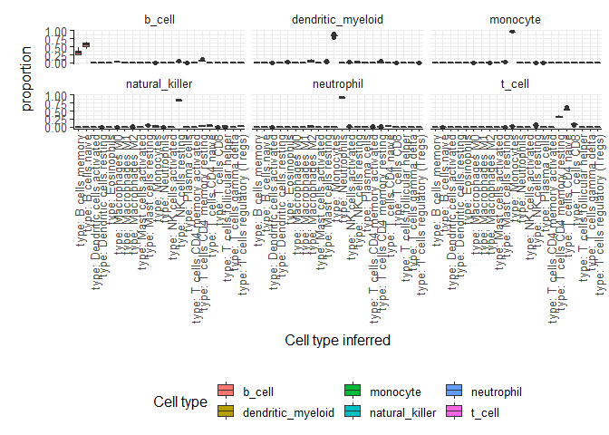
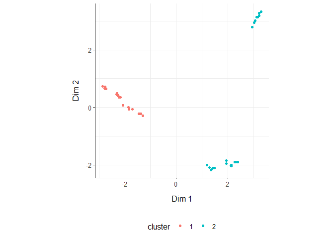
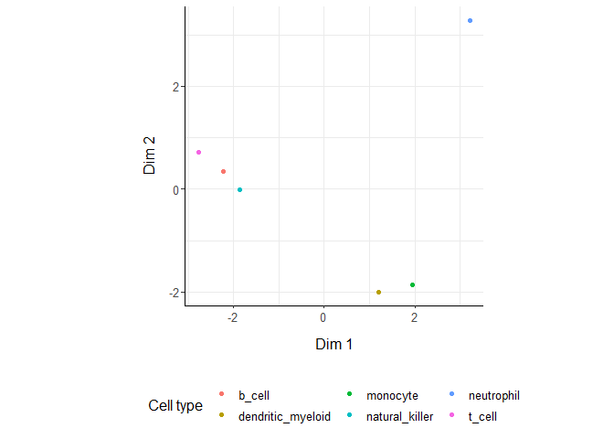
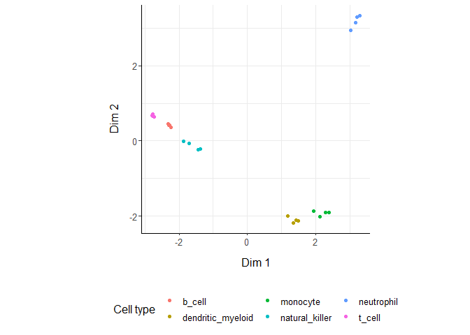

ttBulk - tidyTranscriptomics
================

[](https://travis-ci.org/stemangiola/ttBulk) [](https://coveralls.io/github/stemangiola/ttBulk?branch=master)

A user-firendly grammar of bulk RNA sequencing data explaration and processing


========================================================

Introduction
============

ttBulk is a collection of wrapper functions for bulk tanscriptomic analyses that follows the "tidy" paradigm. The data structure is a tibble with columns for

-   sample identifier column
-   transcript identifier column
-   count column
-   annotation (and other info) columns

``` r
counts = ttBulk::counts
counts 
```

    ## # A tibble: 1,340,160 x 6
    ##    sample     transcript   `Cell type` count time  condition
    ##    <chr>      <chr>        <chr>       <dbl> <chr> <lgl>    
    ##  1 SRR1740034 DDX11L1      b_cell         17 0 d   TRUE     
    ##  2 SRR1740034 WASH7P       b_cell       3568 0 d   TRUE     
    ##  3 SRR1740034 MIR6859-1    b_cell         57 0 d   TRUE     
    ##  4 SRR1740034 MIR1302-2    b_cell          1 0 d   TRUE     
    ##  5 SRR1740034 FAM138A      b_cell          0 0 d   TRUE     
    ##  6 SRR1740034 OR4F5        b_cell          0 0 d   TRUE     
    ##  7 SRR1740034 LOC729737    b_cell       1764 0 d   TRUE     
    ##  8 SRR1740034 LOC102725121 b_cell         11 0 d   TRUE     
    ##  9 SRR1740034 WASH9P       b_cell       3590 0 d   TRUE     
    ## 10 SRR1740034 MIR6859-2    b_cell         40 0 d   TRUE     
    ## # ... with 1,340,150 more rows

In brief you can: + Going from BAM/SAM to a tidy data frame of counts (FeatureCounts) + Adding gene symbols from ensembl IDs + Aggregating duplicated gene symbols + Adding normalised counts + Adding principal components + Adding MDS components + Rotating principal component or MDS dimensions + Running differential transcript abunance analyses (edgeR) + Adding batch adjusted counts (Combat) + Eliminating redunant samples and/or genes + Clustering samples and/or genes with kmeans + Adding tissue composition (Cibersort)

Aggregate `transcripts`
=======================

ttBulk provide the `aggregate_duplicates` function to aggregate duplicated transcripts (e.g., isoforms, ensembl). For example, we often have to convert ensembl symbols to gene/transcript symbol, but in doing so we have to deal with duplicates. `aggregate_duplicates` takes a tibble and column names (as symbols; for `sample`, `transcript` and `count`) as arguments and returns a tibble with aggregate transcript with the same name. All the rest of the column are appended, and factors and boolean are appended as characters.

``` r
counts.aggr = 
  counts %>%
  aggregate_duplicates(
    sample, 
    transcript, 
    `count`,  
    aggregation_function = sum
  )
```

    ## Converted to characters
    ## condition 
    ## "logical"

``` r
counts.aggr 
```

    ## # A tibble: 1,340,160 x 7
    ##    sample   transcript  `Cell type` count time  condition `merged transcri~
    ##    <chr>    <chr>       <chr>       <dbl> <chr> <chr>                 <dbl>
    ##  1 SRR1740~ DDX11L1     b_cell         17 0 d   TRUE                      1
    ##  2 SRR1740~ WASH7P      b_cell       3568 0 d   TRUE                      1
    ##  3 SRR1740~ MIR6859-1   b_cell         57 0 d   TRUE                      1
    ##  4 SRR1740~ MIR1302-2   b_cell          1 0 d   TRUE                      1
    ##  5 SRR1740~ FAM138A     b_cell          0 0 d   TRUE                      1
    ##  6 SRR1740~ OR4F5       b_cell          0 0 d   TRUE                      1
    ##  7 SRR1740~ LOC729737   b_cell       1764 0 d   TRUE                      1
    ##  8 SRR1740~ LOC1027251~ b_cell         11 0 d   TRUE                      1
    ##  9 SRR1740~ WASH9P      b_cell       3590 0 d   TRUE                      1
    ## 10 SRR1740~ MIR6859-2   b_cell         40 0 d   TRUE                      1
    ## # ... with 1,340,150 more rows

Normalise `counts`
==================

We may want to calculate the normalised counts for library size (e.g., with TMM algorithm, Robinson and Oshlack doi.org/10.1186/gb-2010-11-3-r25). `normalise_counts` takes a tibble, column names (as symbols; for `sample`, `transcript` and `count`) and a method as arguments and returns a tibble with additional columns with normalised data as `<NAME OF COUNT COLUMN> normalised`.

``` r
counts.norm =  counts.aggr %>% 
    normalise_counts(sample, transcript, `count`)

counts.norm %>% select(`count`, `count normalised`, `filter out low counts`, everything())
```

    ## # A tibble: 1,340,160 x 11
    ##    count `count normalis~ `filter out low~ sample transcript `Cell type`
    ##    <dbl>            <dbl> <lgl>            <chr>  <chr>      <chr>      
    ##  1   153          134.    FALSE            SRR17~ A1BG       b_cell     
    ##  2    83           72.7   FALSE            SRR17~ A1BG-AS1   b_cell     
    ##  3     1            0.876 TRUE             SRR17~ A1CF       b_cell     
    ##  4     1            0.876 FALSE            SRR17~ A2M        b_cell     
    ##  5     0            0     FALSE            SRR17~ A2M-AS1    b_cell     
    ##  6     3            2.63  FALSE            SRR17~ A2ML1      b_cell     
    ##  7     0            0     TRUE             SRR17~ A2MP1      b_cell     
    ##  8     0            0     FALSE            SRR17~ A3GALT2    b_cell     
    ##  9     4            3.50  TRUE             SRR17~ A4GALT     b_cell     
    ## 10     0            0     TRUE             SRR17~ A4GNT      b_cell     
    ## # ... with 1,340,150 more rows, and 5 more variables: time <chr>,
    ## #   condition <chr>, `merged transcripts` <dbl>, TMM <dbl>,
    ## #   multiplier <dbl>

We can easily plot the normalised density to check the normalisation outcome. On the x axis we have the log scaled counts, on the y axes we have the density, data is grouped by sample and coloured by cell type.

``` r
counts.norm %>% 
    ggplot(aes(`count normalised` + 1, group=sample, color=`Cell type`)) +
    geom_density() + 
    scale_x_log10() +
    my_theme
```



Reduce `dimensions`
===================

We may want to reduce the dimensions of our data, for example using PCA or MDS algorithms. `reduce_dimensions` takes a tibble, column names (as symbols; for `sample`, `transcript` and `count`) and a method (e.g., MDS or PCA) as arguments and returns a tibble with additional columns for the reduced dimensions.

**MDS** (Robinson et al., 10.1093/bioinformatics/btp616)

``` r
counts.norm.MDS =
  counts.norm %>%
  reduce_dimensions(.value = `count normalised`, method="MDS" , .element = sample, .feature = transcript, components = 1:3)

counts.norm.MDS %>% select(sample, contains("Dim"), `Cell type`, time ) %>% distinct()
```

    ## # A tibble: 48 x 6
    ##    sample     `Dim 1` `Dim 2` `Dim 3` `Cell type`       time 
    ##    <chr>        <dbl>   <dbl>   <dbl> <chr>             <chr>
    ##  1 SRR1740034   -2.31   0.491 -3.01   b_cell            0 d  
    ##  2 SRR1740035   -2.29   0.427 -3.03   b_cell            1 d  
    ##  3 SRR1740036   -2.25   0.388 -2.92   b_cell            3 d  
    ##  4 SRR1740037   -2.29   0.420 -2.98   b_cell            7 d  
    ##  5 SRR1740038    1.46  -2.12  -0.163  dendritic_myeloid 0 d  
    ##  6 SRR1740039    1.38  -2.17  -0.0592 dendritic_myeloid 1 d  
    ##  7 SRR1740040    1.42  -2.12  -0.199  dendritic_myeloid 3 d  
    ##  8 SRR1740041    1.35  -2.18  -0.127  dendritic_myeloid 7 d  
    ##  9 SRR1740042    2.13  -2.05  -0.0695 monocyte          0 d  
    ## 10 SRR1740043    1.95  -1.96   0.0121 monocyte          1 d  
    ## # ... with 38 more rows

On the x and y axes axis we have the reduced dimensions 1 to 3, data is coloured by cell type.

``` r
counts.norm.MDS %>%
    select(contains("Dim"), sample, `Cell type`) %>%
  distinct() %>%
  GGally::ggpairs(columns = 1:3, ggplot2::aes(colour=`Cell type`))
```



**PCA**

``` r
counts.norm.PCA =
  counts.norm %>%
  reduce_dimensions(.value = `count normalised`, method="PCA" , .element = sample, .feature = transcript, components = 1:3)
```

    ## Fraction of variance explained by the selected principal components
    ## # A tibble: 3 x 2
    ##   `Fraction of variance`    PC
    ##                    <dbl> <int>
    ## 1                 0.897      1
    ## 2                 0.0475     2
    ## 3                 0.0205     3

``` r
counts.norm.PCA %>% select(sample, contains("PC"), `Cell type`, time ) %>% distinct()
```

    ## # A tibble: 48 x 6
    ##    sample        PC1     PC2     PC3 `Cell type`       time 
    ##    <chr>       <dbl>   <dbl>   <dbl> <chr>             <chr>
    ##  1 SRR1740034 -0.143 -0.131  -0.0746 b_cell            0 d  
    ##  2 SRR1740035 -0.143 -0.131  -0.0742 b_cell            1 d  
    ##  3 SRR1740036 -0.144 -0.130  -0.0718 b_cell            3 d  
    ##  4 SRR1740037 -0.143 -0.130  -0.0719 b_cell            7 d  
    ##  5 SRR1740038 -0.148  0.0471  0.191  dendritic_myeloid 0 d  
    ##  6 SRR1740039 -0.148  0.0425  0.194  dendritic_myeloid 1 d  
    ##  7 SRR1740040 -0.148  0.0466  0.189  dendritic_myeloid 3 d  
    ##  8 SRR1740041 -0.148  0.0398  0.197  dendritic_myeloid 7 d  
    ##  9 SRR1740042 -0.147  0.0741  0.192  monocyte          0 d  
    ## 10 SRR1740043 -0.148  0.0720  0.183  monocyte          1 d  
    ## # ... with 38 more rows

On the x and y axes axis we have the reduced dimensions 1 to 3, data is coloured by cell type.

``` r
counts.norm.PCA %>%
    select(contains("PC"), sample, `Cell type`) %>%
  distinct() %>%
  GGally::ggpairs(columns = 1:3, ggplot2::aes(colour=`Cell type`))
```



Rotate `dimensions`
===================

We may want to rotate the reduced dimensions (or any two numeric columns really) of our data, of a set angle. `rotate_dimensions` takes a tibble, column names (as symbols; for `sample`, `transcript` and `count`) and an angle as arguments and returns a tibble with additional columns for the rotated dimensions. The rotated dimensions will be added to the original data set as `<NAME OF DIMENSION> rotated <ANGLE>` by default, or as specified in the input arguments.

``` r
counts.norm.MDS.rotated =
  counts.norm.MDS %>%
    rotate_dimensions(`Dim 1`, `Dim 2`, rotation_degrees = 45, .element = sample)
```

**Original** On the x and y axes axis we have the first two reduced dimensions, data is coloured by cell type.

``` r
counts.norm.MDS.rotated %>%
    distinct(sample, `Dim 1`,`Dim 2`, `Cell type`) %>%
    ggplot(aes(x=`Dim 1`, y=`Dim 2`, color=`Cell type` )) +
  geom_point() +
  my_theme
```


**Rotated** On the x and y axes axis we have the first two reduced dimensions rotated of 45 degrees, data is coloured by cell type.

``` r
counts.norm.MDS.rotated %>%
    distinct(sample, `Dim 1 rotated 45`,`Dim 2 rotated 45`, `Cell type`) %>%
    ggplot(aes(x=`Dim 1 rotated 45`, y=`Dim 2 rotated 45`, color=`Cell type` )) +
  geom_point() +
  my_theme
```



Annotate `differential transcirption`
=====================================

We may want to test for differential transcription between sample-wise factors of interest (e.g., with edgeR). `test_differential_transcription` takes a tibble, column names (as symbols; for `sample`, `transcript` and `count`) and a formula representing the desired linear model as arguments and returns a tibble with additional columns for the statistics from the hypothesis test (e.g., log fold change, p-value and false discovery rate).

``` r
counts %>%
    test_differential_transcription(
      ~ condition,
      .sample = sample,
      .transcript = transcript,
      .abundance = `count`,
      action="get")
```

    ## # A tibble: 27,920 x 8
    ##    transcript   logFC logCPM    LR   PValue      FDR is_de `filter out low~
    ##    <chr>        <dbl>  <dbl> <dbl>    <dbl>    <dbl> <lgl> <lgl>           
    ##  1 ANKRD18DP     4.82 -0.995 122.  1.88e-28 2.97e-24 TRUE  FALSE           
    ##  2 SCIN          4.83 -0.463 113.  2.07e-26 1.64e-22 TRUE  FALSE           
    ##  3 IGLL3P        5.34 -0.623  89.5 3.13e-21 1.65e-17 TRUE  FALSE           
    ##  4 RNGTT         2.36  4.74   60.7 6.67e-15 2.63e-11 TRUE  FALSE           
    ##  5 LOC1019293~   2.90  0.612  54.5 1.54e-13 4.86e-10 TRUE  FALSE           
    ##  6 STAG3         2.55  3.21   52.9 3.58e-13 9.43e-10 TRUE  FALSE           
    ##  7 GIMAP4      -11.0   7.71   51.2 8.26e-13 1.87e- 9 TRUE  FALSE           
    ##  8 GRAMD1B      -5.87  4.20   43.3 4.61e-11 8.95e- 8 TRUE  FALSE           
    ##  9 BTNL9         6.34  3.83   43.1 5.09e-11 8.95e- 8 TRUE  FALSE           
    ## 10 SMIM3        -9.55  3.52   40.9 1.62e-10 2.56e- 7 TRUE  FALSE           
    ## # ... with 27,910 more rows

Adjust `counts`
===============

We may want to adjust `counts` for (known) unwanted variation. `adjust_abundance` takes as arguments a tibble, column names (as symbols; for `sample`, `transcript` and `count`) and a formula representing the desired linear model where the first covariate is the factor of interest and the second covariate is the unwanted variation, and returns a tibble with additional columns for the adjusted counts as `<COUNT COLUMN> adjusted`. At the moment just an unwanted covariated is allowed at a time.

**"\#\# Standardizing Data across genes" is still in the cache?**

``` r
counts.norm.adj =
    counts.norm %>%

      # Add fake batch and factor of interest
      left_join(
        (.) %>%
            distinct(sample) %>%
            mutate(batch = sample(0:1, n(), replace = T))
      ) %>%
        mutate(factor_of_interest = `Cell type` == "b_cell") %>%

      # Add covariate
      adjust_abundance(
        ~ factor_of_interest + batch,
        sample,
        transcript,
        `count normalised`,
        action = "get"
      )
```

    ## Standardizing Data across genes

``` r
counts.norm.adj
```

    ## # A tibble: 1,340,160 x 4
    ##    transcript sample     `count normalised adjusted` `filter out low count~
    ##    <chr>      <chr>                            <int> <lgl>                 
    ##  1 A1BG       SRR1740034                         134 FALSE                 
    ##  2 A1BG-AS1   SRR1740034                          72 FALSE                 
    ##  3 A1CF       SRR1740034                          NA TRUE                  
    ##  4 A2M        SRR1740034                           0 FALSE                 
    ##  5 A2M-AS1    SRR1740034                           0 FALSE                 
    ##  6 A2ML1      SRR1740034                           2 FALSE                 
    ##  7 A2MP1      SRR1740034                          NA TRUE                  
    ##  8 A3GALT2    SRR1740034                           0 FALSE                 
    ##  9 A4GALT     SRR1740034                          NA TRUE                  
    ## 10 A4GNT      SRR1740034                          NA TRUE                  
    ## # ... with 1,340,150 more rows

Annotate `Cell type composition`
================================

We may want to infer the cell type composition of our samples (with the algorithm Cibersort; Newman et al., 10.1038/nmeth.3337). `annotate_cell_type` takes as arguments a tibble, column names (as symbols; for `sample`, `transcript` and `count`) and returns a tibble with additional columns for the adjusted cell type proportions.

**columns truncated**

``` r
counts.cibersort =
    counts %>%
    annotate_cell_type(sample, transcript, `count`, action="add", cores=2)

counts.cibersort %>% select(sample, contains("type:")) %>% distinct()
```

    ## # A tibble: 48 x 23
    ##    sample `type: B cells ~ `type: B cells ~ `type: Plasma c~
    ##    <chr>             <dbl>            <dbl>            <dbl>
    ##  1 SRR17~            0.632          0.247                  0
    ##  2 SRR17~            0.656          0.235                  0
    ##  3 SRR17~            0.620          0.245                  0
    ##  4 SRR17~            0.586          0.287                  0
    ##  5 SRR17~            0              0.0177                 0
    ##  6 SRR17~            0              0.0133                 0
    ##  7 SRR17~            0              0.00699                0
    ##  8 SRR17~            0              0                      0
    ##  9 SRR17~            0              0                      0
    ## 10 SRR17~            0              0                      0
    ## # ... with 38 more rows, and 19 more variables: `type: T cells CD8` <dbl>,
    ## #   `type: T cells CD4 naive` <dbl>, `type: T cells CD4 memory
    ## #   resting` <dbl>, `type: T cells CD4 memory activated` <dbl>, `type: T
    ## #   cells follicular helper` <dbl>, `type: T cells regulatory
    ## #   (Tregs)` <dbl>, `type: T cells gamma delta` <dbl>, `type: NK cells
    ## #   resting` <dbl>, `type: NK cells activated` <dbl>, `type:
    ## #   Monocytes` <dbl>, `type: Macrophages M0` <dbl>, `type: Macrophages
    ## #   M1` <dbl>, `type: Macrophages M2` <dbl>, `type: Dendritic cells
    ## #   resting` <dbl>, `type: Dendritic cells activated` <dbl>, `type: Mast
    ## #   cells resting` <dbl>, `type: Mast cells activated` <dbl>, `type:
    ## #   Eosinophils` <dbl>, `type: Neutrophils` <dbl>

With the new annotated data frame, we can plot the distributions of cell types across samples, and compare them with the nominal cell type labels to check for the purity of isolation. On the x axis we have the cell types inferred by Cibersort, on the y axis we have the inferred proportions. The data is facetted and coloured by nominal cell types (annotation given by the researcher after FACS sorting).

``` r
counts.cibersort %>%
    select(contains("type:"), everything()) %>%
    gather(`Cell type inferred`, `proportion`, 1:22) %>%
  distinct(sample, `Cell type`, `Cell type inferred`, proportion) %>%
  ggplot(aes(x=`Cell type inferred`, y=proportion, fill=`Cell type`)) +
  geom_boxplot() +
  facet_wrap(~`Cell type`) +
  my_theme +
  theme(axis.text.x = element_text(angle = 90, hjust = 1, vjust = 0.5), aspect.ratio=1/5)
```



Annotate `clusters`
===================

We may want to cluster our data (e.g., using k-means sample-wise). `annotate_clusters` takes as arguments a tibble, column names (as symbols; for `sample`, `transcript` and `count`) and returns a tibble with additional columns for the cluster annotation. At the moment only k-means clustering is supported, the plan is to introduce more clustering methods.

**k-means**

``` r
counts.norm.cluster = counts.norm %>%
  annotate_clusters(.value = `count normalised`, .element = sample, .feature = transcript,  number_of_clusters = 2 )

counts.norm.cluster
```

    ## # A tibble: 1,340,160 x 12
    ##    sample transcript `Cell type` count time  condition `merged transcr~
    ##    <chr>  <chr>      <chr>       <dbl> <chr> <chr>                <dbl>
    ##  1 SRR17~ A1BG       b_cell        153 0 d   TRUE                     1
    ##  2 SRR17~ A1BG-AS1   b_cell         83 0 d   TRUE                     1
    ##  3 SRR17~ A1CF       b_cell          1 0 d   TRUE                     1
    ##  4 SRR17~ A2M        b_cell          1 0 d   TRUE                     1
    ##  5 SRR17~ A2M-AS1    b_cell          0 0 d   TRUE                     1
    ##  6 SRR17~ A2ML1      b_cell          3 0 d   TRUE                     1
    ##  7 SRR17~ A2MP1      b_cell          0 0 d   TRUE                     1
    ##  8 SRR17~ A3GALT2    b_cell          0 0 d   TRUE                     1
    ##  9 SRR17~ A4GALT     b_cell          4 0 d   TRUE                     1
    ## 10 SRR17~ A4GNT      b_cell          0 0 d   TRUE                     1
    ## # ... with 1,340,150 more rows, and 5 more variables: `count
    ## #   normalised` <dbl>, TMM <dbl>, multiplier <dbl>, `filter out low
    ## #   counts` <lgl>, cluster <fct>

We can add cluster annotation to the MDS dimesion reduced data set and plot.

``` r
 counts.norm.MDS %>%
  annotate_clusters(
    .value = `count normalised`,
    .element = sample,
    .feature = transcript,
    number_of_clusters = 2
  ) %>%
    distinct(sample, `Dim 1`, `Dim 2`, cluster) %>%
    ggplot(aes(x=`Dim 1`, y=`Dim 2`, color=cluster)) +
  geom_point() +
  my_theme
```



Drop `redundant`
================

We may want to remove redundant elements from the original data set (e.g., samples or transcripts), for example if we want to define cell-type specific signatures with low sample redundancy. `drop_redundant` takes as arguments a tibble, column names (as symbols; for `sample`, `transcript` and `count`) and returns a tibble dropped recundant elements (e.g., samples). Two redundancy estimation approaches are supported:

-   removal of highly correlated clusters of elements (keeping a representative) with method="correlation"
-   removal of most proximal element pairs in a reduced dimensional space.

**Approach 1**

``` r
counts.norm.non_redundant =
    counts.norm.MDS %>%
  drop_redundant(
    method = "correlation",
    .element = sample,
    .feature = transcript,
    .value = `count normalised`
  )
```

We can visualise how the reduced redundancy with the reduced dimentions look like

``` r
counts.norm.non_redundant %>%
    distinct(sample, `Dim 1`, `Dim 2`, `Cell type`) %>%
    ggplot(aes(x=`Dim 1`, y=`Dim 2`, color=`Cell type`)) +
  geom_point() +
  my_theme
```



**Approach 2**

``` r
counts.norm.non_redundant =
    counts.norm.MDS %>%
  drop_redundant(
    method = "reduced_dimensions",
    .element = sample,
    .feature = transcript,
    Dim_a_column = `Dim 1`,
    Dim_b_column = `Dim 2`
  )
```

We can visualise MDS reduced dimensions of the samples with the closest pair removed.

``` r
counts.norm.non_redundant %>%
    distinct(sample, `Dim 1`, `Dim 2`, `Cell type`) %>%
    ggplot(aes(x=`Dim 1`, y=`Dim 2`, color=`Cell type`)) +
  geom_point() +
  my_theme
```



Other useful wrappers
=====================

The above wrapper streamline the most common processing of bulk RNA sequencing data. Other useful wrappers are listed above.

From BAM/SAM to tibble of gene counts
-------------------------------------

We can calculate gene counts (using FeatureCounts; Liao Y et al., 10.1093/nar/gkz114) from a list of BAM/SAM files and format them into a tidy structure (similar to counts).

``` r
counts = bam_sam_to_featureCounts_tibble(
    file_names, 
    genome = "hg38",
    isPairedEnd = T,
    requireBothEndsMapped = T,
    checkFragLength = F,
    useMetaFeatures = T
)
```

From ensembl IDs to gene symbol IDs
-----------------------------------

We can add gene symbols from ensembl identifiers. This is useful since different resources use ensembl IDs while others use gene symbol IDs.

``` r
counts_ensembl %>% annotate_symbol(ens)
```

    ## # A tibble: 119 x 8
    ##    ens   iso   `read count` sample cases_0_project~ cases_0_samples~
    ##    <chr> <chr>        <dbl> <chr>  <chr>            <chr>           
    ##  1 ENSG~ 13             144 TARGE~ Acute Myeloid L~ Primary Blood D~
    ##  2 ENSG~ 13              72 TARGE~ Acute Myeloid L~ Primary Blood D~
    ##  3 ENSG~ 13               0 TARGE~ Acute Myeloid L~ Primary Blood D~
    ##  4 ENSG~ 13            1099 TARGE~ Acute Myeloid L~ Primary Blood D~
    ##  5 ENSG~ 13              11 TARGE~ Acute Myeloid L~ Primary Blood D~
    ##  6 ENSG~ 13               2 TARGE~ Acute Myeloid L~ Primary Blood D~
    ##  7 ENSG~ 13               3 TARGE~ Acute Myeloid L~ Primary Blood D~
    ##  8 ENSG~ 13            2678 TARGE~ Acute Myeloid L~ Primary Blood D~
    ##  9 ENSG~ 13             751 TARGE~ Acute Myeloid L~ Primary Blood D~
    ## 10 ENSG~ 13               1 TARGE~ Acute Myeloid L~ Primary Blood D~
    ## # ... with 109 more rows, and 2 more variables: hgnc_symbol <chr>,
    ## #   hg <chr>

ADD versus GET modes
====================

Every function takes this structure as input, and outputs either (i) the new information joint to the original input data frame (default), or (ii) just the new information, setting action="add" or action="get" respectively. For example, from this data set

``` r
  counts.norm 
```

    ## # A tibble: 1,340,160 x 11
    ##    sample transcript `Cell type` count time  condition `merged transcr~
    ##    <chr>  <chr>      <chr>       <dbl> <chr> <chr>                <dbl>
    ##  1 SRR17~ A1BG       b_cell        153 0 d   TRUE                     1
    ##  2 SRR17~ A1BG-AS1   b_cell         83 0 d   TRUE                     1
    ##  3 SRR17~ A1CF       b_cell          1 0 d   TRUE                     1
    ##  4 SRR17~ A2M        b_cell          1 0 d   TRUE                     1
    ##  5 SRR17~ A2M-AS1    b_cell          0 0 d   TRUE                     1
    ##  6 SRR17~ A2ML1      b_cell          3 0 d   TRUE                     1
    ##  7 SRR17~ A2MP1      b_cell          0 0 d   TRUE                     1
    ##  8 SRR17~ A3GALT2    b_cell          0 0 d   TRUE                     1
    ##  9 SRR17~ A4GALT     b_cell          4 0 d   TRUE                     1
    ## 10 SRR17~ A4GNT      b_cell          0 0 d   TRUE                     1
    ## # ... with 1,340,150 more rows, and 4 more variables: `count
    ## #   normalised` <dbl>, TMM <dbl>, multiplier <dbl>, `filter out low
    ## #   counts` <lgl>

**action="add"** (Default) We can add the MDS dimensions to the original data set

``` r
  counts.norm %>%
    reduce_dimensions(
        .value = `count normalised`, 
        method="MDS" , 
        .element = sample, 
        .feature = transcript, 
        components = 1:3, 
        action="add"
    )
```

    ## # A tibble: 1,340,160 x 14
    ##    sample transcript `Cell type` count time  condition `merged transcr~
    ##    <chr>  <chr>      <chr>       <dbl> <chr> <chr>                <dbl>
    ##  1 SRR17~ A1BG       b_cell        153 0 d   TRUE                     1
    ##  2 SRR17~ A1BG-AS1   b_cell         83 0 d   TRUE                     1
    ##  3 SRR17~ A1CF       b_cell          1 0 d   TRUE                     1
    ##  4 SRR17~ A2M        b_cell          1 0 d   TRUE                     1
    ##  5 SRR17~ A2M-AS1    b_cell          0 0 d   TRUE                     1
    ##  6 SRR17~ A2ML1      b_cell          3 0 d   TRUE                     1
    ##  7 SRR17~ A2MP1      b_cell          0 0 d   TRUE                     1
    ##  8 SRR17~ A3GALT2    b_cell          0 0 d   TRUE                     1
    ##  9 SRR17~ A4GALT     b_cell          4 0 d   TRUE                     1
    ## 10 SRR17~ A4GNT      b_cell          0 0 d   TRUE                     1
    ## # ... with 1,340,150 more rows, and 7 more variables: `count
    ## #   normalised` <dbl>, TMM <dbl>, multiplier <dbl>, `filter out low
    ## #   counts` <lgl>, `Dim 1` <dbl>, `Dim 2` <dbl>, `Dim 3` <dbl>

**action="get"** We can get just the MDS dimensions relative to each sample

``` r
  counts.norm %>%
    reduce_dimensions(
        .value = `count normalised`, 
        method="MDS" , 
        .element = sample, 
        .feature = transcript, 
        components = 1:3, 
        action="get"
    )
```

    ## # A tibble: 48 x 4
    ##    sample     `Dim 1` `Dim 2` `Dim 3`
    ##    <chr>        <dbl>   <dbl>   <dbl>
    ##  1 SRR1740034   -2.31   0.491 -3.01  
    ##  2 SRR1740035   -2.29   0.427 -3.03  
    ##  3 SRR1740036   -2.25   0.388 -2.92  
    ##  4 SRR1740037   -2.29   0.420 -2.98  
    ##  5 SRR1740038    1.46  -2.12  -0.163 
    ##  6 SRR1740039    1.38  -2.17  -0.0592
    ##  7 SRR1740040    1.42  -2.12  -0.199 
    ##  8 SRR1740041    1.35  -2.18  -0.127 
    ##  9 SRR1740042    2.13  -2.05  -0.0695
    ## 10 SRR1740043    1.95  -1.96   0.0121
    ## # ... with 38 more rows
