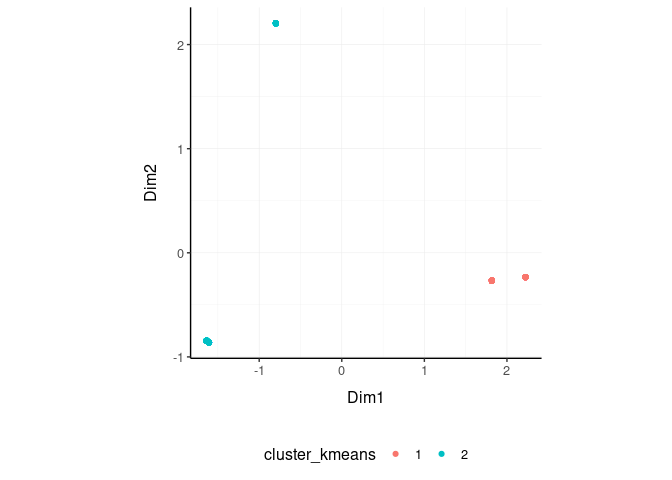
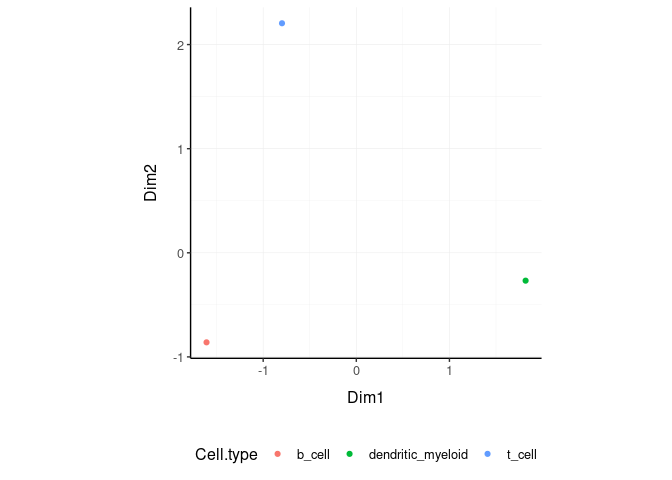

tidybulk - part of *tidyomics*
================

<!-- badges: start -->

[](https://www.tidyverse.org/lifecycle/#maturing)
[](https://github.com/stemangiola/tidybulk/actions)

<!-- badges: end -->

**Brings transcriptomics to the tidyverse!**

The code is released under the version 3 of the GNU General Public
License.


Resources to help you get started with *tidyomics* and tidybulk:

- [The tidyomics blog](https://tidyomics.github.io/tidyomicsBlog/)
- [The tidybulk website](http://stemangiola.github.io/tidybulk/)
- [Third party
  tutorials](https://rstudio-pubs-static.s3.amazonaws.com/792462_f948e766b15d4ee5be5c860493bda0b3.html)

The *tidyomics* ecosystem includes packages for:

- Working with genomic features:

  - [plyranges](https://github.com/sa-lee/plyranges), for tidy
    manipulation of genomic range data.
  - [nullranges](https://github.com/nullranges/nullranges), for tidy
    generation of genomic ranges representing the null hypothesis.
  - [plyinteractions](https://github.com/tidyomics/plyinteractions), for
    tidy manipulation of genomic interaction data.

- Working with transcriptomic features:

  - [tidySummarizedExperiment](https://github.com/stemangiola/tidySummarizedExperiment),
    for tidy manipulation of SummarizedExperiment objects.
  - [tidySingleCellExperiment](https://github.com/stemangiola/tidySingleCellExperiment),
    for tidy manipulation of SingleCellExperiment objects.
  - [tidySpatialExperiment](https://github.com/william-hutchison/tidySpatialExperiment),
    for tidy manipulation of SpatialExperiment objects.
  - [tidyseurat](https://github.com/stemangiola/tidyseurat), for tidy
    manipulation of Seurat objects.

- Working with cytometry features:

  - [tidytof](https://github.com/keyes-timothy/tidytof), for tidy
    manipulation of high-dimensional cytometry data.

A few more tidy tools for data manipulation and plotting:

- [tidyHeatmap](https://github.com/stemangiola/tidyHeatmap), for
  producing heatmaps with tidy principles. analysis and manipulation
- [tidygate](https://github.com/stemangiola/tidygate), for interactive
  plotting and gating.


## Functions/utilities available

| Function                        | Description                                                                  |
|---------------------------------|------------------------------------------------------------------------------|
| `identify_abundant`             | identify the abundant genes                                                  |
| `aggregate_duplicates`          | Aggregate abundance and annotation of duplicated transcripts in a robust way |
| `scale_abundance`               | Scale (normalise) abundance for RNA sequencing depth                         |
| `reduce_dimensions`             | Perform dimensionality reduction (PCA, MDS, tSNE)                            |
| `cluster_elements`              | Labels elements with cluster identity (kmeans, SNN)                          |
| `remove_redundancy`             | Filter out elements with highly correlated features                          |
| `adjust_abundance`              | Remove known unwanted variation (Combat)                                     |
| `test_differential_abundance`   | Differential transcript abundance testing (DE)                               |
| `deconvolve_cellularity`        | Estimated tissue composition (Cibersort or llsr)                             |
| `test_differential_cellularity` | Differential cell-type abundance testing                                     |
| `keep_variable`                 | Filter for top variable features                                             |
| `keep_abundant`                 | Filter out lowly abundant transcripts                                        |
| `test_gene_enrichment`          | Gene enrichment analyses (EGSEA)                                             |
| `test_gene_overrepresentation`  | Gene enrichment on list of transcript names (no rank)                        |

| Utilities                  | Description                                                     |
|----------------------------|-----------------------------------------------------------------|
| `get_bibliography`         | Get the bibliography of your workflow                           |
| `tidybulk`                 | add tidybulk attributes to a tibble object                      |
| `tidybulk_SAM_BAM`         | Convert SAM BAM files into tidybulk tibble                      |
| `pivot_sample`             | Select sample-wise columns/information                          |
| `pivot_transcript`         | Select transcript-wise columns/information                      |
| `rotate_dimensions`        | Rotate two dimensions of a degree                               |
| `ensembl_to_symbol`        | Add gene symbol from ensembl IDs                                |
| `symbol_to_entrez`         | Add entrez ID from gene symbol                                  |
| `describe_transcript`      | Add gene description from gene symbol                           |
| `impute_missing_abundance` | Impute abundance for missing data points using sample groupings |
| `fill_missing_abundance`   | Fill abundance for missing data points using an arbitrary value |

All functions are directly compatibble with `SummarizedExperiment`
object.

## Installation

From Bioconductor

``` r
BiocManager::install("tidybulk")
```

From Github

``` r
devtools::install_github("stemangiola/tidybulk")
```

# Data

We will use a `SummarizedExperiment` object

``` r
se_mini
```

    ## # A SummarizedExperiment-tibble abstraction: 2,635 × 9
    ## # Features=527 | Samples=5 | Assays=count
    ##    .feature .sample    count Cell.type time  condition  days  dead entrez
    ##    <chr>    <chr>      <dbl> <chr>     <chr> <lgl>     <dbl> <dbl> <chr> 
    ##  1 ABCB4    SRR1740034  1035 b_cell    0 d   TRUE          1     1 5244  
    ##  2 ABCB9    SRR1740034    45 b_cell    0 d   TRUE          1     1 23457 
    ##  3 ACAP1    SRR1740034  7151 b_cell    0 d   TRUE          1     1 9744  
    ##  4 ACHE     SRR1740034     2 b_cell    0 d   TRUE          1     1 43    
    ##  5 ACP5     SRR1740034  2278 b_cell    0 d   TRUE          1     1 54    
    ##  6 ADAM28   SRR1740034 11156 b_cell    0 d   TRUE          1     1 10863 
    ##  7 ADAMDEC1 SRR1740034    72 b_cell    0 d   TRUE          1     1 27299 
    ##  8 ADAMTS3  SRR1740034     0 b_cell    0 d   TRUE          1     1 9508  
    ##  9 ADRB2    SRR1740034   298 b_cell    0 d   TRUE          1     1 154   
    ## 10 AIF1     SRR1740034     8 b_cell    0 d   TRUE          1     1 199   
    ## # ℹ 40 more rows

Loading `tidySummarizedExperiment` will automatically abstract this
object as `tibble`, so we can display it and manipulate it with tidy
tools. Although it looks different, and more tools (tidyverse) are
available to us, this object is in fact a `SummarizedExperiment` object.

``` r
class(se_mini)
```

    ## [1] "SummarizedExperiment"
    ## attr(,"package")
    ## [1] "SummarizedExperiment"

## Get the bibliography of your workflow

First of all, you can cite all articles utilised within your workflow
automatically from any tidybulk tibble

``` r
se_mini |>  get_bibliography()
```

## Aggregate duplicated `transcripts`

tidybulk provide the `aggregate_duplicates` function to aggregate
duplicated transcripts (e.g., isoforms, ensembl). For example, we often
have to convert ensembl symbols to gene/transcript symbol, but in doing
so we have to deal with duplicates. `aggregate_duplicates` takes a
tibble and column names (as symbols; for `sample`, `transcript` and
`count`) as arguments and returns a tibble with transcripts with the
same name aggregated. All the rest of the columns are appended, and
factors and boolean are appended as characters.

<div class="column-left">

TidyTranscriptomics

``` r
rowData(se_mini)$gene_name = rownames(se_mini)
se_mini.aggr = se_mini |> aggregate_duplicates(.transcript = gene_name)
```

</div>

<div class="column-right">

Standard procedure (comparative purpose)

``` r
temp = data.frame(
    symbol = dge_list$genes$symbol,
    dge_list$counts
)
dge_list.nr <- by(temp, temp$symbol,
    function(df)
        if(length(df[1,1])>0)
            matrixStats:::colSums(as.matrix(df[,-1]))
)
dge_list.nr <- do.call("rbind", dge_list.nr)
colnames(dge_list.nr) <- colnames(dge_list)
```

</div>

<div style="clear:both;">

</div>

## Scale `counts`

We may want to compensate for sequencing depth, scaling the transcript
abundance (e.g., with TMM algorithm, Robinson and Oshlack
doi.org/10.1186/gb-2010-11-3-r25). `scale_abundance` takes a tibble,
column names (as symbols; for `sample`, `transcript` and `count`) and a
method as arguments and returns a tibble with additional columns with
scaled data as `<NAME OF COUNT COLUMN>_scaled`.

<div class="column-left">

TidyTranscriptomics

``` r
se_mini.norm = se_mini.aggr |> identify_abundant(factor_of_interest = condition) |> scale_abundance()
```

    ## tidybulk says: the sample with largest library size SRR1740035 was chosen as reference for scaling

</div>

<div class="column-right">

Standard procedure (comparative purpose)

``` r
library(edgeR)

dgList <- DGEList(count_m=x,group=group)
keep <- filterByExpr(dgList)
dgList <- dgList[keep,,keep.lib.sizes=FALSE]
[...]
dgList <- calcNormFactors(dgList, method="TMM")
norm_counts.table <- cpm(dgList)
```

</div>

<div style="clear:both;">

</div>

We can easily plot the scaled density to check the scaling outcome. On
the x axis we have the log scaled counts, on the y axes we have the
density, data is grouped by sample and coloured by cell type.

``` r
se_mini.norm |>
    ggplot(aes(count_scaled + 1, group=.sample, color=`Cell.type`)) +
    geom_density() +
    scale_x_log10() +
    my_theme
```

<!-- -->

## Filter `variable transcripts`

We may want to identify and filter variable transcripts.

<div class="column-left">

TidyTranscriptomics

``` r
se_mini.norm.variable = se_mini.norm |> keep_variable()
```

    ## Getting the 393 most variable genes

</div>

<div class="column-right">

Standard procedure (comparative purpose)

``` r
library(edgeR)

x = norm_counts.table

s <- rowMeans((x-rowMeans(x))^2)
o <- order(s,decreasing=TRUE)
x <- x[o[1L:top],,drop=FALSE]

norm_counts.table = norm_counts.table[rownames(x)]

norm_counts.table$cell_type = tibble_counts[
    match(
        tibble_counts$sample,
        rownames(norm_counts.table)
    ),
    "Cell.type"
]
```

</div>

<div style="clear:both;">

</div>

## Reduce `dimensions`

We may want to reduce the dimensions of our data, for example using PCA
or MDS algorithms. `reduce_dimensions` takes a tibble, column names (as
symbols; for `sample`, `transcript` and `count`) and a method (e.g., MDS
or PCA) as arguments and returns a tibble with additional columns for
the reduced dimensions.

**MDS** (Robinson et al., 10.1093/bioinformatics/btp616)

<div class="column-left">

TidyTranscriptomics

``` r
se_mini.norm.MDS =
  se_mini.norm |>
  reduce_dimensions(method="MDS", .dims = 3)
```

    ## Getting the 393 most variable genes

    ## tidybulk says: to access the raw results do `attr(..., "internals")$MDS`

</div>

<div class="column-right">

Standard procedure (comparative purpose)

``` r
library(limma)

count_m_log = log(count_m + 1)
cmds = limma::plotMDS(ndim = .dims, plot = FALSE)

cmds = cmds %$% 
    cmdscale.out |>
    setNames(sprintf("Dim%s", 1:6))

cmds$cell_type = tibble_counts[
    match(tibble_counts$sample, rownames(cmds)),
    "Cell.type"
]
```

</div>

<div style="clear:both;">

</div>

On the x and y axes axis we have the reduced dimensions 1 to 3, data is
coloured by cell type.

``` r
se_mini.norm.MDS |> pivot_sample()  |> select(contains("Dim"), everything())

se_mini.norm.MDS |>
    pivot_sample() |>
  GGally::ggpairs(columns = 9:11, ggplot2::aes(colour=`Cell.type`))
```

**PCA**

<div class="column-left">

TidyTranscriptomics

``` r
se_mini.norm.PCA =
  se_mini.norm |>
  reduce_dimensions(method="PCA", .dims = 3)
```

</div>

<div class="column-right">

Standard procedure (comparative purpose)

``` r
count_m_log = log(count_m + 1)
pc = count_m_log |> prcomp(scale = TRUE)
variance = pc$sdev^2
variance = (variance / sum(variance))[1:6]
pc$cell_type = counts[
    match(counts$sample, rownames(pc)),
    "Cell.type"
]
```

</div>

<div style="clear:both;">

</div>

On the x and y axes axis we have the reduced dimensions 1 to 3, data is
coloured by cell type.

``` r
se_mini.norm.PCA |> pivot_sample() |> select(contains("PC"), everything())

se_mini.norm.PCA |>
     pivot_sample() |>
  GGally::ggpairs(columns = 11:13, ggplot2::aes(colour=`Cell.type`))
```

**tSNE**

<div class="column-left">

TidyTranscriptomics

``` r
se_mini.norm.tSNE =
    breast_tcga_mini_SE |>
    identify_abundant() |>
    reduce_dimensions(
        method = "tSNE",
        perplexity=10,
        pca_scale =TRUE
    )
```

</div>

<div class="column-right">

Standard procedure (comparative purpose)

``` r
count_m_log = log(count_m + 1)

tsne = Rtsne::Rtsne(
    t(count_m_log),
    perplexity=10,
        pca_scale =TRUE
)$Y
tsne$cell_type = tibble_counts[
    match(tibble_counts$sample, rownames(tsne)),
    "Cell.type"
]
```

</div>

<div style="clear:both;">

</div>

Plot

``` r
se_mini.norm.tSNE |>
    pivot_sample() |>
    select(contains("tSNE"), everything()) 
```

    ## # A tibble: 251 × 4
    ##     tSNE1  tSNE2 .sample                      Call 
    ##     <dbl>  <dbl> <chr>                        <fct>
    ##  1  -2.14  11.2  TCGA-A1-A0SD-01A-11R-A115-07 LumA 
    ##  2  -5.49  -3.46 TCGA-A1-A0SF-01A-11R-A144-07 LumA 
    ##  3  14.0    4.69 TCGA-A1-A0SG-01A-11R-A144-07 LumA 
    ##  4 -10.5    7.69 TCGA-A1-A0SH-01A-11R-A084-07 LumA 
    ##  5  -6.06   9.23 TCGA-A1-A0SI-01A-11R-A144-07 LumB 
    ##  6  -3.57  13.0  TCGA-A1-A0SJ-01A-11R-A084-07 LumA 
    ##  7  -5.93 -31.0  TCGA-A1-A0SK-01A-12R-A084-07 Basal
    ##  8  17.8    1.86 TCGA-A1-A0SM-01A-11R-A084-07 LumA 
    ##  9 -11.6   13.4  TCGA-A1-A0SN-01A-11R-A144-07 LumB 
    ## 10  11.7   23.1  TCGA-A1-A0SQ-01A-21R-A144-07 LumA 
    ## # ℹ 241 more rows

``` r
se_mini.norm.tSNE |>
    pivot_sample() |>
    ggplot(aes(x = `tSNE1`, y = `tSNE2`, color=Call)) + geom_point() + my_theme
```

<!-- -->

## Rotate `dimensions`

We may want to rotate the reduced dimensions (or any two numeric columns
really) of our data, of a set angle. `rotate_dimensions` takes a tibble,
column names (as symbols; for `sample`, `transcript` and `count`) and an
angle as arguments and returns a tibble with additional columns for the
rotated dimensions. The rotated dimensions will be added to the original
data set as `<NAME OF DIMENSION> rotated <ANGLE>` by default, or as
specified in the input arguments.

<div class="column-left">

TidyTranscriptomics

``` r
se_mini.norm.MDS.rotated =
  se_mini.norm.MDS |>
    rotate_dimensions(`Dim1`, `Dim2`, rotation_degrees = 45, action="get")
```

</div>

<div class="column-right">

Standard procedure (comparative purpose)

``` r
rotation = function(m, d) {
    r = d * pi / 180
    ((bind_rows(
        c(`1` = cos(r), `2` = -sin(r)),
        c(`1` = sin(r), `2` = cos(r))
    ) |> as_matrix()) %*% m)
}
mds_r = pca |> rotation(rotation_degrees)
mds_r$cell_type = counts[
    match(counts$sample, rownames(mds_r)),
    "Cell.type"
]
```

</div>

<div style="clear:both;">

</div>

**Original** On the x and y axes axis we have the first two reduced
dimensions, data is coloured by cell type.

``` r
se_mini.norm.MDS.rotated |>
    ggplot(aes(x=`Dim1`, y=`Dim2`, color=`Cell.type` )) +
  geom_point() +
  my_theme
```

<!-- -->

**Rotated** On the x and y axes axis we have the first two reduced
dimensions rotated of 45 degrees, data is coloured by cell type.

``` r
se_mini.norm.MDS.rotated |>
    pivot_sample() |>
    ggplot(aes(x=`Dim1_rotated_45`, y=`Dim2_rotated_45`, color=`Cell.type` )) +
  geom_point() +
  my_theme
```

<!-- -->

## Test `differential abundance`

We may want to test for differential transcription between sample-wise
factors of interest (e.g., with edgeR). `test_differential_abundance`
takes a tibble, column names (as symbols; for `sample`, `transcript` and
`count`) and a formula representing the desired linear model as
arguments and returns a tibble with additional columns for the
statistics from the hypothesis test (e.g., log fold change, p-value and
false discovery rate).

<div class="column-left">

TidyTranscriptomics

``` r
se_mini.de =
    se_mini |>
    test_differential_abundance( ~ condition, action="get")
se_mini.de
```

</div>

<div class="column-right">

Standard procedure (comparative purpose)

``` r
library(edgeR)

dgList <- DGEList(counts=counts_m,group=group)
keep <- filterByExpr(dgList)
dgList <- dgList[keep,,keep.lib.sizes=FALSE]
dgList <- calcNormFactors(dgList)
design <- model.matrix(~group)
dgList <- estimateDisp(dgList,design)
fit <- glmQLFit(dgList,design)
qlf <- glmQLFTest(fit,coef=2)
topTags(qlf, n=Inf)
```

</div>

<div style="clear:both;">

</div>

The functon `test_differential_abundance` operated with contrasts too.
The constrasts hve the name of the design matrix (generally
<NAME_COLUMN_COVARIATE><VALUES_OF_COVARIATE>)

``` r
se_mini.de =
    se_mini |>
    identify_abundant(factor_of_interest = condition) |>
    test_differential_abundance(
        ~ 0 + condition,                  
        .contrasts = c( "conditionTRUE - conditionFALSE"),
        action="get"
    )
```

## Adjust `counts`

We may want to adjust `counts` for (known) unwanted variation.
`adjust_abundance` takes as arguments a tibble, column names (as
symbols; for `sample`, `transcript` and `count`) and a formula
representing the desired linear model where the first covariate is the
factor of interest and the second covariate is the unwanted variation,
and returns a tibble with additional columns for the adjusted counts as
`<COUNT COLUMN>_adjusted`. At the moment just an unwanted covariates is
allowed at a time.

<div class="column-left">

TidyTranscriptomics

``` r
se_mini.norm.adj =
    se_mini.norm    |> adjust_abundance(    .factor_unwanted = time, .factor_of_interest = condition, method="combat")
```

</div>

<div class="column-right">

Standard procedure (comparative purpose)

``` r
library(sva)

count_m_log = log(count_m + 1)

design =
        model.matrix(
            object = ~ factor_of_interest + batch,
            data = annotation
        )

count_m_log.sva =
    ComBat(
            batch = design[,2],
            mod = design,
            ...
        )

count_m_log.sva = ceiling(exp(count_m_log.sva) -1)
count_m_log.sva$cell_type = counts[
    match(counts$sample, rownames(count_m_log.sva)),
    "Cell.type"
]
```

</div>

<div style="clear:both;">

</div>

## Deconvolve `Cell type composition`

We may want to infer the cell type composition of our samples (with the
algorithm Cibersort; Newman et al., 10.1038/nmeth.3337).
`deconvolve_cellularity` takes as arguments a tibble, column names (as
symbols; for `sample`, `transcript` and `count`) and returns a tibble
with additional columns for the adjusted cell type proportions.

<div class="column-left">

TidyTranscriptomics

``` r
se_mini.cibersort =
    se_mini |>
    deconvolve_cellularity(action="get", cores=1, prefix = "cibersort__") 
```

</div>

<div class="column-right">

Standard procedure (comparative purpose)

``` r
source(‘CIBERSORT.R’)
count_m |> write.table("mixture_file.txt")
results <- CIBERSORT(
    "sig_matrix_file.txt",
    "mixture_file.txt",
    perm=100, QN=TRUE
)
results$cell_type = tibble_counts[
    match(tibble_counts$sample, rownames(results)),
    "Cell.type"
]
```

</div>

<div style="clear:both;">

</div>

With the new annotated data frame, we can plot the distributions of cell
types across samples, and compare them with the nominal cell type labels
to check for the purity of isolation. On the x axis we have the cell
types inferred by Cibersort, on the y axis we have the inferred
proportions. The data is facetted and coloured by nominal cell types
(annotation given by the researcher after FACS sorting).

``` r
se_mini.cibersort |>
    pivot_longer(
        names_to= "Cell_type_inferred", 
        values_to = "proportion", 
        names_prefix ="cibersort__", 
        cols=contains("cibersort__")
    ) |>
  ggplot(aes(x=Cell_type_inferred, y=proportion, fill=`Cell.type`)) +
  geom_boxplot() +
  facet_wrap(~`Cell.type`) +
  my_theme +
  theme(axis.text.x = element_text(angle = 90, hjust = 1, vjust = 0.5), aspect.ratio=1/5)
```

## Test differential cell-type abundance

We can also perform a statistical test on the differential cell-type
abundance across conditions

``` r
    se_mini |>
    test_differential_cellularity(. ~ condition )
```

We can also perform regression analysis with censored data (coxph).

``` r
    se_mini |>
    test_differential_cellularity(survival::Surv(time, dead) ~ .)
```

## Cluster `samples`

We may want to cluster our data (e.g., using k-means sample-wise).
`cluster_elements` takes as arguments a tibble, column names (as
symbols; for `sample`, `transcript` and `count`) and returns a tibble
with additional columns for the cluster annotation. At the moment only
k-means clustering is supported, the plan is to introduce more
clustering methods.

**k-means**

<div class="column-left">

TidyTranscriptomics

``` r
se_mini.norm.cluster = se_mini.norm.MDS |>
  cluster_elements(method="kmeans", centers = 2, action="get" )
```

</div>

<div class="column-right">

Standard procedure (comparative purpose)

``` r
count_m_log = log(count_m + 1)

k = kmeans(count_m_log, iter.max = 1000, ...)
cluster = k$cluster

cluster$cell_type = tibble_counts[
    match(tibble_counts$sample, rownames(cluster)),
    c("Cell.type", "Dim1", "Dim2")
]
```

</div>

<div style="clear:both;">

</div>

We can add cluster annotation to the MDS dimension reduced data set and
plot.

``` r
 se_mini.norm.cluster |>
    ggplot(aes(x=`Dim1`, y=`Dim2`, color=`cluster_kmeans`)) +
  geom_point() +
  my_theme
```

<!-- -->

**SNN**

Matrix package (v1.3-3) causes an error with Seurat::FindNeighbors used
in this method. We are trying to solve this issue. At the moment this
option in unaviable.

<div class="column-left">

TidyTranscriptomics

``` r
se_mini.norm.SNN =
    se_mini.norm.tSNE |>
    cluster_elements(method = "SNN")
```

</div>

<div class="column-right">

Standard procedure (comparative purpose)

``` r
library(Seurat)

snn = CreateSeuratObject(count_m)
snn = ScaleData(
    snn, display.progress = TRUE,
    num.cores=4, do.par = TRUE
)
snn = FindVariableFeatures(snn, selection.method = "vst")
snn = FindVariableFeatures(snn, selection.method = "vst")
snn = RunPCA(snn, npcs = 30)
snn = FindNeighbors(snn)
snn = FindClusters(snn, method = "igraph", ...)
snn = snn[["seurat_clusters"]]

snn$cell_type = tibble_counts[
    match(tibble_counts$sample, rownames(snn)),
    c("Cell.type", "Dim1", "Dim2")
]
```

</div>

<div style="clear:both;">

</div>

``` r
se_mini.norm.SNN |>
    pivot_sample() |>
    select(contains("tSNE"), everything()) 

se_mini.norm.SNN |>
    pivot_sample() |>
    gather(source, Call, c("cluster_SNN", "Call")) |>
    distinct() |>
    ggplot(aes(x = `tSNE1`, y = `tSNE2`, color=Call)) + geom_point() + facet_grid(~source) + my_theme


# Do differential transcription between clusters
se_mini.norm.SNN |>
    mutate(factor_of_interest = `cluster_SNN` == 3) |>
    test_differential_abundance(
    ~ factor_of_interest,
    action="get"
   )
```

## Drop `redundant` transcripts

We may want to remove redundant elements from the original data set
(e.g., samples or transcripts), for example if we want to define
cell-type specific signatures with low sample redundancy.
`remove_redundancy` takes as arguments a tibble, column names (as
symbols; for `sample`, `transcript` and `count`) and returns a tibble
with redundant elements removed (e.g., samples). Two redundancy
estimation approaches are supported:

- removal of highly correlated clusters of elements (keeping a
  representative) with method=“correlation”
- removal of most proximal element pairs in a reduced dimensional space.

**Approach 1**

<div class="column-left">

TidyTranscriptomics

``` r
se_mini.norm.non_redundant =
    se_mini.norm.MDS |>
  remove_redundancy(    method = "correlation" )
```

    ## Getting the 393 most variable genes

</div>

<div class="column-right">

Standard procedure (comparative purpose)

``` r
library(widyr)

.data.correlated =
    pairwise_cor(
        counts,
        sample,
        transcript,
        rc,
        sort = TRUE,
        diag = FALSE,
        upper = FALSE
    ) |>
    filter(correlation > correlation_threshold) |>
    distinct(item1) |>
    rename(!!.element := item1)

# Return non redudant data frame
counts |> anti_join(.data.correlated) |>
    spread(sample, rc, - transcript) |>
    left_join(annotation)
```

</div>

<div style="clear:both;">

</div>

We can visualise how the reduced redundancy with the reduced dimentions
look like

``` r
se_mini.norm.non_redundant |>
    pivot_sample() |>
    ggplot(aes(x=`Dim1`, y=`Dim2`, color=`Cell.type`)) +
  geom_point() +
  my_theme
```

<!-- -->

**Approach 2**

``` r
se_mini.norm.non_redundant =
    se_mini.norm.MDS |>
  remove_redundancy(
    method = "reduced_dimensions",
    Dim_a_column = `Dim1`,
    Dim_b_column = `Dim2`
  )
```

We can visualise MDS reduced dimensions of the samples with the closest
pair removed.

``` r
se_mini.norm.non_redundant |>
    pivot_sample() |>
    ggplot(aes(x=`Dim1`, y=`Dim2`, color=`Cell.type`)) +
  geom_point() +
  my_theme
```

<!-- -->

## Other useful wrappers

The above wrapper streamline the most common processing of bulk RNA
sequencing data. Other useful wrappers are listed above.

## From BAM/SAM to tibble of gene counts

We can calculate gene counts (using FeatureCounts; Liao Y et al.,
10.1093/nar/gkz114) from a list of BAM/SAM files and format them into a
tidy structure (similar to counts).

``` r
counts = tidybulk_SAM_BAM(
    file_names,
    genome = "hg38",
    isPairedEnd = TRUE,
    requireBothEndsMapped = TRUE,
    checkFragLength = FALSE,
    useMetaFeatures = TRUE
)
```

## From ensembl IDs to gene symbol IDs

We can add gene symbols from ensembl identifiers. This is useful since
different resources use ensembl IDs while others use gene symbol IDs.
This currently works for human and mouse.

``` r
counts_ensembl |> ensembl_to_symbol(ens)
```

    ## # A tibble: 119 × 8
    ##    ens   iso   `read count` sample cases_0_project_dise…¹ cases_0_samples_0_sa…²
    ##    <chr> <chr>        <dbl> <chr>  <chr>                  <chr>                 
    ##  1 ENSG… 13             144 TARGE… Acute Myeloid Leukemia Primary Blood Derived…
    ##  2 ENSG… 13              72 TARGE… Acute Myeloid Leukemia Primary Blood Derived…
    ##  3 ENSG… 13               0 TARGE… Acute Myeloid Leukemia Primary Blood Derived…
    ##  4 ENSG… 13            1099 TARGE… Acute Myeloid Leukemia Primary Blood Derived…
    ##  5 ENSG… 13              11 TARGE… Acute Myeloid Leukemia Primary Blood Derived…
    ##  6 ENSG… 13               2 TARGE… Acute Myeloid Leukemia Primary Blood Derived…
    ##  7 ENSG… 13               3 TARGE… Acute Myeloid Leukemia Primary Blood Derived…
    ##  8 ENSG… 13            2678 TARGE… Acute Myeloid Leukemia Primary Blood Derived…
    ##  9 ENSG… 13             751 TARGE… Acute Myeloid Leukemia Primary Blood Derived…
    ## 10 ENSG… 13               1 TARGE… Acute Myeloid Leukemia Primary Blood Derived…
    ## # ℹ 109 more rows
    ## # ℹ abbreviated names: ¹​cases_0_project_disease_type,
    ## #   ²​cases_0_samples_0_sample_type
    ## # ℹ 2 more variables: transcript <chr>, ref_genome <chr>

## From gene symbol to gene description (gene name in full)

We can add gene full name (and in future description) from symbol
identifiers. This currently works for human and mouse.

``` r
se_mini |> 
    describe_transcript() |> 
    select(feature, description, everything())
```

    ## Warning in is_sample_feature_deprecated_used(.data, .cols):
    ## tidySummarizedExperiment says: from version 1.3.1, the special columns
    ## including sample/feature id (colnames(se), rownames(se)) has changed to
    ## ".sample" and ".feature". This dataset is returned with the old-style
    ## vocabulary (feature and sample), however we suggest to update your workflow to
    ## reflect the new vocabulary (.feature, .sample)

    ## # A SummarizedExperiment-tibble abstraction: 2,635 × 11
    ## # Features=527 | Samples=5 | Assays=count
    ##    feature sample count Cell.type time  condition  days  dead description entrez
    ##    <chr>   <chr>  <dbl> <chr>     <chr> <lgl>     <dbl> <dbl> <chr>       <chr> 
    ##  1 ABCB4   SRR17…  1035 b_cell    0 d   TRUE          1     1 ATP bindin… 5244  
    ##  2 ABCB9   SRR17…    45 b_cell    0 d   TRUE          1     1 ATP bindin… 23457 
    ##  3 ACAP1   SRR17…  7151 b_cell    0 d   TRUE          1     1 ArfGAP wit… 9744  
    ##  4 ACHE    SRR17…     2 b_cell    0 d   TRUE          1     1 acetylchol… 43    
    ##  5 ACP5    SRR17…  2278 b_cell    0 d   TRUE          1     1 acid phosp… 54    
    ##  6 ADAM28  SRR17… 11156 b_cell    0 d   TRUE          1     1 ADAM metal… 10863 
    ##  7 ADAMDE… SRR17…    72 b_cell    0 d   TRUE          1     1 ADAM like … 27299 
    ##  8 ADAMTS3 SRR17…     0 b_cell    0 d   TRUE          1     1 ADAM metal… 9508  
    ##  9 ADRB2   SRR17…   298 b_cell    0 d   TRUE          1     1 adrenocept… 154   
    ## 10 AIF1    SRR17…     8 b_cell    0 d   TRUE          1     1 allograft … 199   
    ## # ℹ 40 more rows
    ## # ℹ 1 more variable: gene_name <chr>
