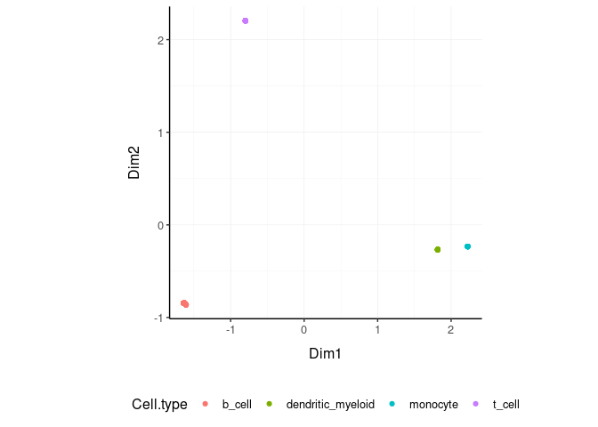

tidybulk - part of tidyTranscriptomics
================

<!-- badges: start -->

[](https://www.tidyverse.org/lifecycle/#maturing)
[](https://github.com/stemangiola/tidybulk/actions)
<!-- badges: end -->

**Brings transcriptomics to the tidyverse\!** (SEO: tidy differential
expression)

# 

website:
[stemangiola.github.io/tidybulk/](http://stemangiola.github.io/tidybulk/)

Please have a look also to

  - [tidyseurat](https://github.com/stemangiola/tidyseurat) for tidy
    high-level data analysis and manipulation
  - [nanny](https://github.com/stemangiola/nanny) for tidy high-level
    data analysis and manipulation
  - [tidygate](https://github.com/stemangiola/tidygate) for adding
    custom gate information to your tibble
  - [tidyHeatmap](https://github.com/stemangiola/tidyHeatmap) for
    heatmaps produced with tidy principles

<!---

[](https://travis-ci.org/stemangiola/tidybulk) [](https://coveralls.io/github/stemangiola/tidybulk?branch=master)

-->

# 

## Functions/utilities available

| Function                        | Description                                                                  |
| ------------------------------- | ---------------------------------------------------------------------------- |
| `identify_abundant`             | identify the abundant genes                                                  |
| `aggregate_duplicates`          | Aggregate abundance and annotation of duplicated transcripts in a robust way |
| `scale_abundance`               | Scale (normalise) abundance for RNA sequencing depth                         |
| `reduce_dimensions`             | Perform dimensionality reduction (PCA, MDS, tSNE)                            |
| `cluster_elements`              | Labels elements with cluster identity (kmeans, SNN)                          |
| `remove_redundancy`             | Filter out elements with highly correlated features                          |
| `adjust_abundance`              | Remove known unwanted variation (Combat)                                     |
| `test_differential_abundance`   | Differential transcript abundance testing (DE)                               |
| `deconvolve_cellularity`        | Estimated tissue composition (Cibersort or llsr)                             |
| `test_differential_cellularity` | Differential cell-type abundance testing                                     |
| `keep_variable`                 | Filter for top variable features                                             |
| `keep_abundant`                 | Filter out lowly abundant transcripts                                        |
| `test_gene_enrichment`          | Gene enrichment analyses (EGSEA)                                             |
| `test_gene_overrepresentation`  | Gene enrichment on list of transcript names (no rank)                        |

| Utilities                  | Description                                                     |
| -------------------------- | --------------------------------------------------------------- |
| `get_bibliography`         | Get the bibliography of your workflow                           |
| `tidybulk`                 | add tidybulk attributes to a tibble object                      |
| `tidybulk_SAM_BAM`         | Convert SAM BAM files into tidybulk tibble                      |
| `pivot_sample`             | Select sample-wise columns/information                          |
| `pivot_transcript`         | Select transcript-wise columns/information                      |
| `rotate_dimensions`        | Rotate two dimensions of a degree                               |
| `ensembl_to_symbol`        | Add gene symbol from ensembl IDs                                |
| `symbol_to_entrez`         | Add entrez ID from gene symbol                                  |
| `describe_transcript`      | Add gene description from gene symbol                           |
| `impute_missing_abundance` | Impute abundance for missing data points using sample groupings |
| `fill_missing_abundance`   | Fill abundance for missing data points using an arbitrary value |

## Minimal input data frame

| sample          | transcript      | abundance | annotation |
| --------------- | --------------- | --------- | ---------- |
| `chr` or `fctr` | `chr` or `fctr` | `integer` | …          |

## Output data frame

| sample          | transcript      | abundance | annotation | new information |
| --------------- | --------------- | --------- | ---------- | --------------- |
| `chr` or `fctr` | `chr` or `fctr` | `integer` | …          | …               |

All functions are also directly compatible with `SummarizedExperiment`
object.

## Installation

From Bioconductor

``` r
BiocManager::install("tidybulk")
```

From Github

``` r
devtools::install_github("stemangiola/tidybulk")
```

## Create `tidybulk` tibble.

It memorises key column names

``` r
tt = counts_SE
```

## Get the bibliography of your workflow

First of all, you can cite all articles utilised within your workflow
automatically from any tidybulk tibble

``` r
tt %>%  get_bibliography()
```

## Aggregate duplicated `transcripts`

tidybulk provide the `aggregate_duplicates` function to aggregate
duplicated transcripts (e.g., isoforms, ensembl). For example, we often
have to convert ensembl symbols to gene/transcript symbol, but in doing
so we have to deal with duplicates. `aggregate_duplicates` takes a
tibble and column names (as symbols; for `sample`, `transcript` and
`count`) as arguments and returns a tibble with transcripts with the
same name aggregated. All the rest of the columns are appended, and
factors and boolean are appended as characters.

<div class="column-left">

TidyTranscriptomics

``` r yellow
tt.aggr = tt %>% aggregate_duplicates()
```

</div>

<div class="column-right">

Standard procedure (comparative purpose)

``` r
temp = data.frame(
    symbol = dge_list$genes$symbol,
    dge_list$counts
)
dge_list.nr <- by(temp, temp$symbol,
    function(df)
        if(length(df[1,1])>0)
            matrixStats:::colSums(as.matrix(df[,-1]))
)
dge_list.nr <- do.call("rbind", dge_list.nr)
colnames(dge_list.nr) <- colnames(dge_list)
```

</div>

<div style="clear:both;">

</div>

## Scale `counts`

We may want to compensate for sequencing depth, scaling the transcript
abundance (e.g., with TMM algorithm, Robinson and Oshlack
doi.org/10.1186/gb-2010-11-3-r25). `scale_abundance` takes a tibble,
column names (as symbols; for `sample`, `transcript` and `count`) and a
method as arguments and returns a tibble with additional columns with
scaled data as `<NAME OF COUNT COLUMN>_scaled`.

<div class="column-left">

TidyTranscriptomics

``` r
tt.norm = tt.aggr %>% identify_abundant(factor_of_interest = condition) %>% scale_abundance()
```

</div>

<div class="column-right">

Standard procedure (comparative purpose)

``` r
library(edgeR)

dgList <- DGEList(count_m=x,group=group)
keep <- filterByExpr(dgList)
dgList <- dgList[keep,,keep.lib.sizes=FALSE]
[...]
dgList <- calcNormFactors(dgList, method="TMM")
norm_counts.table <- cpm(dgList)
```

</div>

<div style="clear:both;">

</div>

We can easily plot the scaled density to check the scaling outcome. On
the x axis we have the log scaled counts, on the y axes we have the
density, data is grouped by sample and coloured by cell type.

``` r
tt.norm %>%
    ggplot(aes(count_scaled + 1, group=sample, color=`Cell.type`)) +
    geom_density() +
    scale_x_log10() +
    my_theme
```

<!-- -->

## Filter `variable transcripts`

We may want to identify and filter variable transcripts.

<div class="column-left">

TidyTranscriptomics

``` r
tt.norm.variable = tt.norm %>% keep_variable()
```

</div>

<div class="column-right">

Standard procedure (comparative purpose)

``` r
library(edgeR)

x = norm_counts.table

s <- rowMeans((x-rowMeans(x))^2)
o <- order(s,decreasing=TRUE)
x <- x[o[1L:top],,drop=FALSE]

norm_counts.table = norm_counts.table[rownames(x)]

norm_counts.table$cell_type = tidybulk::counts[
    match(
        tidybulk::counts$sample,
        rownames(norm_counts.table)
    ),
    "Cell.type"
]
```

</div>

<div style="clear:both;">

</div>

## Reduce `dimensions`

We may want to reduce the dimensions of our data, for example using PCA
or MDS algorithms. `reduce_dimensions` takes a tibble, column names (as
symbols; for `sample`, `transcript` and `count`) and a method (e.g., MDS
or PCA) as arguments and returns a tibble with additional columns for
the reduced dimensions.

**MDS** (Robinson et al., 10.1093/bioinformatics/btp616)

<div class="column-left">

TidyTranscriptomics

``` r
tt.norm.MDS =
  tt.norm %>%
  reduce_dimensions(method="MDS", .dims = 6)
```

</div>

<div class="column-right">

Standard procedure (comparative purpose)

``` r
library(limma)

count_m_log = log(count_m + 1)
cmds = limma::plotMDS(ndim = .dims, plot = FALSE)

cmds = cmds %$% 
    cmdscale.out %>%
    setNames(sprintf("Dim%s", 1:6))

cmds$cell_type = tidybulk::counts[
    match(tidybulk::counts$sample, rownames(cmds)),
    "Cell.type"
]
```

</div>

<div style="clear:both;">

</div>

On the x and y axes axis we have the reduced dimensions 1 to 3, data is
coloured by cell type.

``` r
tt.norm.MDS %>% pivot_sample()  %>% select(contains("Dim"), everything())
```

    ## # A tibble: 48 x 15
    ##      Dim1   Dim2   Dim3     Dim4    Dim5    Dim6 sample Cell.type time 
    ##     <dbl>  <dbl>  <dbl>    <dbl>   <dbl>   <dbl> <chr>  <chr>     <chr>
    ##  1 -1.46   0.220 -1.68  -0.0553   0.0658 -0.126  SRR17… b_cell    0 d  
    ##  2 -1.46   0.226 -1.71  -0.0300   0.0454 -0.137  SRR17… b_cell    1 d  
    ##  3 -1.44   0.193 -1.60  -0.0890   0.0503 -0.121  SRR17… b_cell    3 d  
    ##  4 -1.44   0.198 -1.67  -0.0891   0.0543 -0.110  SRR17… b_cell    7 d  
    ##  5  0.243 -1.42   0.182 -0.00642 -0.503  -0.131  SRR17… dendriti… 0 d  
    ##  6  0.191 -1.42   0.195 -0.0180  -0.457  -0.130  SRR17… dendriti… 1 d  
    ##  7  0.257 -1.42   0.152 -0.0130  -0.582  -0.0927 SRR17… dendriti… 3 d  
    ##  8  0.162 -1.43   0.189 -0.0232  -0.452  -0.109  SRR17… dendriti… 7 d  
    ##  9  0.516 -1.47   0.240  0.251    0.457  -0.119  SRR17… monocyte  0 d  
    ## 10  0.514 -1.41   0.231  0.219    0.458  -0.131  SRR17… monocyte  1 d  
    ## # … with 38 more rows, and 6 more variables: condition <chr>, batch <chr>,
    ## #   factor_of_interest <chr>, merged.transcripts <dbl>, TMM <dbl>,
    ## #   multiplier <dbl>

``` r
tt.norm.MDS %>%
    pivot_sample() %>%
  GGally::ggpairs(columns = 10:15, ggplot2::aes(colour=`Cell.type`))
```

<!-- -->

**PCA**

<div class="column-left">

TidyTranscriptomics

``` r
tt.norm.PCA =
  tt.norm %>%
  reduce_dimensions(method="PCA", .dims = 6)
```

</div>

<div class="column-right">

Standard procedure (comparative purpose)

``` r
count_m_log = log(count_m + 1)
pc = count_m_log %>% prcomp(scale = TRUE)
variance = pc$sdev^2
variance = (variance / sum(variance))[1:6]
pc$cell_type = counts[
    match(counts$sample, rownames(pc)),
    "Cell.type"
]
```

</div>

<div style="clear:both;">

</div>

On the x and y axes axis we have the reduced dimensions 1 to 3, data is
coloured by cell type.

``` r
tt.norm.PCA %>% pivot_sample() %>% select(contains("PC"), everything())
```

    ## # A tibble: 48 x 16
    ##       PC1   PC2    PC3    PC4    PC5   PC6 sample Cell.type time  condition
    ##     <dbl> <dbl>  <dbl>  <dbl>  <dbl> <dbl> <chr>  <chr>     <chr> <chr>    
    ##  1 -32.7  -4.93 -37.5  -1.24   -1.47 -2.81 SRR17… b_cell    0 d   TRUE     
    ##  2 -32.7  -5.05 -38.1  -0.672  -1.02 -3.06 SRR17… b_cell    1 d   TRUE     
    ##  3 -32.2  -4.32 -35.8  -1.99   -1.12 -2.70 SRR17… b_cell    3 d   TRUE     
    ##  4 -32.3  -4.43 -37.3  -1.99   -1.21 -2.45 SRR17… b_cell    7 d   TRUE     
    ##  5   5.44 31.8    4.08 -0.144  11.3  -2.94 SRR17… dendriti… 0 d   FALSE    
    ##  6   4.28 31.7    4.35 -0.403  10.2  -2.91 SRR17… dendriti… 1 d   FALSE    
    ##  7   5.74 31.7    3.40 -0.290  13.0  -2.07 SRR17… dendriti… 3 d   FALSE    
    ##  8   3.62 32.1    4.23 -0.519  10.1  -2.43 SRR17… dendriti… 7 d   FALSE    
    ##  9  11.5  32.8    5.37  5.60  -10.2  -2.66 SRR17… monocyte  0 d   FALSE    
    ## 10  11.5  31.6    5.16  4.90  -10.2  -2.92 SRR17… monocyte  1 d   FALSE    
    ## # … with 38 more rows, and 6 more variables: batch <chr>,
    ## #   factor_of_interest <chr>, merged.transcripts <dbl>, TMM <dbl>,
    ## #   multiplier <dbl>, sample.x <chr>

``` r
tt.norm.PCA %>%
     pivot_sample() %>%
  GGally::ggpairs(columns = 11:13, ggplot2::aes(colour=`Cell.type`))
```

<!-- -->

**tSNE**

<div class="column-left">

TidyTranscriptomics

``` r
tt.norm.tSNE =
    breast_tcga_mini %>%
    tidybulk(       sample, ens, count_scaled) %>%
    identify_abundant() %>%
    reduce_dimensions(
        method = "tSNE",
        perplexity=10,
        pca_scale =TRUE
    )
```

</div>

<div class="column-right">

Standard procedure (comparative purpose)

``` r
count_m_log = log(count_m + 1)

tsne = Rtsne::Rtsne(
    t(count_m_log),
    perplexity=10,
        pca_scale =TRUE
)$Y
tsne$cell_type = tidybulk::counts[
    match(tidybulk::counts$sample, rownames(tsne)),
    "Cell.type"
]
```

</div>

<div style="clear:both;">

</div>

Plot

``` r
tt.norm.tSNE %>%
    pivot_sample() %>%
    select(contains("tSNE"), everything()) 
```

    ## # A tibble: 251 x 4
    ##      tSNE1   tSNE2 sample                       Call 
    ##      <dbl>   <dbl> <chr>                        <fct>
    ##  1 -10.3     7.13  TCGA-A1-A0SD-01A-11R-A115-07 LumA 
    ##  2   5.88    7.66  TCGA-A1-A0SF-01A-11R-A144-07 LumA 
    ##  3 -11.7    -8.02  TCGA-A1-A0SG-01A-11R-A144-07 LumA 
    ##  4  -0.186  -2.37  TCGA-A1-A0SH-01A-11R-A084-07 LumA 
    ##  5  -7.49    5.87  TCGA-A1-A0SI-01A-11R-A144-07 LumB 
    ##  6  -1.02  -11.8   TCGA-A1-A0SJ-01A-11R-A084-07 LumA 
    ##  7  32.4    -0.966 TCGA-A1-A0SK-01A-12R-A084-07 Basal
    ##  8   4.90  -10.8   TCGA-A1-A0SM-01A-11R-A084-07 LumA 
    ##  9   3.53  -10.3   TCGA-A1-A0SN-01A-11R-A144-07 LumB 
    ## 10 -22.7    -8.44  TCGA-A1-A0SQ-01A-21R-A144-07 LumA 
    ## # … with 241 more rows

``` r
tt.norm.tSNE %>%
    pivot_sample() %>%
    ggplot(aes(x = `tSNE1`, y = `tSNE2`, color=Call)) + geom_point() + my_theme
```

<!-- -->

## Rotate `dimensions`

We may want to rotate the reduced dimensions (or any two numeric columns
really) of our data, of a set angle. `rotate_dimensions` takes a tibble,
column names (as symbols; for `sample`, `transcript` and `count`) and an
angle as arguments and returns a tibble with additional columns for the
rotated dimensions. The rotated dimensions will be added to the original
data set as `<NAME OF DIMENSION> rotated <ANGLE>` by default, or as
specified in the input arguments.

<div class="column-left">

TidyTranscriptomics

``` r
tt.norm.MDS.rotated =
  tt.norm.MDS %>%
    rotate_dimensions(`Dim1`, `Dim2`, rotation_degrees = 45, action="get")
```

</div>

<div class="column-right">

Standard procedure (comparative purpose)

``` r
rotation = function(m, d) {
    r = d * pi / 180
    ((bind_rows(
        c(`1` = cos(r), `2` = -sin(r)),
        c(`1` = sin(r), `2` = cos(r))
    ) %>% as_matrix) %*% m)
}
mds_r = pca %>% rotation(rotation_degrees)
mds_r$cell_type = counts[
    match(counts$sample, rownames(mds_r)),
    "Cell.type"
]
```

</div>

<div style="clear:both;">

</div>

**Original** On the x and y axes axis we have the first two reduced
dimensions, data is coloured by cell type.

``` r
tt.norm.MDS.rotated %>%
    ggplot(aes(x=`Dim1`, y=`Dim2`, color=`Cell.type` )) +
  geom_point() +
  my_theme
```

<!-- -->

**Rotated** On the x and y axes axis we have the first two reduced
dimensions rotated of 45 degrees, data is coloured by cell type.

``` r
tt.norm.MDS.rotated %>%
    pivot_sample() %>%
    ggplot(aes(x=`Dim1_rotated_45`, y=`Dim2_rotated_45`, color=`Cell.type` )) +
  geom_point() +
  my_theme
```

<!-- -->

## Test `differential abundance`

We may want to test for differential transcription between sample-wise
factors of interest (e.g., with edgeR). `test_differential_abundance`
takes a tibble, column names (as symbols; for `sample`, `transcript` and
`count`) and a formula representing the desired linear model as
arguments and returns a tibble with additional columns for the
statistics from the hypothesis test (e.g., log fold change, p-value and
false discovery rate).

<div class="column-left">

TidyTranscriptomics

``` r
tt.de =
    tt %>%
    test_differential_abundance( ~ condition, action="get")
tt.de
```

</div>

<div class="column-right">

Standard procedure (comparative purpose)

``` r
library(edgeR)

dgList <- DGEList(counts=counts_m,group=group)
keep <- filterByExpr(dgList)
dgList <- dgList[keep,,keep.lib.sizes=FALSE]
dgList <- calcNormFactors(dgList)
design <- model.matrix(~group)
dgList <- estimateDisp(dgList,design)
fit <- glmQLFit(dgList,design)
qlf <- glmQLFTest(fit,coef=2)
topTags(qlf, n=Inf)
```

</div>

<div style="clear:both;">

</div>

The functon `test_differential_abundance` operated with contrasts too.
The constrasts hve the name of the design matrix (generally
<NAME_COLUMN_COVARIATE><VALUES_OF_COVARIATE>)

``` r
tt.de =
    tt %>%
    identify_abundant(factor_of_interest = condition) %>%
    test_differential_abundance(
        ~ 0 + condition,                  
        .contrasts = c( "conditionTRUE - conditionFALSE"),
        action="get"
    )
```

## Adjust `counts`

We may want to adjust `counts` for (known) unwanted variation.
`adjust_abundance` takes as arguments a tibble, column names (as
symbols; for `sample`, `transcript` and `count`) and a formula
representing the desired linear model where the first covariate is the
factor of interest and the second covariate is the unwanted variation,
and returns a tibble with additional columns for the adjusted counts as
`<COUNT COLUMN>_adjusted`. At the moment just an unwanted covariated is
allowed at a time.

<div class="column-left">

TidyTranscriptomics

``` r
tt.norm.adj =
    tt.norm %>% adjust_abundance(   ~ factor_of_interest + batch)
```

</div>

<div class="column-right">

Standard procedure (comparative purpose)

``` r
library(sva)

count_m_log = log(count_m + 1)

design =
        model.matrix(
            object = ~ factor_of_interest + batch,
            data = annotation
        )

count_m_log.sva =
    ComBat(
            batch = design[,2],
            mod = design,
            ...
        )

count_m_log.sva = ceiling(exp(count_m_log.sva) -1)
count_m_log.sva$cell_type = counts[
    match(counts$sample, rownames(count_m_log.sva)),
    "Cell.type"
]
```

</div>

<div style="clear:both;">

</div>

## Deconvolve `Cell type composition`

We may want to infer the cell type composition of our samples (with the
algorithm Cibersort; Newman et al., 10.1038/nmeth.3337).
`deconvolve_cellularity` takes as arguments a tibble, column names (as
symbols; for `sample`, `transcript` and `count`) and returns a tibble
with additional columns for the adjusted cell type proportions.

<div class="column-left">

TidyTranscriptomics

``` r
tt.cibersort =
    tt %>%
    deconvolve_cellularity(action="get", cores=1, prefix = "cibersort__") 
```

</div>

<div class="column-right">

Standard procedure (comparative purpose)

``` r
source(‘CIBERSORT.R’)
count_m %>% write.table("mixture_file.txt")
results <- CIBERSORT(
    "sig_matrix_file.txt",
    "mixture_file.txt",
    perm=100, QN=TRUE
)
results$cell_type = tidybulk::counts[
    match(tidybulk::counts$sample, rownames(results)),
    "Cell.type"
]
```

</div>

<div style="clear:both;">

</div>

With the new annotated data frame, we can plot the distributions of cell
types across samples, and compare them with the nominal cell type labels
to check for the purity of isolation. On the x axis we have the cell
types inferred by Cibersort, on the y axis we have the inferred
proportions. The data is facetted and coloured by nominal cell types
(annotation given by the researcher after FACS sorting).

``` r
tt.cibersort %>%
    pivot_longer(
        names_to= "Cell_type_inferred", 
        values_to = "proportion", 
        names_prefix ="cibersort__", 
        cols=contains("cibersort__")
    ) %>%
  ggplot(aes(x=`Cell_type_inferred`, y=proportion, fill=`Cell.type`)) +
  geom_boxplot() +
  facet_wrap(~`Cell.type`) +
  my_theme +
  theme(axis.text.x = element_text(angle = 90, hjust = 1, vjust = 0.5), aspect.ratio=1/5)
```

<!-- -->

## Test differential cell-type abundance

We can also perform a statistical test on the differential cell-type
abundance across conditions

``` r
    tt %>%
    test_differential_cellularity(. ~ condition )
```

    ## # A tibble: 22 x 7
    ##    .cell_type cell_type_propo… `estimate_(Inte… estimate_condit…
    ##    <chr>      <list>                      <dbl>            <dbl>
    ##  1 cibersort… <tibble [48 × 8…            -2.97            2.33 
    ##  2 cibersort… <tibble [48 × 8…            -4.79            1.86 
    ##  3 cibersort… <tibble [48 × 8…            -5.44           -0.503
    ##  4 cibersort… <tibble [48 × 8…            -2.28            0.883
    ##  5 cibersort… <tibble [48 × 8…            -2.79           -0.637
    ##  6 cibersort… <tibble [48 × 8…            -2.60            0.320
    ##  7 cibersort… <tibble [48 × 8…            -3.72            2.14 
    ##  8 cibersort… <tibble [48 × 8…            -5.20           -0.251
    ##  9 cibersort… <tibble [48 × 8…            -4.80            1.75 
    ## 10 cibersort… <tibble [48 × 8…            -5.34           -0.219
    ## # … with 12 more rows, and 3 more variables: std.error_conditionTRUE <dbl>,
    ## #   statistic_conditionTRUE <dbl>, p.value_conditionTRUE <dbl>

We can also perform regression analysis with censored data (coxph).

``` r
    tt %>%
    test_differential_cellularity(survival::Surv(time, dead) ~ .)
```

## Cluster `samples`

We may want to cluster our data (e.g., using k-means sample-wise).
`cluster_elements` takes as arguments a tibble, column names (as
symbols; for `sample`, `transcript` and `count`) and returns a tibble
with additional columns for the cluster annotation. At the moment only
k-means clustering is supported, the plan is to introduce more
clustering methods.

**k-means**

<div class="column-left">

TidyTranscriptomics

``` r
tt.norm.cluster = tt.norm.MDS %>%
  cluster_elements(method="kmeans", centers = 2, action="get" )
```

</div>

<div class="column-right">

Standard procedure (comparative purpose)

``` r
count_m_log = log(count_m + 1)

k = kmeans(count_m_log, iter.max = 1000, ...)
cluster = k$cluster

cluster$cell_type = tidybulk::counts[
    match(tidybulk::counts$sample, rownames(cluster)),
    c("Cell.type", "Dim1", "Dim2")
]
```

</div>

<div style="clear:both;">

</div>

We can add cluster annotation to the MDS dimesion reduced data set and
plot.

``` r
 tt.norm.cluster %>%
    ggplot(aes(x=`Dim1`, y=`Dim2`, color=`cluster_kmeans`)) +
  geom_point() +
  my_theme
```

<!-- -->

**SNN**

<div class="column-left">

TidyTranscriptomics

``` r
tt.norm.SNN =
    tt.norm.tSNE %>%
    cluster_elements(method = "SNN")
```

</div>

<div class="column-right">

Standard procedure (comparative purpose)

``` r
library(Seurat)

snn = CreateSeuratObject(count_m)
snn = ScaleData(
    snn, display.progress = TRUE,
    num.cores=4, do.par = TRUE
)
snn = FindVariableFeatures(snn, selection.method = "vst")
snn = FindVariableFeatures(snn, selection.method = "vst")
snn = RunPCA(snn, npcs = 30)
snn = FindNeighbors(snn)
snn = FindClusters(snn, method = "igraph", ...)
snn = snn[["seurat_clusters"]]

snn$cell_type = tidybulk::counts[
    match(tidybulk::counts$sample, rownames(snn)),
    c("Cell.type", "Dim1", "Dim2")
]
```

</div>

<div style="clear:both;">

</div>

``` r
tt.norm.SNN %>%
    pivot_sample() %>%
    select(contains("tSNE"), everything()) 
```

    ## # A tibble: 251 x 5
    ##      tSNE1   tSNE2 sample                       Call  `cluster SNN`
    ##      <dbl>   <dbl> <chr>                        <fct> <fct>        
    ##  1 -10.3     7.13  TCGA-A1-A0SD-01A-11R-A115-07 LumA  1            
    ##  2   5.88    7.66  TCGA-A1-A0SF-01A-11R-A144-07 LumA  2            
    ##  3 -11.7    -8.02  TCGA-A1-A0SG-01A-11R-A144-07 LumA  1            
    ##  4  -0.186  -2.37  TCGA-A1-A0SH-01A-11R-A084-07 LumA  0            
    ##  5  -7.49    5.87  TCGA-A1-A0SI-01A-11R-A144-07 LumB  0            
    ##  6  -1.02  -11.8   TCGA-A1-A0SJ-01A-11R-A084-07 LumA  1            
    ##  7  32.4    -0.966 TCGA-A1-A0SK-01A-12R-A084-07 Basal 3            
    ##  8   4.90  -10.8   TCGA-A1-A0SM-01A-11R-A084-07 LumA  2            
    ##  9   3.53  -10.3   TCGA-A1-A0SN-01A-11R-A144-07 LumB  2            
    ## 10 -22.7    -8.44  TCGA-A1-A0SQ-01A-21R-A144-07 LumA  1            
    ## # … with 241 more rows

``` r
tt.norm.SNN %>%
    pivot_sample() %>%
    gather(source, Call, c("cluster SNN", "Call")) %>%
    distinct() %>%
    ggplot(aes(x = `tSNE1`, y = `tSNE2`, color=Call)) + geom_point() + facet_grid(~source) + my_theme
```

<!-- -->

``` r
# Do differential transcription between clusters
tt.norm.SNN %>%
    mutate(factor_of_interest = `cluster SNN` == 3) %>%
    test_differential_abundance(
    ~ factor_of_interest,
    action="get"
   )
```

    ## # A tibble: 500 x 7
    ##    ens             .abundant   logFC logCPM      F   PValue      FDR
    ##    <chr>           <lgl>       <dbl>  <dbl>  <dbl>    <dbl>    <dbl>
    ##  1 ENSG00000002834 TRUE      -1.01    10.7  43.1   2.95e-10 8.32e-10
    ##  2 ENSG00000003989 TRUE      -3.59     9.93 81.5   4.61e-17 2.50e-16
    ##  3 ENSG00000004478 TRUE      -0.129   10.6   0.819 3.66e- 1 3.89e- 1
    ##  4 ENSG00000006125 TRUE      -0.673   10.7  29.9   1.10e- 7 2.29e- 7
    ##  5 ENSG00000008988 TRUE       0.830   11.3  80.4   6.89e-17 3.66e-16
    ##  6 ENSG00000009307 TRUE       0.405   11.3  30.2   9.30e- 8 1.96e- 7
    ##  7 ENSG00000010278 TRUE       0.0907  10.6   0.727 3.95e- 1 4.17e- 1
    ##  8 ENSG00000011465 TRUE      -1.22    11.1  39.6   1.34e- 9 3.47e- 9
    ##  9 ENSG00000012223 TRUE       0.270   11.8   0.327 5.68e- 1 5.84e- 1
    ## 10 ENSG00000012660 TRUE      -1.72    10.5  91.2   1.16e-18 7.06e-18
    ## # … with 490 more rows

## Drop `redundant` transcripts

We may want to remove redundant elements from the original data set
(e.g., samples or transcripts), for example if we want to define
cell-type specific signatures with low sample redundancy.
`remove_redundancy` takes as arguments a tibble, column names (as
symbols; for `sample`, `transcript` and `count`) and returns a tibble
with redundant elements removed (e.g., samples). Two redundancy
estimation approaches are supported:

  - removal of highly correlated clusters of elements (keeping a
    representative) with method=“correlation”
  - removal of most proximal element pairs in a reduced dimensional
    space.

**Approach 1**

<div class="column-left">

TidyTranscriptomics

``` r
tt.norm.non_redundant =
    tt.norm.MDS %>%
  remove_redundancy(    method = "correlation" )
```

</div>

<div class="column-right">

Standard procedure (comparative purpose)

``` r
library(widyr)

.data.correlated =
    pairwise_cor(
        counts,
        sample,
        transcript,
        rc,
        sort = TRUE,
        diag = FALSE,
        upper = FALSE
    ) %>%
    filter(correlation > correlation_threshold) %>%
    distinct(item1) %>%
    rename(!!.element := item1)

# Return non redudant data frame
counts %>% anti_join(.data.correlated) %>%
    spread(sample, rc, - transcript) %>%
    left_join(annotation)
```

</div>

<div style="clear:both;">

</div>

We can visualise how the reduced redundancy with the reduced dimentions
look like

``` r
tt.norm.non_redundant %>%
    pivot_sample() %>%
    ggplot(aes(x=`Dim1`, y=`Dim2`, color=`Cell.type`)) +
  geom_point() +
  my_theme
```

<!-- -->

**Approach 2**

``` r
tt.norm.non_redundant =
    tt.norm.MDS %>%
  remove_redundancy(
    method = "reduced_dimensions",
    Dim_a_column = `Dim1`,
    Dim_b_column = `Dim2`
  )
```

We can visualise MDS reduced dimensions of the samples with the closest
pair removed.

``` r
tt.norm.non_redundant %>%
    pivot_sample() %>%
    ggplot(aes(x=`Dim1`, y=`Dim2`, color=`Cell.type`)) +
  geom_point() +
  my_theme
```

<!-- -->

## Other useful wrappers

The above wrapper streamline the most common processing of bulk RNA
sequencing data. Other useful wrappers are listed above.

## From BAM/SAM to tibble of gene counts

We can calculate gene counts (using FeatureCounts; Liao Y et al.,
10.1093/nar/gkz114) from a list of BAM/SAM files and format them into a
tidy structure (similar to counts).

``` r
counts = tidybulk_SAM_BAM(
    file_names,
    genome = "hg38",
    isPairedEnd = TRUE,
    requireBothEndsMapped = TRUE,
    checkFragLength = FALSE,
    useMetaFeatures = TRUE
)
```

## From ensembl IDs to gene symbol IDs

We can add gene symbols from ensembl identifiers. This is useful since
different resources use ensembl IDs while others use gene symbol IDs.
This currently works for human and mouse.

``` r
counts_ensembl %>% ensembl_to_symbol(ens)
```

    ## # A tibble: 119 x 8
    ##    ens   iso   `read count` sample cases_0_project… cases_0_samples… transcript
    ##    <chr> <chr>        <dbl> <chr>  <chr>            <chr>            <chr>     
    ##  1 ENSG… 13             144 TARGE… Acute Myeloid L… Primary Blood D… TSPAN6    
    ##  2 ENSG… 13              72 TARGE… Acute Myeloid L… Primary Blood D… TSPAN6    
    ##  3 ENSG… 13               0 TARGE… Acute Myeloid L… Primary Blood D… TSPAN6    
    ##  4 ENSG… 13            1099 TARGE… Acute Myeloid L… Primary Blood D… TSPAN6    
    ##  5 ENSG… 13              11 TARGE… Acute Myeloid L… Primary Blood D… TSPAN6    
    ##  6 ENSG… 13               2 TARGE… Acute Myeloid L… Primary Blood D… TSPAN6    
    ##  7 ENSG… 13               3 TARGE… Acute Myeloid L… Primary Blood D… TSPAN6    
    ##  8 ENSG… 13            2678 TARGE… Acute Myeloid L… Primary Blood D… TSPAN6    
    ##  9 ENSG… 13             751 TARGE… Acute Myeloid L… Primary Blood D… TSPAN6    
    ## 10 ENSG… 13               1 TARGE… Acute Myeloid L… Primary Blood D… TSPAN6    
    ## # … with 109 more rows, and 1 more variable: ref_genome <chr>

## From gene symbol to gene description (gene name in full)

We can add gene full name (and in future description) from symbol
identifiers. This currently works for human and mouse.

``` r
tt %>% describe_transcript() %>% select(transcript, description, everything())
```

    ## # A tibble abstraction: 408,624 x 9
    ##    transcript sample count Cell.type time  condition batch factor_of_inter…
    ##    <chr>      <chr>  <dbl> <fct>     <fct> <lgl>     <fct> <lgl>           
    ##  1 A1BG       SRR17…   153 b_cell    0 d   TRUE      0     TRUE            
    ##  2 A1BG-AS1   SRR17…    83 b_cell    0 d   TRUE      0     TRUE            
    ##  3 AAAS       SRR17…   868 b_cell    0 d   TRUE      0     TRUE            
    ##  4 AACS       SRR17…   222 b_cell    0 d   TRUE      0     TRUE            
    ##  5 AAGAB      SRR17…   590 b_cell    0 d   TRUE      0     TRUE            
    ##  6 AAMDC      SRR17…    48 b_cell    0 d   TRUE      0     TRUE            
    ##  7 AAMP       SRR17…  1257 b_cell    0 d   TRUE      0     TRUE            
    ##  8 AANAT      SRR17…   284 b_cell    0 d   TRUE      0     TRUE            
    ##  9 AAR2       SRR17…   379 b_cell    0 d   TRUE      0     TRUE            
    ## 10 AARS2      SRR17…   685 b_cell    0 d   TRUE      0     TRUE            
    ## # … with 40 more rows, and 1 more variable: description <chr>
