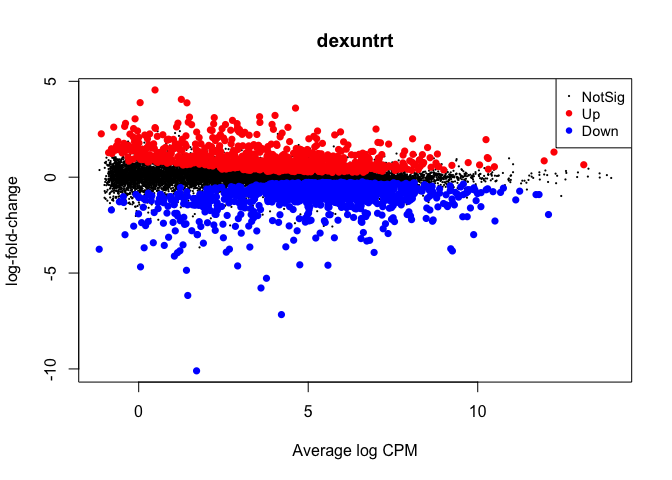

tidybulk: An R tidy framework for modular transcriptomic data analysis
================

<!-- badges: start -->

[](https://www.tidyverse.org/lifecycle/#maturing)
[](https://github.com/stemangiola/tidybulk/actions/)
[](https://bioconductor.org/checkResults/release/bioc-LATEST/tidybulk/)
<!-- badges: end -->

**tidybulk** is a powerful R package designed for modular transcriptomic
data analysis that brings transcriptomics to the tidyverse.

## Why tidybulk?

Tidybulk provides a unified interface for comprehensive transcriptomic
data analysis with seamless integration of SummarizedExperiment objects
and tidyverse principles. It streamlines the entire workflow from raw
data to biological insights.

## Functions/utilities available

### Abundance Normalization Functions

| Function                         | Description                             |
|----------------------------------|-----------------------------------------|
| `scale_abundance()`              | Scale abundance data                    |
| `quantile_normalise_abundance()` | Quantile normalization                  |
| `adjust_abundance()`             | Adjust abundance for unwanted variation |
| `fill_missing_abundance()`       | Fill missing abundance values           |
| `impute_missing_abundance()`     | Impute missing abundance values         |

### Filtering and Selection Functions

| Function              | Description                                         |
|-----------------------|-----------------------------------------------------|
| `identify_abundant()` | Identify abundant transcripts without removing them |
| `keep_abundant()`     | Keep abundant transcripts                           |
| `keep_variable()`     | Keep variable transcripts                           |
| `filterByExpr()`      | Filter by expression                                |

### Dimensionality Reduction Functions

| Function              | Description                              |
|-----------------------|------------------------------------------|
| `reduce_dimensions()` | Reduce dimensions with PCA/MDS/tSNE/UMAP |
| `rotate_dimensions()` | Rotate dimensions                        |
| `remove_redundancy()` | Remove redundant features                |

### Clustering Functions

| Function                  | Description                           |
|---------------------------|---------------------------------------|
| `cluster_elements()`      | Cluster elements with various methods |
| `kmeans clustering`       | K-means clustering                    |
| `SNN clustering`          | Shared nearest neighbor clustering    |
| `hierarchical clustering` | Hierarchical clustering               |
| `DBSCAN clustering`       | Density-based clustering              |

### Differential Analysis Functions

| Function | Description |
|----|----|
| `test_differential_expression()` | Test differential expression with various methods |

### Cellularity Analysis Functions

| Function                   | Description                                 |
|----------------------------|---------------------------------------------|
| `deconvolve_cellularity()` | Deconvolve cellularity with various methods |
| `cibersort()`              | CIBERSORT analysis                          |

### Gene Enrichment Functions

| Function                         | Description                  |
|----------------------------------|------------------------------|
| `test_gene_enrichment()`         | Test gene enrichment         |
| `test_gene_overrepresentation()` | Test gene overrepresentation |
| `test_gene_rank()`               | Test gene rank               |

### Utility Functions

| Function | Description |
|----|----|
| `describe_transcript()` | Describe transcript characteristics |
| `get_bibliography()` | Get bibliography |
| `resolve_complete_confounders_of_non_interest()` | Resolve confounders |

### Validation and Utility Functions

| Function                      | Description                       |
|-------------------------------|-----------------------------------|
| `check_if_counts_is_na()`     | Check if counts contain NA values |
| `check_if_duplicated_genes()` | Check for duplicated genes        |
| `check_if_wrong_input()`      | Validate input data               |
| `log10_reverse_trans()`       | Log10 reverse transformation      |
| `logit_trans()`               | Logit transformation              |

All functions are directly compatible with `SummarizedExperiment`
objects and follow tidyverse principles for seamless integration with
the tidyverse ecosystem.

### Scientific Citation

Mangiola, Stefano, Ramyar Molania, Ruining Dong, Maria A. Doyle, and
Anthony T. Papenfuss. 2021. “Tidybulk: An R tidy framework for modular
transcriptomic data analysis.” Genome Biology 22 (42).
<https://doi.org/10.1186/s13059-020-02233-7>

[Genome Biology - tidybulk: an R tidy framework for modular
transcriptomic data
analysis](https://genomebiology.biomedcentral.com/articles/10.1186/s13059-020-02233-7)

In this example we will use the `airway` dataset, a
`SummarizedExperiment` object containing RNA-seq data from an experiment
studying the effect of dexamethasone treatment on airway smooth muscle
cells. This dataset is available in the
[airway](https://bioconductor.org/packages/airway/) package.

``` r
library(airway)
data(airway)
```

### Comparison of  Differential Expression methods


``` r
# Standard differential expression analysis
airway = airway |>

# Use QL method
    test_differential_expression(~ dex, method = "edgeR_quasi_likelihood", prefix = "ql__") |>
    
    # Use edger_robust_likelihood_ratio
    test_differential_expression(~ dex, method = "edger_robust_likelihood_ratio", prefix = "lr_robust__") |>
    
# Use DESeq2 method
    test_differential_expression(~ dex, method = "DESeq2", prefix = "deseq2__") |>
    
    # Use limma_voom
    test_differential_expression(~ dex, method = "limma_voom", prefix = "voom__") |>

# Use limma_voom_sample_weights
    test_differential_expression(~ dex, method = "limma_voom_sample_weights", prefix = "voom_weights__") 
```


### Histograms of p-values across methods

Inspection of the raw p-value histogram provides a rapid check of
differential-expression results. When no gene is truly differentially
expressed, the p-values follow a uniform U(0,1) distribution across the
interval 0–1, so the histogram appears flat
[Source](https://bioconductor.org/help/course-materials/2014/useR2014/Workflows.html).
In a more realistic scenario where only a subset of genes changes, this
uniform background is still present but an obvious spike emerges close
to zero, created by the genuine signals.

Thanks to the modularity of the `tidybulk` workflow, that can multiplex
different methods, we can easily compare the p-values across methods.

``` r
    airway |>
  rowData() |> 
  as_tibble() |> 
  select(
    ql__PValue, 
    lr_robust__PValue, 
    voom__P.Value, 
    voom_weights__P.Value, 
    deseq2__pvalue
  ) |> 
  pivot_longer(everything(), names_to = "method", values_to = "pvalue") |>
  ggplot(aes(x = pvalue, fill = method)) +
  geom_histogram(binwidth = 0.01) +
  facet_wrap(~method) +
  my_theme +
  labs(title = "Histogram of p-values across methods")
```

    ## Warning: Removed 30 rows containing non-finite outside the scale range
    ## (`stat_bin()`).

<!-- -->

### Compare Results Across Methods

``` r
# Summary statistics
airway |> rowData() |> as_tibble() |> select(contains("ql|lr_robust|voom|voom_weights|deseq2")) |> select(contains("logFC")) |> 
summarise(across(everything(), list(min = min, median = median, max = max), na.rm = TRUE))
```

    ## Warning: There was 1 warning in `summarise()`.
    ## ℹ In argument: `across(...)`.
    ## Caused by warning:
    ## ! The `...` argument of `across()` is deprecated as of dplyr 1.1.0.
    ## Supply arguments directly to `.fns` through an anonymous function instead.
    ## 
    ##   # Previously
    ##   across(a:b, mean, na.rm = TRUE)
    ## 
    ##   # Now
    ##   across(a:b, \(x) mean(x, na.rm = TRUE))

    ## # A tibble: 1 × 0

### Pairplot of pvalues across methods (GGpairs)

``` r
library(GGally)
```

    ## Warning: package 'GGally' was built under R version 4.5.1

``` r
airway |> 
  rowData() |> 
  as_tibble() |> 
  select(ql__PValue, lr_robust__PValue, voom__P.Value, voom_weights__P.Value, deseq2__pvalue) |> 
  ggpairs(columns = 1:5) +
  scale_x_continuous(trans = tidybulk::log10_reverse_trans()) +
  scale_y_continuous(trans = tidybulk::log10_reverse_trans()) +
  my_theme +
  labs(title = "Pairplot of p-values across methods")
```

<!-- -->

### Pairplot of effect sizes across methods (GGpairs)

``` r
library(GGally)
airway |> 
  rowData() |> 
  as_tibble() |> 
  select(ql__logFC, lr_robust__logFC, voom__logFC, voom_weights__logFC, deseq2__log2FoldChange) |> 
  ggpairs(columns = 1:5) +
  my_theme +
  labs(title = "Pairplot of effect sizes across methods")
```

<!-- -->


### Quality Control 

It is important to check the quality of the fit. All methods produce a
fit object that can be used for quality control. The fit object produced
by each underlying method are stored in as attributes of the
`airway_mini` object. We can use them for example to perform quality
control of the fit.

#### For edgeR

Plot the biological coefficient of variation (BCV) trend. This plot is
helpful to understant the dispersion of the data.

``` r
library(edgeR)
```

``` r
metadata(airway)$tidybulk$edgeR_quasi_likelihood_object |>
  plotBCV()
```

<!-- -->

Plot the log-fold change vs mean plot.

``` r
library(edgeR)

metadata(airway)$tidybulk$edgeR_quasi_likelihood_fit |>
  plotMD()
```

<!-- -->

#### For DESeq2

Plot the mean-variance trend.

``` r
library(DESeq2)

metadata(airway)$tidybulk$DESeq2_object |>
  plotDispEsts()
```

<!-- -->

Plot the log-fold change vs mean plot.

``` r
library(DESeq2)

metadata(airway)$tidybulk$DESeq2_object |>
  plotMA()
```

<!-- -->


### Volcano Plots for Each Method

Visualising the significance and effect size of the differential
expression results as a volcano plots we appreciate that some methods
have much lower p-values distributions than other methods, for the same
model and data.

``` r
# Create volcano plots
airway |>

    # Select the columns we want to plot
    rowData() |> 
    as_tibble(rownames = ".feature") |> 
    select(
            .feature,
      ql__logFC, ql__PValue,
      lr_robust__logFC, lr_robust__PValue,
      voom__logFC, voom__P.Value,
      voom_weights__logFC, voom_weights__P.Value,
      deseq2__log2FoldChange, deseq2__pvalue
    ) |>

    # Pivot longer to get a tidy data frame
    pivot_longer(
      - .feature,
      names_to = c("method", "stat"),
      values_to = "value", names_sep = "__"
    ) |>

    # Harmonize column names
    mutate(stat  = case_when(
        stat %in% c("logFC", "log2FoldChange") ~ "logFC",
        stat %in% c("PValue", "pvalue", "P.Value", "p.value") ~ "PValue"
    )) |>
  pivot_wider(names_from = "stat", values_from = "value") |>
  unnest(c(logFC, PValue)) |> 

    # Plot
  ggplot(aes(x = logFC, y = PValue)) +
  geom_point(aes(color = PValue < 0.05, size = PValue < 0.05)) +
  scale_y_continuous(trans = tidybulk::log10_reverse_trans()) +
  scale_color_manual(values = c("TRUE" = "red", "FALSE" = "black")) +
  scale_size_manual(values = c("TRUE" = 0.5, "FALSE" = 0.1)) +
  facet_wrap(~method) +
  my_theme +
  labs(title = "Volcano Plots by Method")
```

    ## Warning: Removed 30 rows containing missing values or values outside the scale range
    ## (`geom_point()`).

<!-- -->

Plotting independent y-axis scales for the p-values and effect sizes
allows us to compare the top genes across methods.

**Methods:**

- **edgeR quasi-likelihood:** Quasi-likelihood F-tests for differential
  expression

- **edgeR robust likelihood ratio:** Robust likelihood ratio tests

- **DESeq2:** Negative binomial distribution with dispersion estimation

- **limma-voom:** Linear modeling with empirical Bayes moderation

- **limma-voom with sample weights:** Enhanced voom with quality weights
  **References:**

- Robinson et al. (2010) edgeR: a Bioconductor package for differential
  expression analysis

- Chen et al. (2016) From reads to genes to pathways: differential
  expression analysis of RNA-Seq experiments using Rsubread and the
  edgeR quasi-likelihood pipeline

- Love et al. (2014) Moderated estimation of fold change and dispersion
  for RNA-seq data with DESeq2

- Law et al. (2014) voom: precision weights unlock linear model analysis
  tools for RNA-seq read counts

- Liu et al. (2015) Why weight? Modelling sample and observational level
  variability improves power in RNA-seq analyses


## Automatic bibliography

`tidybulk` allows you to get the bibliography of all methods used in our
workflow.

``` r
# Get bibliography of all methods used in our workflow
airway |> get_bibliography()
```

    ##  @Article{tidybulk,
    ##   title = {tidybulk: an R tidy framework for modular transcriptomic data analysis},
    ##   author = {Stefano Mangiola and Ramyar Molania and Ruining Dong and Maria A. Doyle & Anthony T. Papenfuss},
    ##   journal = {Genome Biology},
    ##   year = {2021},
    ##   volume = {22},
    ##   number = {42},
    ##   url = {https://genomebiology.biomedcentral.com/articles/10.1186/s13059-020-02233-7},
    ##   }
    ## @article{wickham2019welcome,
    ##   title={Welcome to the Tidyverse},
    ##   author={Wickham, Hadley and Averick, Mara and Bryan, Jennifer and Chang, Winston and McGowan, Lucy D'Agostino and Francois, Romain and Grolemund, Garrett and Hayes, Alex and Henry, Lionel and Hester, Jim and others},
    ##   journal={Journal of Open Source Software},
    ##   volume={4},
    ##   number={43},
    ##   pages={1686},
    ##   year={2019}
    ##  }
    ## @article{robinson2010edger,
    ##   title={edgeR: a Bioconductor package for differential expression analysis of digital gene expression data},
    ##   author={Robinson, Mark D and McCarthy, Davis J and Smyth, Gordon K},
    ##   journal={Bioinformatics},
    ##   volume={26},
    ##   number={1},
    ##   pages={139--140},
    ##   year={2010},
    ##   publisher={Oxford University Press}
    ##  }
    ## @article{robinson2010scaling,
    ##   title={A scaling normalization method for differential expression analysis of RNA-seq data},
    ##   author={Robinson, Mark D and Oshlack, Alicia},
    ##   journal={Genome biology},
    ##   volume={11},
    ##   number={3},
    ##   pages={1--9},
    ##   year={2010},
    ##   publisher={BioMed Central}
    ##  }
    ## @incollection{smyth2005limma,
    ##   title={Limma: linear models for microarray data},
    ##   author={Smyth, Gordon K},
    ##   booktitle={Bioinformatics and computational biology solutions using R and Bioconductor},
    ##   pages={397--420},
    ##   year={2005},
    ##   publisher={Springer}
    ##  }
    ## @Manual{,
    ##     title = {R: A Language and Environment for Statistical Computing},
    ##     author = {{R Core Team}},
    ##     organization = {R Foundation for Statistical Computing},
    ##     address = {Vienna, Austria},
    ##     year = {2020},
    ##     url = {https://www.R-project.org/},
    ##   }
    ## @article{lund2012detecting,
    ##   title={Detecting differential expression in RNA-sequence data using quasi-likelihood with shrunken dispersion estimates},
    ##   author={Lund, Steven P and Nettleton, Dan and McCarthy, Davis J and Smyth, Gordon K},
    ##   journal={Statistical applications in genetics and molecular biology},
    ##   volume={11},
    ##   number={5},
    ##   year={2012},
    ##   publisher={De Gruyter}
    ##     }
    ## @article{zhou2014robustly,
    ##   title={Robustly detecting differential expression in RNA sequencing data using observation weights},
    ##   author={Zhou, Xiaobei and Lindsay, Helen and Robinson, Mark D},
    ##   journal={Nucleic acids research},
    ##   volume={42},
    ##   number={11},
    ##   pages={e91--e91},
    ##   year={2014},
    ##   publisher={Oxford University Press}
    ##  }
    ## @article{love2014moderated,
    ##   title={Moderated estimation of fold change and dispersion for RNA-seq data with DESeq2},
    ##   author={Love, Michael I and Huber, Wolfgang and Anders, Simon},
    ##   journal={Genome biology},
    ##   volume={15},
    ##   number={12},
    ##   pages={550},
    ##   year={2014},
    ##   publisher={Springer}
    ##  }
    ## @article{law2014voom,
    ##   title={voom: Precision weights unlock linear model analysis tools for RNA-seq read counts},
    ##   author={Law, Charity W and Chen, Yunshun and Shi, Wei and Smyth, Gordon K},
    ##   journal={Genome biology},
    ##   volume={15},
    ##   number={2},
    ##   pages={R29},
    ##   year={2014},
    ##   publisher={Springer}
    ##     }
    ## @article{liu2015weight,
    ##   title={Why weight? Modelling sample and observational level variability improves power in RNA-seq analyses},
    ##   author={Liu, Ruijie and Holik, Aliaksei Z and Su, Shian and Jansz, Natasha and Chen, Kelan and Leong, Huei San and Blewitt, Marnie E and Asselin-Labat, Marie-Liesse and Smyth, Gordon K and Ritchie, Matthew E},
    ##   journal={Nucleic acids research},
    ##   volume={43},
    ##   number={15},
    ##   pages={e97--e97},
    ##   year={2015},
    ##   publisher={Oxford University Press}
    ##     }
    ## @article{leek2012sva,
    ##   title={The sva package for removing batch effects and other unwanted variation in high-throughput experiments},
    ##   author={Leek, Jeffrey T and Johnson, W Evan and Parker, Hilary S and Jaffe, Andrew E and Storey, John D},
    ##   journal={Bioinformatics},
    ##   volume={28},
    ##   number={6},
    ##   pages={882--883},
    ##   year={2012},
    ##   publisher={Oxford University Press}
    ##  }
    ## @article{newman2015robust,
    ##   title={Robust enumeration of cell subsets from tissue expression profiles},
    ##   author={Newman, Aaron M and Liu, Chih Long and Green, Michael R and Gentles, Andrew J and Feng, Weiguo and Xu, Yue and Hoang, Chuong D and Diehn, Maximilian and Alizadeh, Ash A},
    ##   journal={Nature methods},
    ##   volume={12},
    ##   number={5},
    ##   pages={453--457},
    ##   year={2015},
    ##   publisher={Nature Publishing Group}
    ##  }
