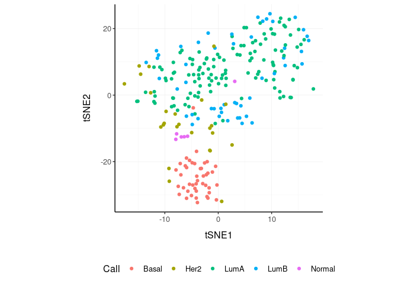
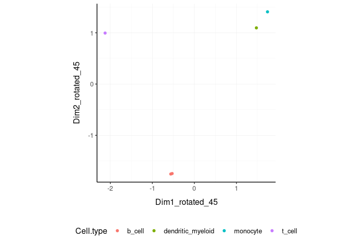

tidybulk - part of tidyTranscriptomics
================

<!-- badges: start -->

[](https://www.tidyverse.org/lifecycle/#maturing)
[](https://github.com/stemangiola/tidybulk/actions)
<!-- badges: end -->

**Brings transcriptomics to the tidyverse!**

The code is released under the version 3 of the GNU General Public
License.


website:
[stemangiola.github.io/tidybulk/](http://stemangiola.github.io/tidybulk/)

Please have a look also to

-   [tidySummarizedExperiment](https://github.com/stemangiola/tidySummarizedExperiment)
    for bulk data tidy representation
-   [tidySingleCellExperiment](https://github.com/stemangiola/tidySingleCellExperiment)
    for single-cell data tidy representation
-   [tidyseurat](https://github.com/stemangiola/tidyseurat) for
    single-cell data tidy representation
-   [tidyHeatmap](https://github.com/stemangiola/tidyHeatmap) for
    heatmaps produced with tidy principles analysis and manipulation
-   [nanny](https://github.com/stemangiola/nanny) for tidy high-level
    data analysis and manipulation
-   [tidygate](https://github.com/stemangiola/tidygate) for adding
    custom gate information to your tibble

<!---

[](https://travis-ci.org/stemangiola/tidybulk) [](https://coveralls.io/github/stemangiola/tidybulk?branch=master)

-->


## Functions/utilities available

| Function                            | Description                                                                        |
|-------------------------------------|------------------------------------------------------------------------------------|
| `aggregate_duplicates`              | Aggregate abundance and annotation of duplicated transcripts in a robust way       |
| `identify_abundant` `keep_abundant` | identify or keep the abundant genes                                                |
| `keep_variable`                     | Filter for top variable features                                                   |
| `scale_abundance`                   | Scale (normalise) abundance for RNA sequencing depth                               |
| `reduce_dimensions`                 | Perform dimensionality reduction (PCA, MDS, tSNE, UMAP)                            |
| `cluster_elements`                  | Labels elements with cluster identity (kmeans, SNN)                                |
| `remove_redundancy`                 | Filter out elements with highly correlated features                                |
| `adjust_abundance`                  | Remove known unwanted variation (Combat)                                           |
| `test_differential_abundance`       | Differential transcript abundance testing (DESeq2, edgeR, voom)                    |
| `deconvolve_cellularity`            | Estimated tissue composition (Cibersort, llsr, epic, xCell, mcp_counter, quantiseq |
| `test_differential_cellularity`     | Differential cell-type abundance testing                                           |
| `test_stratification_cellularity`   | Estimate Kaplan-Meier survival differences                                         |
| `test_gene_enrichment`              | Gene enrichment analyses (EGSEA)                                                   |
| `test_gene_overrepresentation`      | Gene enrichment on list of transcript names (no rank)                              |
| `test_gene_rank`                    | Gene enrichment on list of transcript (GSEA)                                       |
| `impute_missing_abundance`          | Impute abundance for missing data points using sample groupings                    |

| Utilities             | Description                                |
|-----------------------|--------------------------------------------|
| `get_bibliography`    | Get the bibliography of your workflow      |
| `tidybulk`            | add tidybulk attributes to a tibble object |
| `tidybulk_SAM_BAM`    | Convert SAM BAM files into tidybulk tibble |
| `pivot_sample`        | Select sample-wise columns/information     |
| `pivot_transcript`    | Select transcript-wise columns/information |
| `rotate_dimensions`   | Rotate two dimensions of a degree          |
| `ensembl_to_symbol`   | Add gene symbol from ensembl IDs           |
| `symbol_to_entrez`    | Add entrez ID from gene symbol             |
| `describe_transcript` | Add gene description from gene symbol      |

All functions are directly compatibble with `SummarizedExperiment`
object.

## Installation

From Bioconductor

``` r
BiocManager::install("tidybulk")
```

From Github

``` r
devtools::install_github("stemangiola/tidybulk")
```

# Data

We will use a `SummarizedExperiment` object

``` r
counts_SE
```

    ## # A SummarizedExperiment-tibble abstraction: 408,624 × 48
    ## # Features=8513 | Samples=48 | Assays=count
    ##    .feature .sample    count Cell.type time  condition batch factor_of_interest
    ##    <chr>    <chr>      <dbl> <fct>     <fct> <lgl>     <fct> <lgl>             
    ##  1 A1BG     SRR1740034   153 b_cell    0 d   TRUE      0     TRUE              
    ##  2 A1BG-AS1 SRR1740034    83 b_cell    0 d   TRUE      0     TRUE              
    ##  3 AAAS     SRR1740034   868 b_cell    0 d   TRUE      0     TRUE              
    ##  4 AACS     SRR1740034   222 b_cell    0 d   TRUE      0     TRUE              
    ##  5 AAGAB    SRR1740034   590 b_cell    0 d   TRUE      0     TRUE              
    ##  6 AAMDC    SRR1740034    48 b_cell    0 d   TRUE      0     TRUE              
    ##  7 AAMP     SRR1740034  1257 b_cell    0 d   TRUE      0     TRUE              
    ##  8 AANAT    SRR1740034   284 b_cell    0 d   TRUE      0     TRUE              
    ##  9 AAR2     SRR1740034   379 b_cell    0 d   TRUE      0     TRUE              
    ## 10 AARS2    SRR1740034   685 b_cell    0 d   TRUE      0     TRUE              
    ## # … with 40 more rows
    ## # ℹ Use `print(n = ...)` to see more rows

Loading `tidySummarizedExperiment` will automatically abstract this
object as `tibble`, so we can display it and manipulate it with tidy
tools. Although it looks different, and more tools (tidyverse) are
available to us, this object is in fact a `SummarizedExperiment` object.

``` r
class(counts_SE)
```

    ## [1] "SummarizedExperiment"
    ## attr(,"package")
    ## [1] "SummarizedExperiment"

## Get the bibliography of your workflow

First of all, you can cite all articles utilised within your workflow
automatically from any tidybulk tibble

``` r
counts_SE %>%   get_bibliography()
```

## Aggregate duplicated `transcripts`

tidybulk provide the `aggregate_duplicates` function to aggregate
duplicated transcripts (e.g., isoforms, ensembl). For example, we often
have to convert ensembl symbols to gene/transcript symbol, but in doing
so we have to deal with duplicates. `aggregate_duplicates` takes a
tibble and column names (as symbols; for `sample`, `transcript` and
`count`) as arguments and returns a tibble with transcripts with the
same name aggregated. All the rest of the columns are appended, and
factors and boolean are appended as characters.

<div class="column-left">

TidyTranscriptomics

``` r
rowData(counts_SE)$gene_name = rownames(counts_SE)
counts_SE.aggr = counts_SE %>% aggregate_duplicates(.transcript = gene_name)
```

</div>

<div class="column-right">

Standard procedure (comparative purpose)

``` r
temp = data.frame(
    symbol = dge_list$genes$symbol,
    dge_list$counts
)
dge_list.nr <- by(temp, temp$symbol,
    function(df)
        if(length(df[1,1])>0)
            matrixStats:::colSums(as.matrix(df[,-1]))
)
dge_list.nr <- do.call("rbind", dge_list.nr)
colnames(dge_list.nr) <- colnames(dge_list)
```

</div>

<div style="clear:both;">

</div>

## Scale `counts`

We may want to compensate for sequencing depth, scaling the transcript
abundance (e.g., with TMM algorithm, Robinson and Oshlack
doi.org/10.1186/gb-2010-11-3-r25). `scale_abundance` takes a tibble,
column names (as symbols; for `sample`, `transcript` and `count`) and a
method as arguments and returns a tibble with additional columns with
scaled data as `<NAME OF COUNT COLUMN>_scaled`.

<div class="column-left">

TidyTranscriptomics

``` r
counts_SE.norm = counts_SE.aggr %>% identify_abundant(factor_of_interest = condition) %>% scale_abundance()
```

</div>

<div class="column-right">

Standard procedure (comparative purpose)

``` r
library(edgeR)

dgList <- DGEList(count_m=x,group=group)
keep <- filterByExpr(dgList)
dgList <- dgList[keep,,keep.lib.sizes=FALSE]
[...]
dgList <- calcNormFactors(dgList, method="TMM")
norm_counts.table <- cpm(dgList)
```

</div>

<div style="clear:both;">

</div>

We can easily plot the scaled density to check the scaling outcome. On
the x axis we have the log scaled counts, on the y axes we have the
density, data is grouped by sample and coloured by cell type.

``` r
counts_SE.norm %>%
    ggplot(aes(count_scaled + 1, group=sample, color=`Cell.type`)) +
    geom_density() +
    scale_x_log10() +
    my_theme
```

<!-- -->

## Filter `variable transcripts`

We may want to identify and filter variable transcripts.

<div class="column-left">

TidyTranscriptomics

``` r
counts_SE.norm.variable = counts_SE.norm %>% keep_variable()
```

</div>

<div class="column-right">

Standard procedure (comparative purpose)

``` r
library(edgeR)

x = norm_counts.table

s <- rowMeans((x-rowMeans(x))^2)
o <- order(s,decreasing=TRUE)
x <- x[o[1L:top],,drop=FALSE]

norm_counts.table = norm_counts.table[rownames(x)]

norm_counts.table$cell_type = tibble_counts[
    match(
        tibble_counts$sample,
        rownames(norm_counts.table)
    ),
    "Cell.type"
]
```

</div>

<div style="clear:both;">

</div>

## Reduce `dimensions`

We may want to reduce the dimensions of our data, for example using PCA
or MDS algorithms. `reduce_dimensions` takes a tibble, column names (as
symbols; for `sample`, `transcript` and `count`) and a method (e.g., MDS
or PCA) as arguments and returns a tibble with additional columns for
the reduced dimensions.

**MDS** (Robinson et al., 10.1093/bioinformatics/btp616)

<div class="column-left">

TidyTranscriptomics

``` r
counts_SE.norm.MDS =
  counts_SE.norm %>%
  reduce_dimensions(method="MDS", .dims = 6)
```

</div>

<div class="column-right">

Standard procedure (comparative purpose)

``` r
library(limma)

count_m_log = log(count_m + 1)
cmds = limma::plotMDS(ndim = .dims, plot = FALSE)

cmds = cmds %$% 
    cmdscale.out %>%
    setNames(sprintf("Dim%s", 1:6))

cmds$cell_type = tibble_counts[
    match(tibble_counts$sample, rownames(cmds)),
    "Cell.type"
]
```

</div>

<div style="clear:both;">

</div>

On the x and y axes axis we have the reduced dimensions 1 to 3, data is
coloured by cell type.

``` r
counts_SE.norm.MDS %>% pivot_sample()  %>% select(contains("Dim"), everything())
```

    ## # A tibble: 48 × 14
    ##      Dim1   Dim2   Dim3     Dim4    Dim5    Dim6 .sample   Cell.…¹ time  condi…²
    ##     <dbl>  <dbl>  <dbl>    <dbl>   <dbl>   <dbl> <chr>     <fct>   <fct> <lgl>  
    ##  1 -1.46   0.220 -1.68   0.0553   0.0658 -0.126  SRR17400… b_cell  0 d   TRUE   
    ##  2 -1.46   0.226 -1.71   0.0300   0.0454 -0.137  SRR17400… b_cell  1 d   TRUE   
    ##  3 -1.44   0.193 -1.60   0.0890   0.0503 -0.121  SRR17400… b_cell  3 d   TRUE   
    ##  4 -1.44   0.198 -1.67   0.0891   0.0543 -0.110  SRR17400… b_cell  7 d   TRUE   
    ##  5  0.243 -1.42   0.182  0.00642 -0.503  -0.131  SRR17400… dendri… 0 d   FALSE  
    ##  6  0.191 -1.42   0.195  0.0180  -0.457  -0.130  SRR17400… dendri… 1 d   FALSE  
    ##  7  0.257 -1.42   0.152  0.0130  -0.582  -0.0927 SRR17400… dendri… 3 d   FALSE  
    ##  8  0.162 -1.43   0.189  0.0232  -0.452  -0.109  SRR17400… dendri… 7 d   FALSE  
    ##  9  0.516 -1.47   0.240 -0.251    0.457  -0.119  SRR17400… monocy… 0 d   FALSE  
    ## 10  0.514 -1.41   0.231 -0.219    0.458  -0.131  SRR17400… monocy… 1 d   FALSE  
    ## # … with 38 more rows, 4 more variables: batch <fct>, factor_of_interest <lgl>,
    ## #   TMM <dbl>, multiplier <dbl>, and abbreviated variable names ¹​Cell.type,
    ## #   ²​condition
    ## # ℹ Use `print(n = ...)` to see more rows, and `colnames()` to see all variable names

``` r
counts_SE.norm.MDS %>%
    pivot_sample() %>%
  GGally::ggpairs(columns = 6:(6+5), ggplot2::aes(colour=`Cell.type`))
```

<!-- -->

**PCA**

<div class="column-left">

TidyTranscriptomics

``` r
counts_SE.norm.PCA =
  counts_SE.norm %>%
  reduce_dimensions(method="PCA", .dims = 6)
```

</div>

<div class="column-right">

Standard procedure (comparative purpose)

``` r
count_m_log = log(count_m + 1)
pc = count_m_log %>% prcomp(scale = TRUE)
variance = pc$sdev^2
variance = (variance / sum(variance))[1:6]
pc$cell_type = counts[
    match(counts$sample, rownames(pc)),
    "Cell.type"
]
```

</div>

<div style="clear:both;">

</div>

On the x and y axes axis we have the reduced dimensions 1 to 3, data is
coloured by cell type.

``` r
counts_SE.norm.PCA %>% pivot_sample() %>% select(contains("PC"), everything())
```

    ## # A tibble: 48 × 14
    ##        PC1   PC2    PC3     PC4    PC5   PC6 .sample Cell.…¹ time  condi…² batch
    ##      <dbl> <dbl>  <dbl>   <dbl>  <dbl> <dbl> <chr>   <fct>   <fct> <lgl>   <fct>
    ##  1 -12.6   -2.52 -14.9  -0.424  -0.592 -1.22 SRR174… b_cell  0 d   TRUE    0    
    ##  2 -12.6   -2.57 -15.2  -0.140  -0.388 -1.30 SRR174… b_cell  1 d   TRUE    1    
    ##  3 -12.6   -2.41 -14.5  -0.714  -0.344 -1.10 SRR174… b_cell  3 d   TRUE    1    
    ##  4 -12.5   -2.34 -14.9  -0.816  -0.427 -1.00 SRR174… b_cell  7 d   TRUE    1    
    ##  5   0.189 13.0    1.66 -0.0269  4.64  -1.35 SRR174… dendri… 0 d   FALSE   0    
    ##  6  -0.293 12.9    1.76 -0.0727  4.21  -1.28 SRR174… dendri… 1 d   FALSE   0    
    ##  7   0.407 13.0    1.42 -0.0529  5.37  -1.01 SRR174… dendri… 3 d   FALSE   1    
    ##  8  -0.620 13.0    1.73 -0.201   4.17  -1.07 SRR174… dendri… 7 d   FALSE   0    
    ##  9   2.56  13.5    2.32  2.03   -4.32  -1.22 SRR174… monocy… 0 d   FALSE   1    
    ## 10   2.65  13.1    2.21  1.80   -4.29  -1.30 SRR174… monocy… 1 d   FALSE   1    
    ## # … with 38 more rows, 3 more variables: factor_of_interest <lgl>, TMM <dbl>,
    ## #   multiplier <dbl>, and abbreviated variable names ¹​Cell.type, ²​condition
    ## # ℹ Use `print(n = ...)` to see more rows, and `colnames()` to see all variable names

``` r
counts_SE.norm.PCA %>%
     pivot_sample() %>%
  GGally::ggpairs(columns = 11:13, ggplot2::aes(colour=`Cell.type`))
```

<!-- -->

**tSNE**

<div class="column-left">

TidyTranscriptomics

``` r
counts_SE.norm.tSNE =
    breast_tcga_mini_SE %>%
    identify_abundant() %>%
    reduce_dimensions(
        method = "tSNE",
        perplexity=10,
        pca_scale =TRUE
    )
```

</div>

<div class="column-right">

Standard procedure (comparative purpose)

``` r
count_m_log = log(count_m + 1)

tsne = Rtsne::Rtsne(
    t(count_m_log),
    perplexity=10,
        pca_scale =TRUE
)$Y
tsne$cell_type = tibble_counts[
    match(tibble_counts$sample, rownames(tsne)),
    "Cell.type"
]
```

</div>

<div style="clear:both;">

</div>

Plot

``` r
counts_SE.norm.tSNE %>%
    pivot_sample() %>%
    select(contains("tSNE"), everything()) 
```

    ## # A tibble: 251 × 4
    ##     tSNE1  tSNE2 .sample                      Call 
    ##     <dbl>  <dbl> <chr>                        <fct>
    ##  1  -5.25  10.2  TCGA-A1-A0SD-01A-11R-A115-07 LumA 
    ##  2   6.41   2.79 TCGA-A1-A0SF-01A-11R-A144-07 LumA 
    ##  3  -9.28   6.63 TCGA-A1-A0SG-01A-11R-A144-07 LumA 
    ##  4  -1.76   4.82 TCGA-A1-A0SH-01A-11R-A084-07 LumA 
    ##  5  -1.41  12.2  TCGA-A1-A0SI-01A-11R-A144-07 LumB 
    ##  6  -1.89  -3.60 TCGA-A1-A0SJ-01A-11R-A084-07 LumA 
    ##  7  18.5  -13.4  TCGA-A1-A0SK-01A-12R-A084-07 Basal
    ##  8  -4.03 -10.4  TCGA-A1-A0SM-01A-11R-A084-07 LumA 
    ##  9  -2.84 -10.8  TCGA-A1-A0SN-01A-11R-A144-07 LumB 
    ## 10 -19.3    5.03 TCGA-A1-A0SQ-01A-21R-A144-07 LumA 
    ## # … with 241 more rows
    ## # ℹ Use `print(n = ...)` to see more rows

``` r
counts_SE.norm.tSNE %>%
    pivot_sample() %>%
    ggplot(aes(x = `tSNE1`, y = `tSNE2`, color=Call)) + geom_point() + my_theme
```

<!-- -->

## Rotate `dimensions`

We may want to rotate the reduced dimensions (or any two numeric columns
really) of our data, of a set angle. `rotate_dimensions` takes a tibble,
column names (as symbols; for `sample`, `transcript` and `count`) and an
angle as arguments and returns a tibble with additional columns for the
rotated dimensions. The rotated dimensions will be added to the original
data set as `<NAME OF DIMENSION> rotated <ANGLE>` by default, or as
specified in the input arguments.

<div class="column-left">

TidyTranscriptomics

``` r
counts_SE.norm.MDS.rotated =
  counts_SE.norm.MDS %>%
    rotate_dimensions(`Dim1`, `Dim2`, rotation_degrees = 45, action="get")
```

</div>

<div class="column-right">

Standard procedure (comparative purpose)

``` r
rotation = function(m, d) {
    r = d * pi / 180
    ((bind_rows(
        c(`1` = cos(r), `2` = -sin(r)),
        c(`1` = sin(r), `2` = cos(r))
    ) %>% as_matrix) %*% m)
}
mds_r = pca %>% rotation(rotation_degrees)
mds_r$cell_type = counts[
    match(counts$sample, rownames(mds_r)),
    "Cell.type"
]
```

</div>

<div style="clear:both;">

</div>

**Original** On the x and y axes axis we have the first two reduced
dimensions, data is coloured by cell type.

``` r
counts_SE.norm.MDS.rotated %>%
    ggplot(aes(x=`Dim1`, y=`Dim2`, color=`Cell.type` )) +
  geom_point() +
  my_theme
```

<!-- -->

**Rotated** On the x and y axes axis we have the first two reduced
dimensions rotated of 45 degrees, data is coloured by cell type.

``` r
counts_SE.norm.MDS.rotated %>%
    pivot_sample() %>%
    ggplot(aes(x=`Dim1_rotated_45`, y=`Dim2_rotated_45`, color=`Cell.type` )) +
  geom_point() +
  my_theme
```

<!-- -->

## Test `differential abundance`

We may want to test for differential transcription between sample-wise
factors of interest (e.g., with edgeR). `test_differential_abundance`
takes a tibble, column names (as symbols; for `sample`, `transcript` and
`count`) and a formula representing the desired linear model as
arguments and returns a tibble with additional columns for the
statistics from the hypothesis test (e.g., log fold change, p-value and
false discovery rate).

<div class="column-left">

TidyTranscriptomics

``` r
counts_SE.de =
    counts_SE %>%
    test_differential_abundance( ~ condition, action="get")
counts_SE.de
```

</div>

<div class="column-right">

Standard procedure (comparative purpose)

``` r
library(edgeR)

dgList <- DGEList(counts=counts_m,group=group)
keep <- filterByExpr(dgList)
dgList <- dgList[keep,,keep.lib.sizes=FALSE]
dgList <- calcNormFactors(dgList)
design <- model.matrix(~group)
dgList <- estimateDisp(dgList,design)
fit <- glmQLFit(dgList,design)
qlf <- glmQLFTest(fit,coef=2)
topTags(qlf, n=Inf)
```

</div>

<div style="clear:both;">

</div>

The functon `test_differential_abundance` operated with contrasts too.
The constrasts hve the name of the design matrix (generally
<NAME_COLUMN_COVARIATE><VALUES_OF_COVARIATE>)

``` r
counts_SE.de =
    counts_SE %>%
    identify_abundant(factor_of_interest = condition) %>%
    test_differential_abundance(
        ~ 0 + condition,                  
        .contrasts = c( "conditionTRUE - conditionFALSE"),
        action="get"
    )
```

## Adjust `counts`

We may want to adjust `counts` for (known) unwanted variation.
`adjust_abundance` takes as arguments a tibble, column names (as
symbols; for `sample`, `transcript` and `count`) and a formula
representing the desired linear model where the first covariate is the
factor of interest and the second covariate is the unwanted variation,
and returns a tibble with additional columns for the adjusted counts as
`<COUNT COLUMN>_adjusted`. At the moment just an unwanted covariated is
allowed at a time.

<div class="column-left">

TidyTranscriptomics

``` r
counts_SE.norm.adj =
    counts_SE.norm %>% adjust_abundance(    ~ factor_of_interest + batch)
```

</div>

<div class="column-right">

Standard procedure (comparative purpose)

``` r
library(sva)

count_m_log = log(count_m + 1)

design =
        model.matrix(
            object = ~ factor_of_interest + batch,
            data = annotation
        )

count_m_log.sva =
    ComBat(
            batch = design[,2],
            mod = design,
            ...
        )

count_m_log.sva = ceiling(exp(count_m_log.sva) -1)
count_m_log.sva$cell_type = counts[
    match(counts$sample, rownames(count_m_log.sva)),
    "Cell.type"
]
```

</div>

<div style="clear:both;">

</div>

## Deconvolve `Cell type composition`

We may want to infer the cell type composition of our samples (with the
algorithm Cibersort; Newman et al., 10.1038/nmeth.3337).
`deconvolve_cellularity` takes as arguments a tibble, column names (as
symbols; for `sample`, `transcript` and `count`) and returns a tibble
with additional columns for the adjusted cell type proportions.

<div class="column-left">

TidyTranscriptomics

``` r
counts_SE.cibersort =
    counts_SE %>%
    deconvolve_cellularity(action="get", cores=1, prefix = "cibersort__") 
```

    ## 
    ## The downloaded binary packages are in
    ##  /var/folders/zn/m_qvr9zd7tq0wdtsbq255f8xypj_zg/T//RtmpIi5KN6/downloaded_packages

</div>

<div class="column-right">

Standard procedure (comparative purpose)

``` r
source(‘CIBERSORT.R’)
count_m %>% write.table("mixture_file.txt")
results <- CIBERSORT(
    "sig_matrix_file.txt",
    "mixture_file.txt",
    perm=100, QN=TRUE
)
results$cell_type = tibble_counts[
    match(tibble_counts$sample, rownames(results)),
    "Cell.type"
]
```

</div>

<div style="clear:both;">

</div>

With the new annotated data frame, we can plot the distributions of cell
types across samples, and compare them with the nominal cell type labels
to check for the purity of isolation. On the x axis we have the cell
types inferred by Cibersort, on the y axis we have the inferred
proportions. The data is facetted and coloured by nominal cell types
(annotation given by the researcher after FACS sorting).

``` r
counts_SE.cibersort %>%
    pivot_longer(
        names_to= "Cell_type_inferred", 
        values_to = "proportion", 
        names_prefix ="cibersort__", 
        cols=contains("cibersort__")
    ) %>%
  ggplot(aes(x=`Cell_type_inferred`, y=proportion, fill=`Cell.type`)) +
  geom_boxplot() +
  facet_wrap(~`Cell.type`) +
  my_theme +
  theme(axis.text.x = element_text(angle = 90, hjust = 1, vjust = 0.5), aspect.ratio=1/5)
```

<!-- -->

## Test differential cell-type abundance

We can also perform a statistical test on the differential cell-type
abundance across conditions

``` r
    counts_SE %>%
    test_differential_cellularity(. ~ condition )
```

    ## 
    ## The downloaded binary packages are in
    ##  /var/folders/zn/m_qvr9zd7tq0wdtsbq255f8xypj_zg/T//RtmpIi5KN6/downloaded_packages

    ## # A tibble: 22 × 7
    ##    .cell_type                  cell_t…¹ estim…² estim…³ std.e…⁴ stati…⁵ p.valu…⁶
    ##    <chr>                       <list>     <dbl>   <dbl>   <dbl>   <dbl>    <dbl>
    ##  1 cibersort.B.cells.naive     <tibble>   -2.94   2.25    0.367   6.13  8.77e-10
    ##  2 cibersort.B.cells.memory    <tibble>   -4.86   1.48    0.436   3.40  6.77e- 4
    ##  3 cibersort.Plasma.cells      <tibble>   -5.33  -0.487   0.507  -0.960 3.37e- 1
    ##  4 cibersort.T.cells.CD8       <tibble>   -2.33   0.924   0.475   1.94  5.18e- 2
    ##  5 cibersort.T.cells.CD4.naive <tibble>   -2.83  -0.620   0.531  -1.17  2.43e- 1
    ##  6 cibersort.T.cells.CD4.memo… <tibble>   -2.46   0.190   0.500   0.380 7.04e- 1
    ##  7 cibersort.T.cells.CD4.memo… <tibble>   -3.67   2.23    0.427   5.22  1.80e- 7
    ##  8 cibersort.T.cells.follicul… <tibble>   -5.68  -0.217   0.507  -0.427 6.69e- 1
    ##  9 cibersort.T.cells.regulato… <tibble>   -5.04   1.94    0.360   5.39  6.86e- 8
    ## 10 cibersort.T.cells.gamma.de… <tibble>   -4.78  -0.250   0.514  -0.486 6.27e- 1
    ## # … with 12 more rows, and abbreviated variable names ¹​cell_type_proportions,
    ## #   ²​`estimate_(Intercept)`, ³​estimate_conditionTRUE, ⁴​std.error_conditionTRUE,
    ## #   ⁵​statistic_conditionTRUE, ⁶​p.value_conditionTRUE
    ## # ℹ Use `print(n = ...)` to see more rows

We can also perform regression analysis with censored data (coxph).

``` r
    # Add survival data

counts_SE_survival = 
    counts_SE %>%
    nest(data = -sample) %>%
        mutate(
            days = sample(1:1000, size = n()),
            dead = sample(c(0,1), size = n(), replace = TRUE)
        ) %>%
    unnest(data) 

# Test
counts_SE_survival %>%
    test_differential_cellularity(survival::Surv(days, dead) ~ .)
```

    ## # A tibble: 22 × 6
    ##    .cell_type                           cell_t…¹ estim…² std.e…³ stati…⁴ p.value
    ##    <chr>                                <list>     <dbl>   <dbl>   <dbl>   <dbl>
    ##  1 cibersort.B.cells.naive              <tibble>  -0.224   0.415  -0.540  0.589 
    ##  2 cibersort.B.cells.memory             <tibble>   0.510   0.346   1.48   0.140 
    ##  3 cibersort.Plasma.cells               <tibble>   0.892   0.449   1.99   0.0467
    ##  4 cibersort.T.cells.CD8                <tibble>   0.531   0.639   0.831  0.406 
    ##  5 cibersort.T.cells.CD4.naive          <tibble>   0.112   0.386   0.290  0.772 
    ##  6 cibersort.T.cells.CD4.memory.resting <tibble>   0.498   0.540   0.921  0.357 
    ##  7 cibersort.T.cells.CD4.memory.activa… <tibble>   2.37    0.939   2.52   0.0117
    ##  8 cibersort.T.cells.follicular.helper  <tibble>  -0.544   0.421  -1.29   0.197 
    ##  9 cibersort.T.cells.regulatory..Tregs. <tibble>   1.59    0.656   2.42   0.0157
    ## 10 cibersort.T.cells.gamma.delta        <tibble>   0.510   0.688   0.741  0.459 
    ## # … with 12 more rows, and abbreviated variable names ¹​cell_type_proportions,
    ## #   ²​estimate, ³​std.error, ⁴​statistic
    ## # ℹ Use `print(n = ...)` to see more rows

We can also perform test of Kaplan-Meier curves.

``` r
counts_stratified = 
    counts_SE_survival %>%

    # Test
    test_stratification_cellularity(
        survival::Surv(days, dead) ~ .,
        sample, transcript, count
    )

counts_stratified
```

    ## # A tibble: 22 × 6
    ##    .cell_type                         cell_t…¹ .low_…² .high…³ pvalue plot      
    ##    <chr>                              <list>     <dbl>   <dbl>  <dbl> <list>    
    ##  1 cibersort.B.cells.naive            <tibble>   14.4     7.56  0.506 <ggsrvplt>
    ##  2 cibersort.B.cells.memory           <tibble>   17.2     4.77  0.500 <ggsrvplt>
    ##  3 cibersort.Plasma.cells             <tibble>   13.3     8.73  0.903 <ggsrvplt>
    ##  4 cibersort.T.cells.CD8              <tibble>   13.9     8.06  0.369 <ggsrvplt>
    ##  5 cibersort.T.cells.CD4.naive        <tibble>   12.8     9.15  0.407 <ggsrvplt>
    ##  6 cibersort.T.cells.CD4.memory.rest… <tibble>    7.65   14.4   0.105 <ggsrvplt>
    ##  7 cibersort.T.cells.CD4.memory.acti… <tibble>   15.7     6.26  0.392 <ggsrvplt>
    ##  8 cibersort.T.cells.follicular.help… <tibble>   17.1     4.88  0.949 <ggsrvplt>
    ##  9 cibersort.T.cells.regulatory..Tre… <tibble>   13.7     8.35  0.771 <ggsrvplt>
    ## 10 cibersort.T.cells.gamma.delta      <tibble>   16.2     5.76  0.379 <ggsrvplt>
    ## # … with 12 more rows, and abbreviated variable names ¹​cell_type_proportions,
    ## #   ²​.low_cellularity_expected, ³​.high_cellularity_expected
    ## # ℹ Use `print(n = ...)` to see more rows

Plot Kaplan-Meier curves

``` r
counts_stratified$plot[[1]]
```

<!-- -->

## Cluster `samples`

We may want to cluster our data (e.g., using k-means sample-wise).
`cluster_elements` takes as arguments a tibble, column names (as
symbols; for `sample`, `transcript` and `count`) and returns a tibble
with additional columns for the cluster annotation. At the moment only
k-means clustering is supported, the plan is to introduce more
clustering methods.

**k-means**

<div class="column-left">

TidyTranscriptomics

``` r
counts_SE.norm.cluster = counts_SE.norm.MDS %>%
  cluster_elements(method="kmeans", centers = 2, action="get" )
```

</div>

<div class="column-right">

Standard procedure (comparative purpose)

``` r
count_m_log = log(count_m + 1)

k = kmeans(count_m_log, iter.max = 1000, ...)
cluster = k$cluster

cluster$cell_type = tibble_counts[
    match(tibble_counts$sample, rownames(cluster)),
    c("Cell.type", "Dim1", "Dim2")
]
```

</div>

<div style="clear:both;">

</div>

We can add cluster annotation to the MDS dimension reduced data set and
plot.

``` r
 counts_SE.norm.cluster %>%
    ggplot(aes(x=`Dim1`, y=`Dim2`, color=`cluster_kmeans`)) +
  geom_point() +
  my_theme
```

<!-- -->

**SNN**

Matrix package (v1.3-3) causes an error with Seurat::FindNeighbors used
in this method. We are trying to solve this issue. At the moment this
option in unaviable.

<div class="column-left">

TidyTranscriptomics

``` r
counts_SE.norm.SNN =
    counts_SE.norm.tSNE %>%
    cluster_elements(method = "SNN")
```

</div>

<div class="column-right">

Standard procedure (comparative purpose)

``` r
library(Seurat)

snn = CreateSeuratObject(count_m)
snn = ScaleData(
    snn, display.progress = TRUE,
    num.cores=4, do.par = TRUE
)
snn = FindVariableFeatures(snn, selection.method = "vst")
snn = FindVariableFeatures(snn, selection.method = "vst")
snn = RunPCA(snn, npcs = 30)
snn = FindNeighbors(snn)
snn = FindClusters(snn, method = "igraph", ...)
snn = snn[["seurat_clusters"]]

snn$cell_type = tibble_counts[
    match(tibble_counts$sample, rownames(snn)),
    c("Cell.type", "Dim1", "Dim2")
]
```

</div>

<div style="clear:both;">

</div>

``` r
counts_SE.norm.SNN %>%
    pivot_sample() %>%
    select(contains("tSNE"), everything()) 

counts_SE.norm.SNN %>%
    pivot_sample() %>%
    gather(source, Call, c("cluster_SNN", "Call")) %>%
    distinct() %>%
    ggplot(aes(x = `tSNE1`, y = `tSNE2`, color=Call)) + geom_point() + facet_grid(~source) + my_theme


# Do differential transcription between clusters
counts_SE.norm.SNN %>%
    mutate(factor_of_interest = `cluster_SNN` == 3) %>%
    test_differential_abundance(
    ~ factor_of_interest,
    action="get"
   )
```

## Drop `redundant` transcripts

We may want to remove redundant elements from the original data set
(e.g., samples or transcripts), for example if we want to define
cell-type specific signatures with low sample redundancy.
`remove_redundancy` takes as arguments a tibble, column names (as
symbols; for `sample`, `transcript` and `count`) and returns a tibble
with redundant elements removed (e.g., samples). Two redundancy
estimation approaches are supported:

-   removal of highly correlated clusters of elements (keeping a
    representative) with method=“correlation”
-   removal of most proximal element pairs in a reduced dimensional
    space.

**Approach 1**

<div class="column-left">

TidyTranscriptomics

``` r
counts_SE.norm.non_redundant =
    counts_SE.norm.MDS %>%
  remove_redundancy(    method = "correlation" )
```

    ## 
    ## The downloaded binary packages are in
    ##  /var/folders/zn/m_qvr9zd7tq0wdtsbq255f8xypj_zg/T//RtmpIi5KN6/downloaded_packages

</div>

<div class="column-right">

Standard procedure (comparative purpose)

``` r
library(widyr)

.data.correlated =
    pairwise_cor(
        counts,
        sample,
        transcript,
        rc,
        sort = TRUE,
        diag = FALSE,
        upper = FALSE
    ) %>%
    filter(correlation > correlation_threshold) %>%
    distinct(item1) %>%
    rename(!!.element := item1)

# Return non redudant data frame
counts %>% anti_join(.data.correlated) %>%
    spread(sample, rc, - transcript) %>%
    left_join(annotation)
```

</div>

<div style="clear:both;">

</div>

We can visualise how the reduced redundancy with the reduced dimentions
look like

``` r
counts_SE.norm.non_redundant %>%
    pivot_sample() %>%
    ggplot(aes(x=`Dim1`, y=`Dim2`, color=`Cell.type`)) +
  geom_point() +
  my_theme
```

<!-- -->

**Approach 2**

``` r
counts_SE.norm.non_redundant =
    counts_SE.norm.MDS %>%
  remove_redundancy(
    method = "reduced_dimensions",
    Dim_a_column = `Dim1`,
    Dim_b_column = `Dim2`
  )
```

We can visualise MDS reduced dimensions of the samples with the closest
pair removed.

``` r
counts_SE.norm.non_redundant %>%
    pivot_sample() %>%
    ggplot(aes(x=`Dim1`, y=`Dim2`, color=`Cell.type`)) +
  geom_point() +
  my_theme
```

<!-- -->

## Other useful wrappers

The above wrapper streamline the most common processing of bulk RNA
sequencing data. Other useful wrappers are listed above.

## From BAM/SAM to tibble of gene counts

We can calculate gene counts (using FeatureCounts; Liao Y et al.,
10.1093/nar/gkz114) from a list of BAM/SAM files and format them into a
tidy structure (similar to counts).

``` r
counts = tidybulk_SAM_BAM(
    file_names,
    genome = "hg38",
    isPairedEnd = TRUE,
    requireBothEndsMapped = TRUE,
    checkFragLength = FALSE,
    useMetaFeatures = TRUE
)
```

## From ensembl IDs to gene symbol IDs

We can add gene symbols from ensembl identifiers. This is useful since
different resources use ensembl IDs while others use gene symbol IDs.
This currently works for human and mouse.

``` r
counts_ensembl %>% ensembl_to_symbol(ens)
```

    ## # A tibble: 119 × 8
    ##    ens             iso   `read count` sample     cases…¹ cases…² trans…³ ref_g…⁴
    ##    <chr>           <chr>        <dbl> <chr>      <chr>   <chr>   <chr>   <chr>  
    ##  1 ENSG00000000003 13             144 TARGET-20… Acute … Primar… TSPAN6  hg38   
    ##  2 ENSG00000000003 13              72 TARGET-20… Acute … Primar… TSPAN6  hg38   
    ##  3 ENSG00000000003 13               0 TARGET-20… Acute … Primar… TSPAN6  hg38   
    ##  4 ENSG00000000003 13            1099 TARGET-20… Acute … Primar… TSPAN6  hg38   
    ##  5 ENSG00000000003 13              11 TARGET-20… Acute … Primar… TSPAN6  hg38   
    ##  6 ENSG00000000003 13               2 TARGET-20… Acute … Primar… TSPAN6  hg38   
    ##  7 ENSG00000000003 13               3 TARGET-20… Acute … Primar… TSPAN6  hg38   
    ##  8 ENSG00000000003 13            2678 TARGET-20… Acute … Primar… TSPAN6  hg38   
    ##  9 ENSG00000000003 13             751 TARGET-20… Acute … Primar… TSPAN6  hg38   
    ## 10 ENSG00000000003 13               1 TARGET-20… Acute … Primar… TSPAN6  hg38   
    ## # … with 109 more rows, and abbreviated variable names
    ## #   ¹​cases_0_project_disease_type, ²​cases_0_samples_0_sample_type, ³​transcript,
    ## #   ⁴​ref_genome
    ## # ℹ Use `print(n = ...)` to see more rows

## From gene symbol to gene description (gene name in full)

We can add gene full name (and in future description) from symbol
identifiers. This currently works for human and mouse.

``` r
counts_SE %>% 
    describe_transcript() %>% 
    select(feature, description, everything())
```

    ## # A SummarizedExperiment-tibble abstraction: 408,624 × 48
    ## # Features=8513 | Samples=48 | Assays=count
    ##    feature  sample     count Cell.…¹ time  condi…² batch facto…³ descr…⁴ gene_…⁵
    ##    <chr>    <chr>      <dbl> <fct>   <fct> <lgl>   <fct> <lgl>   <chr>   <chr>  
    ##  1 A1BG     SRR1740034   153 b_cell  0 d   TRUE    0     TRUE    alpha-… A1BG   
    ##  2 A1BG-AS1 SRR1740034    83 b_cell  0 d   TRUE    0     TRUE    A1BG a… A1BG-A…
    ##  3 AAAS     SRR1740034   868 b_cell  0 d   TRUE    0     TRUE    aladin… AAAS   
    ##  4 AACS     SRR1740034   222 b_cell  0 d   TRUE    0     TRUE    acetoa… AACS   
    ##  5 AAGAB    SRR1740034   590 b_cell  0 d   TRUE    0     TRUE    alpha … AAGAB  
    ##  6 AAMDC    SRR1740034    48 b_cell  0 d   TRUE    0     TRUE    adipog… AAMDC  
    ##  7 AAMP     SRR1740034  1257 b_cell  0 d   TRUE    0     TRUE    angio … AAMP   
    ##  8 AANAT    SRR1740034   284 b_cell  0 d   TRUE    0     TRUE    aralky… AANAT  
    ##  9 AAR2     SRR1740034   379 b_cell  0 d   TRUE    0     TRUE    AAR2 s… AAR2   
    ## 10 AARS2    SRR1740034   685 b_cell  0 d   TRUE    0     TRUE    alanyl… AARS2  
    ## # … with 40 more rows, and abbreviated variable names ¹​Cell.type, ²​condition,
    ## #   ³​factor_of_interest, ⁴​description, ⁵​gene_name
    ## # ℹ Use `print(n = ...)` to see more rows
